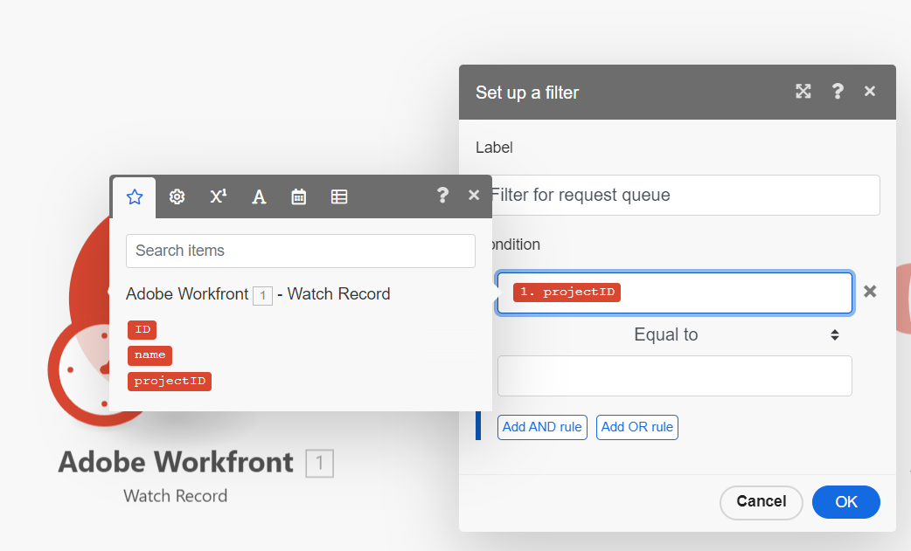

# 基本シナリオへのフィルターの追加

フィルターを使用すると、特定の条件が満たされた場合にのみ、シナリオを確実に進行させることができます。

この例では、リクエストが特定のリクエストキューに送信された場合にのみ、リクエストから新しいプロジェクトを作成できるフィルターをシナリオに追加します。

この例では、[基本シナリオの作成](/help/workfront-fusion/build-practice-scenarios/create-basic-scenario.md)で作成したシナリオを変更します。

>[!NOTE]
>
>Workfrontのトリガーモジュールには、特定の条件が満たされた場合にのみシナリオを開始できるフィルターが含まれています。 ただし、モジュール間のフィルターは、トリガー以外のユースケースやWorkfront以外のユースケースごとに使用されるため、モジュール間のフィルターの使用方法を学習することが重要です。 この例では、モジュール内フィルターで満たすことができる機能にモジュール間フィルターを使用します。

## アクセス要件

+++ 展開すると、この記事の機能のアクセス要件が表示されます。

<table style="table-layout:auto">
 <col> 
 <col> 
 <tbody> 
  <tr> 
   <td role="rowheader">Adobe Workfront パッケージ</td> 
   <td> 
任意の Adobe Workfront Workflow パッケージと任意の Adobe Workfront Automation および Integration パッケージ

Workfront Ultimate

Workfront Fusion を追加購入した Workfront Prime および Select パッケージ。
 </td> 
  </tr> 
  <tr data-mc-conditions=""> 
   <td role="rowheader">Adobe Workfront ライセンス</td> 
   <td> 
標準

Work またはそれ以上
 </td> 
  </tr> 
  <tr> 
   <td role="rowheader">製品</td> 
   <td>
   
組織が Workfront Automation および Integration を含まない Select またはPrime Workfront パッケージを持っている場合は、Adobe Workfront Fusion を購入する必要があります。</li></ul>
   </td> 
  </tr>
 </tbody> 
</table>

この表の情報について詳しくは、[ドキュメントのアクセス要件](/help/workfront-fusion/references/licenses-and-roles/access-level-requirements-in-documentation.md)を参照してください。

+++

## 前提条件

この手順に従う前に、[基本シナリオの作成](/help/workfront-fusion/build-practice-scenarios/create-basic-scenario.md)で説明したシナリオを作成する必要があります。

## フィルターの追加

### フィルターを追加する準備

1. シナリオを開きます。
1. 最初のモジュールをクリックして開きます。
1. **出力**&#x200B;領域で、`Project`を選択します。
これで、`ID`、`Name`、`Project`が選択されました。
1. 「OK」をクリックして、モジュール設定を保存します。
1. Workfrontを開きます。
1. Workfrontで、Fusion シナリオが操作するリクエストキューを表すプロジェクトを見つけます。

   このプロジェクトは、Fusion接続が設定されているのと同じWorkfront アカウントにある必要があります。

1. URLにプロジェクト IDを書き留めます。

   例：https://\&lt;MyDomain\>.my.workfront.com/project/\&lt;ProjectID\>/tasks

### フィルターの追加と設定

1. シナリオエディターのシナリオに戻ります。
1. 最初と2番目のモジュールの間にあるレンチアイコン をクリックし、**フィルターの設定**&#x200B;を選択します。
1. 「ラベル」フィールドに、「リクエストキュー用のフィルター」など、このフィルターのラベルを入力します。
1. **条件**&#x200B;領域の上部フィールドで、最初のモジュールから`projectID`をマッピングします。

   
1. **Condition**&#x200B;演算子は次のままにします。
1. **条件**&#x200B;領域の下部のフィールドに、[のプロジェクト URLからメモしたプロジェクト IDを貼り付けて、フィルター](#prepare-to-add-the-filter)を追加する準備をします。
1. **OK**&#x200B;をクリックして、フィルター設定を保存します。

### 検証と活用

1. Fusionが接続しているWorkfront環境に移動し、フィルターで指定したプロジェクトにイシューを追加します。 別の問題を別のプロジェクトに追加します。
1. シナリオエディターの左下隅にある「**[!UICONTROL 1 回実行]**」をクリックします。
1. 出力を調べて、シナリオが期待どおりに実行されていることを確認します。

   両方の問題は最初のモジュールの出力に表示されますが、指定したプロジェクトの問題のみが2番目のモジュールの入力として表示されます。
1. シナリオが期待どおりに機能していることを確認したら、画面の左下にある&#x200B;**スケジュール** トグルを&#x200B;**オン**&#x200B;にクリックします。

   これにより、シナリオがアクティブになります。
1. Workfront Fusionで、左下隅付近の&#x200B;**[!UICONTROL 保存]**&#x200B;をクリックして、シナリオの進行状況を保存します。

   >[!IMPORTANT]
   >
   >シナリオを改良、テストするたびに保存するようにしてください。 シナリオをトリガーするには、Workfront アカウントで新しいイシューを作成する必要がある場合があります。

## リソース

* フィルターについて詳しくは、[ シナリオへのフィルターの追加](/help/workfront-fusion/create-scenarios/add-modules/add-a-filter-to-a-scenario.md)を参照してください。
