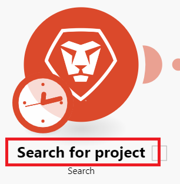
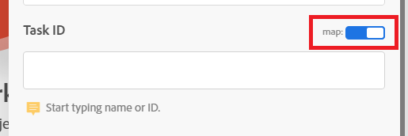
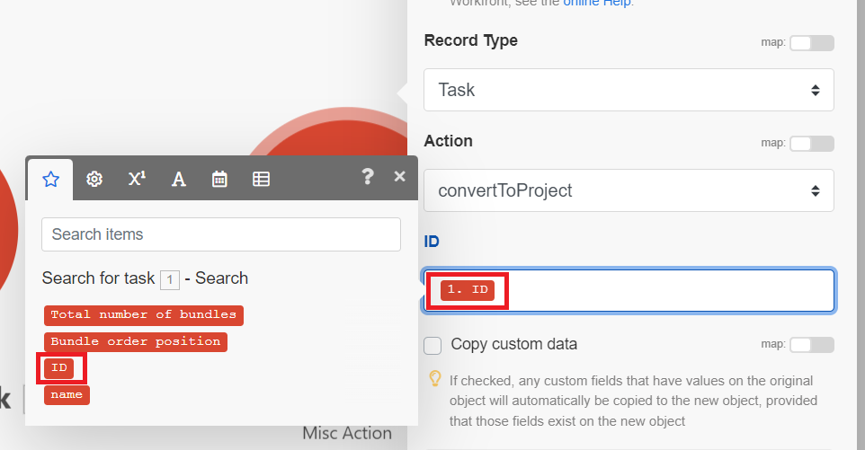

# 基本的なシナリオの作成

Adobe Workfront Fusion の役割は、プロセスを自動処理することで、ユーザーが同じタスクを何度も繰り返すのではなく、新しいタスクに集中できるようにすることです。 これは、アプリ内やサービス内、およびそれらの間でアクションをリンクし、データを自動的に転送および変換するシナリオを作成することで機能します。 作成するシナリオは、アプリまたはサービス内のデータを監視し、そのデータを処理して必要な結果を提供します。

この例では、Workfrontでリクエストを検索し、それをプロジェクトに変換するシナリオを作成するプロセスを説明します。

## アクセス要件

+++ 展開すると、この記事の機能のアクセス要件が表示されます。

<table style="table-layout:auto">
 <col> 
 <col> 
 <tbody> 
  <tr> 
   <td role="rowheader">Adobe Workfront パッケージ</td> 
   <td> 
任意の Adobe Workfront Workflow パッケージと任意の Adobe Workfront Automation および Integration パッケージ

Workfront Ultimate

Workfront Fusion を追加購入した Workfront Prime および Select パッケージ。
 </td> 
  </tr> 
  <tr data-mc-conditions=""> 
   <td role="rowheader">Adobe Workfront ライセンス</td> 
   <td> 
標準

Work またはそれ以上
 </td> 
  </tr> 
  <tr> 
   <td role="rowheader">製品</td> 
   <td>
   
組織が Workfront Automation および Integration を含まない Select またはPrime Workfront パッケージを持っている場合は、Adobe Workfront Fusion を購入する必要があります。</li></ul>
   </td> 
  </tr>
 </tbody> 
</table>

この表の情報について詳しくは、[ドキュメントのアクセス要件](/help/workfront-fusion/references/licenses-and-roles/access-level-requirements-in-documentation.md)を参照してください。

+++

## 練習シナリオを作成

### シナリオの作成を開始

1. **シナリオ**&#x200B;領域で、**新しいシナリオの作成**&#x200B;をクリックします。

   「シナリオ」エリアを見つけるには、[Workfront Fusionの移動](/help/workfront-fusion/get-started-with-fusion/navigate-fusion/navigate-workfront-fusion.md)を参照してください。

   シナリオエディターが表示され、中央に空のモジュールが含まれます。

1. 左上隅の「**[!UICONTROL 新しいシナリオ]**」プレースホルダー名を選択し、名前を入力します。
1. [に進み、最初のモジュールを追加して設定](#add-and-configure-the-first-module)。

### 最初のモジュールを追加して設定

1. 空のモジュールをクリックして、モジュールを選択するアプリを選択します。

   モジュールの右側にアプリのリストが表示されます。

1. **Adobe Workfront**&#x200B;を選択します。 表示されていない場合は、リストの下部にある検索バーをクリックし、「Workfront」と入力して、リストに表示されたら選択します。

   リストが変更され、使用できるすべてのWorkfront モジュールが表示されます。

1. **[!UICONTROL 検索]** モジュールをクリックします。

   モジュール設定ウィンドウが開きます。

1. [!UICONTROL Connection] ボックスで、Workfront接続を選択します。

   Workfront接続がない場合は、[接続の作成](/help/workfront-fusion/create-scenarios/connect-to-apps/connect-to-fusion-general.md)を参照してください。
1. [!UICONTROL  レコードタイプ ] ボックスで、**[!UICONTROL 問題]**&#x200B;を選択します。 これにより、リクエストを含むイシューのみを検索するようにモジュールを設定します。

   「[!UICONTROL Issue]」という単語の入力を開始すると、リストに&#x200B;**[!UICONTROL Issue]**&#x200B;が表示されます。

1. **[!UICONTROL 結果セット]** ボックスで、**[!UICONTROL 最初に一致するレコード]**&#x200B;を選択します。

   これにより、モジュールは、条件を満たす最初のレコードのみを返すように設定されます。
1. **[!UICONTROL 検索条件]**&#x200B;領域で、特定のタスクを返すように条件を設定します。

   1. [!UICONTROL 検索条件]の下の最初のボックスで、検索に含めるフィールドを選択します。 この例では、「**[!UICONTROL 名前]**」を選択します。

      「[!UICONTROL name]」という単語の入力を開始すると、リストに&#x200B;**[!UICONTROL Name]**&#x200B;が表示されます。
   1. 演算子の場合、**存在**&#x200B;の横にあるドロップダウン矢印をクリックし、[!UICONTROL **含む（大文字と小文字を区別しない）**]&#x200B;に変更します。

      これにより、名前全体を入力しない場合または名前に大文字と小文字を区別せずに入力した場合でも、モジュールは名前に選択した単語を含むプロジェクトを検索できます（すべて大文字など）。
   1. [!UICONTROL 検索条件]の最後のフィールドに、検索対象のタスクの名前に含まれる単語または語句を入力します。

1. **[!UICONTROL 出力]**&#x200B;リストで、モジュールを出力するフィールドを選択します。 この例では、「**[!UICONTROL ID]**」フィールドおよび「**[!UICONTROL 名前]**」フィールドを選択します。

   >[!TIP]
   >
   >**Cmd+F**（[!DNL Mac] OS）または **Ctrl+F**（[!DNL Windows] OS）を使用して、すばやくフィールドを検索できます。

1. モジュール設定を保存するには、**[!UICONTROL OK]**&#x200B;をクリックします。

1. モジュールを右クリックし、「**[!UICONTROL 名前を変更]**」をクリックしてから、モジュールの目的を表す名前（「リクエストの検索」など）を入力し、「**[!UICONTROL OK]**」をクリックします。

   名前はモジュールのすぐ下に表示されます。 その下に、Workfront Fusionで実行されるアクションのタイプの簡単な説明が含まれています。

   

1. [2 つ目のモジュールを追加して設定](#add-and-configure-the-second-module)に進みます。

## 2 つ目のモジュールを追加して設定

1. モジュールの右側にある部分円にカーソルを合わせ、**[!UICONTROL 別のモジュールを追加]**&#x200B;をクリックします。
1. アプリケーションのリストから「Adobe Workfront」を選択し、「**[!UICONTROL オブジェクトを変換]**」モジュールを選択します。
1. 「[!UICONTROL Connection]」フィールドで、前のモジュールで使用したのと同じWorkfront接続を選択します。
1. **[!UICONTROL レコードタイプ]** フィールドで、**[!UICONTROL イシュー]**&#x200B;を選択します。モジュールがイシューを変換するためです。
1. 「**[!UICONTROL 変換先]**」フィールドで、「**プロジェクト**」を選択します。
1. タスク ID フィールドの横にあるマップトグルをクリックして有効にします。

   有効にすると、トグルが青に変わります。 これにより、前のモジュールからタスク IDをマッピングできます。

   
1. 「**[!UICONTROL タスク ID]**」フィールドをクリックします。

   パネルが開き、プロジェクトに変換するタスクのIDとして使用するものを選択できます。 マッピングを有効にしたので、パネルには以前のモジュールからの出力が含まれます。 前のモジュールの出力としてIDを選択したので、パネルで使用できるようになりました。

   このパネルはマッピングパネルと呼ばれます。 マッピングパネルについて詳しくは、[ マッピングの概要](/help/workfront-fusion/get-started-with-fusion/understand-fusion/mapping-overview.md)を参照してください。
1. マッピングパネルで「**ID**」を選択します。

   ID フィールドにID ブロックが表示されます。 マッピングされるモジュールの数と、マッピングされるフィールドが表示されます。

   

1. 「**テンプレート ID**」フィールドをクリックし、このプロジェクトに使用するWorkfront テンプレートの名前の入力を開始し、リストに表示されたら選択します。
1. モジュール設定を保存するには、**[!UICONTROL OK]**&#x200B;をクリックします。

1. モジュールを右クリックし、「**[!UICONTROL 名前を変更]**」をクリックし、モジュールの目的を表す名前（「プロジェクトに変換する」など）を入力して、**[!UICONTROL OK]**&#x200B;をクリックします。

1. 引き続き[ シナリオのテスト ](#test-the-scenario)を行います。

## シナリオのテスト

シナリオをアクティベートする前にテストすることが重要です。少なくとも 1 回実行して結果を確認します。 これは、シナリオにおけるデータの流れを理解し、エラーを見つけるのに役立ちます。

このシナリオでは、テストが成功すると、リクエストを見つけてプロジェクトに変換します。

1. シナリオエディターの左下隅にある「**[!UICONTROL 1 回実行]**」をクリックします。
1. シナリオの実行が完了したら、最初のモジュールの上にあるバブルをクリックして、モジュールが処理したデータバンドルに関する情報（モジュールが返したリクエストから取得したデータを含む）を表示できます。

1. 2番目のモジュールの上にある実行インスペクターバブルをクリックして、入力（リクエスト）と出力（変換されたプロジェクト）を確認します。

   検査バブル内のデータの詳細については、次を参照してください。

   * 一般的な情報については、[ シナリオ実行フロー](/help/workfront-fusion/references/scenarios/scenario-execution-flow.md)を参照してください。
   * 処理されたバンドルについて詳しくは、[ シナリオ実行、サイクル、フェーズ ](/help/workfront-fusion/references/scenarios/scenario-execution-cycles-phases.md)を参照してください。

1. Workfront Fusionで、左下隅付近の&#x200B;**[!UICONTROL 保存]**&#x200B;をクリックして、シナリオの進行状況を保存します。

   >[!IMPORTANT]
   >
   >シナリオを改良、テストするたびに保存するようにしてください。 シナリオをトリガーするには、Workfront アカウントで新しいイシューを作成する必要がある場合があります。

>[!TIP]
>
>各モジュールに関するメモを追加する方法として、任意ではあるものの便利な方法をお勧めします。
>
>1. モジュールを右クリックし、**[!UICONTROL メモを追加]**&#x200B;を選択します。
>1. 表示されるメモに、モジュールの概要を入力します。
>
>    1 つのモジュールに複数のノートを追加できます。
>
>1. **[!UICONTROL メモ]**&#x200B;エリアを閉じます。
>
>     シナリオにメモを追加すると、シナリオエディターの下部にある&#x200B;**[!UICONTROL Notes]** アイコン が表示されます。
>
>1. **[!UICONTROL Notes]** アイコン を付けてメモを表示します。 ノートを開くと、メモアイコンの周りに円が表示されます。
>

## シナリオをアクティベート

シナリオを作成する最後のステップは、シナリオをアクティブ化することです。

このシナリオでは特定の問題を検索しているため、アクティブ化する必要はありません。 シナリオをアクティブ化すると、スケジュールで実行されるか、アプリケーションで特定のアクションが発生したときに実行されます。 シナリオをアクティベートすると、デフォルトでは 15 分ごとに実行されます。 これは、実行するタイミングと頻度を定義することで変更できます。

シナリオのアクティブ化について詳しくは、[ シナリオのアクティブ化または非アクティブ化](/help/workfront-fusion/manage-scenarios/activate-deactivate-scenarios.md)を参照してください。

スケジュールについて詳しくは、[ シナリオのスケジュール ](/help/workfront-fusion/create-scenarios/config-scenarios-settings/schedule-a-scenario.md)を参照してください。

## 次のステップ

* [トリガーモジュール ](/help/workfront-fusion/build-practice-scenarios/add-a-webhook-to-basic-scenario.md)を追加して、新しいリクエストを定期的に検索してプロジェクトに変換できるようにします。
* [ リクエストが入力されるたびにシナリオを実行できるように、Webhook](/help/workfront-fusion/build-practice-scenarios/add-a-webhook-to-basic-scenario.md)を追加します。
* [ フィルター](/help/workfront-fusion/build-practice-scenarios/add-filter-basic-scenario.md)を追加して、特定のリクエストのみがプロジェクトに変換されるようにします。
* [新しいプロジェクトの名前をカスタマイズする関数](/help/workfront-fusion/build-practice-scenarios/use-function-to-build-practice-scenario.md)を追加します。
