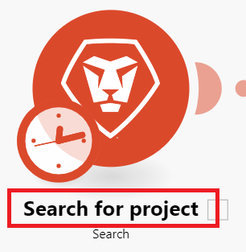

# 基本的なシナリオの作成

Adobe Workfront Fusion の役割は、プロセスを自動化して、同じ作業を何度も繰り返すのではなく、新しい作業に集中できるようにすることです。 これは、アプリ内やサービス内、およびそれらの間でアクションをリンクし、データを自動的に転送および変換するシナリオを作成することで機能します。作成するシナリオは、アプリまたはサービス内のデータを監視し、そのデータを処理して必要な結果を提供します。

この例では、Workfrontでリクエストを検索し、によってリクエストがプロジェクトに変換されるシナリオの作成プロセスを説明します。

## アクセス要件

+++ 展開すると、この記事の機能のアクセス要件が表示されます。

この記事で説明している機能を使用するには、次のアクセス権が必要です。

<table style="table-layout:auto">
 <col> 
 <col> 
 <tbody> 
  <tr> 
   <td role="rowheader">Adobe Workfront パッケージ</td> 
   <td> 
任意
 </td> 
  </tr> 
  <tr data-mc-conditions=""> 
   <td role="rowheader">Adobe Workfront プラン</td> 
   <td> 
新規：標準

または

現在：[!UICONTROL Work] 以上
 </td> 
  </tr> 
  <tr> 
   <td role="rowheader">Adobe Workfront Fusion ライセンス**</td> 
   <td>
   
現在：Workfront Fusion ライセンスは必要ありません。

   
または

   
レガシー：任意 

   </td> 
  </tr> 
  <tr> 
   <td role="rowheader">製品</td> 
   <td>
   
新規：
 <ul><li>[!UICONTROL Select] または [!UICONTROL Prime] Workfront プラン：組織はAdobe Workfront Fusion を購入する必要があります。</li><li>[!UICONTROL Ultimate] Workfront プラン：Workfront Fusion が含まれています。</li></ul>
   
または

   
現在：Adobe Workfront Fusion を購入する必要があります。

   </td> 
  </tr>
 </tbody> 
</table>

このテーブルの情報について詳しくは、[&#x200B; ドキュメントのアクセス要件 &#x200B;](/help/workfront-fusion/references/licenses-and-roles/access-level-requirements-in-documentation.md) を参照してください。

Adobe Workfront Fusion ライセンスについて詳しくは、[Adobe Workfront Fusion ライセンス &#x200B;](/help/workfront-fusion/set-up-and-manage-workfront-fusion/licensing-operations-overview/license-automation-vs-integration.md) を参照してください。

+++

## 練習シナリオを作成

### シナリオの作成を開始

1. **シナリオ** エリアで、「**新しいシナリオを作成**」をクリックします。

   「シナリオ」領域を見つけるには、[Workfront Fusion に移動 &#x200B;](/help/workfront-fusion/get-started-with-fusion/navigate-fusion/navigate-workfront-fusion.md) を参照してください。

   シナリオエディターが表示され、中央に空のモジュールが含まれます。

1. 左上隅の **[!UICONTROL 新規シナリオ]** プレースホルダー名を選択し、名前を入力します。
1. [&#x200B; 最初のモジュールを追加して設定 &#x200B;](#add-and-configure-the-first-module) を続行します。

### 最初のモジュールを追加して設定

1. 空のモジュールをクリックして、モジュールを選択するアプリを選択します。

   アプリのリストがモジュールの右側に表示されます。

1. 「**Adobe Workfront**」を選択します。 表示されない場合は、リストの下部にある検索バーをクリックして「Workfront」と入力し、リストに表示されたら選択します。

   リストが変わり、使用可能なすべてのWorkfront モジュールが表示されます。

1. **[!UICONTROL 検索]** モジュールをクリックします。

   モジュール設定ウィンドウが開きます。

1. 「[!UICONTROL &#x200B; 接続 &#x200B;]」ボックスで、Workfront接続を選択します。

   Workfrontに接続されていない場合は、[&#x200B; 接続の作成 &#x200B;](/help/workfront-fusion/create-scenarios/connect-to-apps/connect-to-fusion-general.md) を参照してください
1. 「[!UICONTROL &#x200B; レコードタイプ &#x200B;]」ボックスで、「**[!UICONTROL イシュー]**」を選択します。 これにより、モジュールはリクエストを含む問題のみを検索するように設定されます。

   「**[!UICONTROL イシュー]**」という単語を入力し始めると、リストに [!UICONTROL &#x200B; イシュー &#x200B;] が表示されます。

1. 「**[!UICONTROL 結果セット]**」ボックスで、「**[!UICONTROL 最初に一致したレコード]**」を選択します。

   これにより、条件を満たす最初のレコードのみを返すようにモジュールが設定されます。
1. **[!UICONTROL 検索条件]** 領域で、特定のタスクを返す条件を設定します。

   1. [!UICONTROL &#x200B; 検索条件 &#x200B;] の最初のボックスで、検索に含めるフィールドを選択します。 この例では、「**[!UICONTROL 名前]**」を選択します。

      「**[!UICONTROL name]**」という単語を入力し始めると、リストに [!UICONTROL name] が表示されます。
   1. オペレーターの場合は、「存在する **の横にあるドロップダウン矢印をクリックし** 「含む [!UICONTROL **大文字と小文字を区別しない）**] に変更します。

      これにより、名前全体を入力しない場合または名前に大文字と小文字を区別せずに入力した場合でも、モジュールは名前に選択した単語を含むプロジェクトを検索できます（すべて大文字など）。
   1. [!UICONTROL &#x200B; 検索条件 &#x200B;] の下の最後のフィールドに、検索するタスクの名前に含まれていることがわかっている単語または語句を入力します。

1. **[!UICONTROL 出力]**&#x200B;リストで、モジュールを出力するフィールドを選択します。この例では、「**[!UICONTROL ID]**」フィールドおよび「**[!UICONTROL 名前]**」フィールドを選択します。

   >[!TIP]
   >
   >**Cmd+F**（[!DNL Mac] OS）または **Ctrl+F**（[!DNL Windows] OS）を使用して、すばやくフィールドを検索できます。

1. **[!UICONTROL OK]** をクリックして、モジュール設定を保存します。

1. モジュールを右クリックして **[!UICONTROL 名前を変更]** をクリックし、モジュールで実行する内容を示す名前（「リクエストを検索」など）を入力して **[!UICONTROL OK]** をクリックします。

   名前はモジュールのすぐ下に表示されます。次に、Workfront Fusion でモジュールが実行するアクションの種類について簡単に説明します。

   

1. [2 つ目のモジュールを追加して設定](#add-and-configure-the-second-module)に進みます。

## 2 つ目のモジュールを追加して設定

1. モジュールの右側にある部分的な円にポインタを合わせ、「**[!UICONTROL 別のモジュールを追加]**」をクリックします。
1. アプリケーションのリストから「Adobe Workfront」を選択し、モジュール **[!UICONTROL オブジェクトを変換]** を選択します。
1. 「[!UICONTROL &#x200B; 接続 &#x200B;]」フィールドで、前のモジュールで使用したのと同じWorkfront接続を選択します。
1. モジュールによってイシューが変換されるので、「**[!UICONTROL レコードタイプ]**」フィールドで「**[!UICONTROL イシュー]**」を選択します。
1. **[!UICONTROL 変換先]** フィールドで、「**プロジェクト**」を選択します。
1. 「タスク ID」フィールドの横にある「マップ」切替スイッチをクリックして有効にします。

   切替スイッチが有効になると青に変わります。 これにより、前のモジュールからタスク ID をマッピングできます。

   
1. 「**[!UICONTROL タスク ID]**」フィールドをクリックします。

   パネルが開き、プロジェクトに変換するタスクの ID として使用するものを選択できます。 マッピングを有効にしたため、パネルには以前のモジュールからの出力が含まれます。 以前のモジュールの出力として ID を選択したので、パネルで使用できるようになりました。

   このパネルは、マッピングパネルと呼ばれます。 マッピングパネルについて詳しくは、[&#x200B; マッピングの概要 &#x200B;](/help/workfront-fusion/get-started-with-fusion/understand-fusion/mapping-overview.md) を参照してください。
1. マッピングパネルで **ID** を選択します。

   「ID」フィールドに ID ブロックが表示されます。 マッピング元のモジュールの数と、マッピングされたフィールドが表示されます。

   

1. 「**テンプレート ID**」フィールドをクリックし、このプロジェクトに使用するWorkfront テンプレートの名前の入力を開始し、リストに表示されたら選択します。
1. **[!UICONTROL OK]** をクリックして、モジュール設定を保存します。

1. モジュールを右クリックして **[!UICONTROL 名前を変更]** をクリックし、モジュールで実行する内容を示す名前（「プロジェクトに変換」など）を入力して **[!UICONTROL OK]** をクリックします。

1. [&#x200B; シナリオのテスト &#x200B;](#test-the-scenario) に進みます。

## シナリオのテスト

シナリオをアクティベートする前にテストすることが重要です。少なくとも 1 回実行して結果を確認します。これは、シナリオにおけるデータの流れを理解し、エラーを見つけるのに役立ちます。

このシナリオでは、テストが成功すると、リクエストが見つかり、プロジェクトに変換されます。

1. シナリオエディターの左下隅にある「**[!UICONTROL 1 回実行]**」をクリックします。
1. シナリオの実行が完了したら、最初のモジュールの上にあるバブルをクリックして、モジュールが処理したデータのバンドルに関する情報（モジュールが返した要求から取り込まれたデータを含む）を表示できます。

1. 2 番目のモジュールの上にある実行インスペクターのバブルをクリックして、入力（要求）と出力（変換されたプロジェクト）を確認します。

   検査バブル内のデータの詳細については、以下を参照してください。

   * 一般情報については、[&#x200B; シナリオ実行フロー &#x200B;](/help/workfront-fusion/references/scenarios/scenario-execution-flow.md) を参照してください。
   * 処理されたバンドルについて詳しくは、[&#x200B; シナリオ実行、サイクル、フェーズ &#x200B;](/help/workfront-fusion/references/scenarios/scenario-execution-cycles-phases.md) を参照してください。

1. Workfront Fusion で、左下隅付近の **[!UICONTROL 保存]** をクリックして、シナリオの進捗を保存します。

   >[!IMPORTANT]
   >
   >シナリオを改良、テストするたびに保存するようにしてください。

>[!TIP]
>
>各モジュールに関するメモを追加する方法として、任意ではあるものの便利な方法をお勧めします。
>
>1. モジュールを右クリックし、「**[!UICONTROL メモを追加]**」を選択します。
>1. 表示されるメモに、モジュールの概要を入力します。
>
>    1 つのモジュールに複数のノートを追加できます。
>
>1. **[!UICONTROL メモ]**&#x200B;エリアを閉じます。
>
>     シナリオにメモを追加すると、シナリオエディターの下部にある **[!UICONTROL メモ]** アイコン  にドットが表示されます。
>
>1. **[!UICONTROL メモ]** アイコン  をクリックして、メモを表示します。 メモを開くと、メモアイコンの周囲に円が表示されます。
>

## シナリオをアクティベート

シナリオを作成するための最後の手順は、シナリオをアクティブ化することです。

このシナリオでは特定の問題を検索するので、アクティブ化する必要はありません。 シナリオをアクティブ化すると、スケジュールに従って、またはアプリケーションで特定のアクションが発生したときにシナリオが実行されます。 シナリオをアクティベートすると、デフォルトでは 15 分ごとに実行されます。これは、実行するタイミングと頻度を定義することで変更できます。

シナリオのアクティブ化の詳細については、[&#x200B; シナリオのアクティブ化または非アクティブ化 &#x200B;](/help/workfront-fusion/manage-scenarios/activate-deactivate-scenarios.md) を参照してください。

スケジュールについては、[&#x200B; シナリオのスケジュール &#x200B;](/help/workfront-fusion/create-scenarios/config-scenarios-settings/schedule-a-scenario.md) を参照してください。

## 次のステップ

* [トリガーモジュールを追加 &#x200B;](/help/workfront-fusion/build-practice-scenarios/add-a-webhook-to-basic-scenario.md) して、シナリオが定期的に新しいリクエストを検索し、プロジェクトに変換できるようにします。
* [Webhook を追加 &#x200B;](/help/workfront-fusion/build-practice-scenarios/add-a-webhook-to-basic-scenario.md) して、リクエストが入力されるたびにシナリオを実行できるようにします。
* [&#x200B; フィルターを追加 &#x200B;](/help/workfront-fusion/build-practice-scenarios/add-filter-basic-scenario.md) して、特定のリクエストのみがプロジェクトに変換されるようにします。
* 新しいプロジェクトの名前をカスタマイズする [&#x200B; 関数を追加 &#x200B;](/help/workfront-fusion/build-practice-scenarios/use-function-to-build-practice-scenario.md) します。
