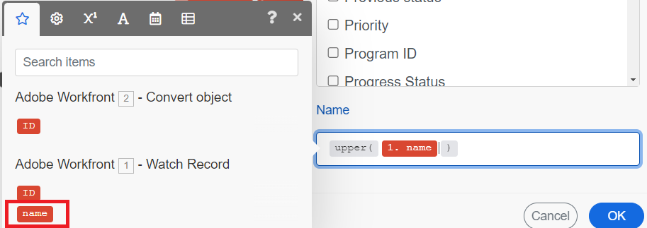

# 関数を使用した基本シナリオのプロジェクトの更新

Workfront作業項目の更新は、Workfront Fusionの一般的な使用例です。 この例では、関数を使用して、プロジェクトの名前を大文字に変更します。

Fusionには、データに対して条件付きロジックを変換および実行できる多くのタイプの関数が含まれています。 関数の使用について詳しくは、[関数の概要](/help/workfront-fusion/get-started-with-fusion/understand-fusion/function-overview.md)を参照してください。

この例では、[基本シナリオの作成](/help/workfront-fusion/build-practice-scenarios/create-basic-scenario.md)で作成したシナリオを変更します。

## アクセス要件

+++ 展開すると、この記事の機能のアクセス要件が表示されます。

<table style="table-layout:auto">
 <col> 
 <col> 
 <tbody> 
  <tr> 
   <td role="rowheader">Adobe Workfront パッケージ</td> 
   <td> 
任意の Adobe Workfront Workflow パッケージと任意の Adobe Workfront Automation および Integration パッケージ

Workfront Ultimate

Workfront Fusion を追加購入した Workfront Prime および Select パッケージ。
 </td> 
  </tr> 
  <tr data-mc-conditions=""> 
   <td role="rowheader">Adobe Workfront ライセンス</td> 
   <td> 
標準

Work またはそれ以上
 </td> 
  </tr> 
  <tr> 
   <td role="rowheader">製品</td> 
   <td>
   
組織が Workfront Automation および Integration を含まない Select またはPrime Workfront パッケージを持っている場合は、Adobe Workfront Fusion を購入する必要があります。</li></ul>
   </td> 
  </tr>
 </tbody> 
</table>

この表の情報について詳しくは、[ドキュメントのアクセス要件](/help/workfront-fusion/references/licenses-and-roles/access-level-requirements-in-documentation.md)を参照してください。

+++

## 前提条件

この手順に従う前に、[基本シナリオの作成](/help/workfront-fusion/build-practice-scenarios/create-basic-scenario.md)で説明したシナリオを作成する必要があります。

## 関数を使用したプロジェクトの更新

### Update Record モジュールをシナリオに追加します

1. シナリオエディターでシナリオを開きます。
1. 2番目のモジュールの右側にある部分円にカーソルを合わせ、**[!UICONTROL 別のモジュールを追加]**&#x200B;をクリックします。
1. アプリケーションのリストから「Adobe Workfront」を選択し、「**[!UICONTROL レコードを更新]**」モジュールを選択します。
1. 「ID」フィールドで、オブジェクトを変換モジュールの下にあるID ブロックを選択します。 これは、そのモジュールによって出力されたプロジェクトのIDです。

   Convert オブジェクトからの

1. 更新するオブジェクトがプロジェクトであるため、「レコードタイプ」フィールドで「プロジェクト」を選択します。
1. 「マップするフィールドを選択」領域で、「名前」を選択します。

   「名前」フィールドが開きます。
1. 続行[名前update](#map-the-function-for-the-name-update)の関数のマッピングを行います。

### 名前の更新のための関数のマッピング

このシナリオでリクエストをプロジェクトに変換する場合、プロジェクトの名前はリクエストと同じです。 ここでの関数は、その名前を取得し、その中のすべての文字を大文字にします。

1. 「**名前**」フィールドをクリックします。

   マッピングパネルが開きます。
1. マッピングパネルで、**テキスト関数とバイナリ関数** アイコンをクリックします。 
1. 関数&#x200B;**upper**&#x200B;を選択します。

   関数は、「名前」フィールドに表示されます。これには、想定される入力の書式が含まれます。

   この例の入力は、プロジェクトが変換されたイシューの名前です。

1. 入力が行われる場所なので、括弧の間にカーソルを移動します。
1. マッピングパネルで、**モジュール出力** アイコンをクリックします。 
1. 最初のモジュールによって出力された名前ブロックを選択します。

   名前ブロックが関数に表示されます。

   の名前ブロック

1. 「**OK**」をクリックして、モジュール設定を保存します。

### 検証と活用

1. 画面の左下隅にある「**1回実行**」をクリックして、シナリオをテストします。
1. 出力を調べて、シナリオが期待どおりに実行されていることを確認します。
1. シナリオが期待どおりに機能していることを確認したら、画面の左下にある&#x200B;**スケジュール** トグルを&#x200B;**オン**&#x200B;にクリックします。

   これにより、シナリオがアクティブになります。 アクティブなシナリオは、トリガーモジュールで設定されたスケジュールに従って実行されます。
1. Workfront Fusionで、左下隅付近の&#x200B;**[!UICONTROL 保存]**&#x200B;をクリックして、シナリオの進行状況を保存します。

   >[!IMPORTANT]
   >
   >シナリオの磨き上げやテストの際に、頻繁に節約しましょう。 シナリオをトリガーするには、Workfront アカウントで新しいイシューを作成する必要がある場合があります。

## リソース

* [組み込み関数を使用したアイテムのマッピング](/help//workfront-fusion/create-scenarios/map-data/map-using-functions.md)
