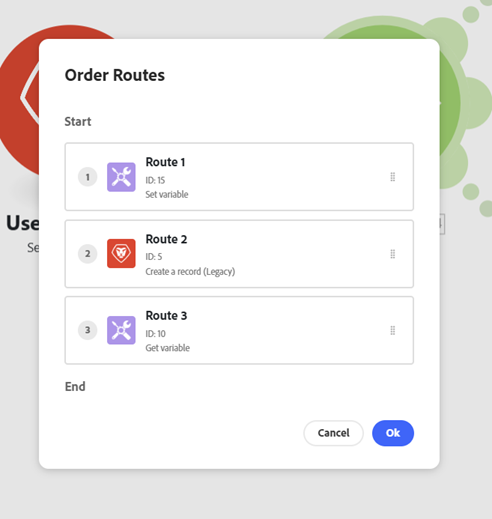

# ルーターモジュールの追加とルートの設定

ルーターモジュールを使用すると、シナリオを複数のルートに分岐し、各ルート内のデータを異なる方法で処理できます。 ルーターモジュールがバンドルを受信すると、ルーターモジュールにルートが取り付けられた順序で、接続されている各ルートに転送されます。

ルートは、並列ではなく順番に処理されます。 バンドルは、前のルートで完全に処理されるまで、次のルートに送信されません。

## アクセス要件

+++ 展開すると、この記事の機能のアクセス要件が表示されます。

<table style="table-layout:auto">
 <col> 
 <col> 
 <tbody> 
  <tr> 
   <td role="rowheader">Adobe Workfront パッケージ</td> 
   <td> 
任意の Adobe Workfront Workflow パッケージと任意の Adobe Workfront Automation および Integration パッケージ

Workfront Ultimate

Workfront Fusion を追加購入した Workfront Prime および Select パッケージ。
 </td> 
  </tr> 
  <tr data-mc-conditions=""> 
   <td role="rowheader">Adobe Workfront ライセンス</td> 
   <td> 
標準

Work またはそれ以上
 </td> 
  </tr> 
  <tr> 
   <td role="rowheader">製品</td> 
   <td>
   
組織が Workfront Automation および Integration を含まない Select またはPrime Workfront パッケージを持っている場合は、Adobe Workfront Fusion を購入する必要があります。</li></ul>
   </td> 
  </tr>
 </tbody> 
</table>

この表の情報について詳しくは、[ドキュメントのアクセス要件](/help/workfront-fusion/references/licenses-and-roles/access-level-requirements-in-documentation.md)を参照してください。

+++

## シナリオへのルーターモジュールの追加

ルートを設定する前に、ルーターモジュールを追加する必要があります。

1. 左側のパネルの「**[!UICONTROL シナリオ]**」タブをクリックします。
1. ルーターを追加するシナリオを選択します。
1. シナリオの任意の場所をクリックして、シナリオエディターに入ります。
1. シナリオエディターで、ルーターを追加するモジュールの右側のハンドルをクリックし、表示されるモジュールのリストで&#x200B;**[!UICONTROL フロー制御]** > **ルーター**&#x200B;を選択します。

   

   または

   2つのモジュール間にルーターモジュールを挿入するには、2つのモジュールを接続するルートの下にあるレンチアイコンをクリックし、メニューから「**[!UICONTROL ルーターを追加]**」を選択します。

   
1. ルータの右側のハンドルをクリックしてモジュールを追加し、任意のモジュールを追加するのと同様に、ルータへの最初のルートを追加します。
1. 別のルートを追加するには、ルーターモジュールをクリックします。 ルートが表示されます。 必要に応じてこのルートにモジュールを追加します。

   必要なだけルートを追加できます。

1. ルートの順序を確認するには、各ルートのラベルを確認します。 ルート 1が最初に実行され、次にルート 2が実行されます。

   または

   自動整列アイコン をクリックします。

   ルートは、実行される順に配置されます。 一番上のルートが最初に実行されます。

1. （オプション）ルートの順序を変更するには、ルーターモジュールを右クリックし、**ルートの順序**&#x200B;を選択します。ルートを実行する順序にドラッグ&amp;ドロップします。 ルートは、ルータに続く最初のモジュール（ルートの最初のモジュール）によってマークされます。

   

1. （オプション）ルートを無効にするには、ルーターからそのルートに導くドットを右クリックし、**ルートを無効にする**&#x200B;を選択します。

   無効なルートには、ルーターからルート上の最初のモジュールに至るグレーのドットが表示され、無効なルート アイコン がラベルに表示されます。

1. （オプションおよび条件付き）無効なルートを有効にするには、ルートのラベルにある無効なルートアイコン をクリックします。
1. 続行[&#x200B; ルートにフィルターを追加](#add-a-filter-to-a-route)します。

## ルートへのフィルターの追加

ルーターモジュールの後のルートにフィルターを配置して、バンドルをフィルタリングできます。 フィルターを通過するバンドルのみが、ルート上のモジュールによって処理されます。

データが複数のルートのフィルターを通過する場合、データは両方のルートで処理されます。 一番上のルートが最初にデータを処理します。

フィルターを含むルーターには、ルートラベルにフィルターアイコン が表示されます。

1. 左側のパネルの「**[!UICONTROL シナリオ]**」タブをクリックします。
1. フィルターを追加するシナリオを選択します。
1. シナリオの任意の場所をクリックして、シナリオエディターに入ります。
1. フィルターを設定するパスのレンチアイコン をクリックします。 これは、ルータ モジュールとルートの最初のモジュールとの間のパスです。
1. **フィルターを設定を選択します。**
1. 表示されるパネルの「ラベル」フィールドに、ラベルを追加します。 このラベルはシナリオに表示されます。
1. フィルター条件を設定します。

   詳しくは、[シナリオへのフィルターの追加](/help/workfront-fusion/create-scenarios/add-modules/add-a-filter-to-a-scenario.md)を参照してください。

1. **[!UICONTROL OK]**&#x200B;をクリックして、フィルター設定を保存します。
1. （条件付き）フィルター名が長すぎてラベルに収まらない場合は、ラベルにカーソルを合わせると、名前の全体が表示されます。

1. [&#x200B; フォールバックルートの設定](#configure-a-fallback-route)に進みます。

## フォールバックルートの設定

フォールバックルートは、フィルターを別のルートに渡さないバンドルで実行されるルートです。

フォールバックルートでは、ラベルに「フォールバック」が表示されます。

フィルターパネルでフォールバックルートを有効にすることができます。

1. 左側のパネルの「**[!UICONTROL シナリオ]**」タブをクリックします。
1. フォールバックルートを追加するシナリオを選択します。
1. シナリオの任意の場所をクリックして、シナリオエディターに入ります。
1. フィルターを設定するパスのレンチアイコン をクリックします。 これは、ルータ モジュールとルートの最初のモジュールとの間のパスです。
1. **フィルターを設定を選択します。**
1. 表示されるパネルの「ラベル」フィールドに、ラベルを追加します。 このラベルはシナリオに表示されます。
1. フォールバックルートチェックボックスを有効にします。

   

1. **[!UICONTROL OK]**&#x200B;をクリックして、フィルター設定を保存します。

フォールバックルートは、ルーターモジュールで別の矢印でマークされます。

## 例：`if/else` ユースケース

>[!BEGINSHADEBOX]

フォールバックルートの一般的な使用例は、条件が満たされた場合は1つのルートで、満たされていない場合は別のルートでフローを続行することです。 次の手順に従います。

この例では、最初のルートはフィルターで設定されています。 これは、`if` コンポーネントを表します。

2つ目のルートは、フォールバックルートとして設定されます。 これは、`else` コンポーネントを表します。

>[!ENDSHADEBOX]
