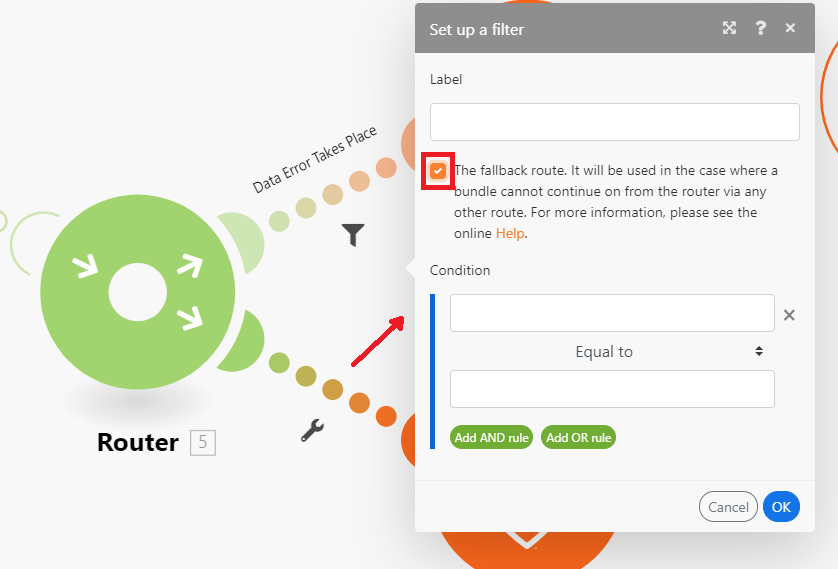

# ルーターモジュールの追加とルートの設定

ルーターモジュールを使用すると、シナリオを複数のルートに分岐し、各ルート内のデータを異なる方法で処理できます。 ルーターモジュールは、バンドルを受信すると、ルートがルーターモジュールにアタッチされた順に、接続された各ルートに転送します。

ルートは、並列ではなく順番に処理されます。バンドルは、前のルートで完全に処理されるまで、次のルートに送信されません。

## アクセス要件

+++ 展開すると、この記事の機能のアクセス要件が表示されます。

この記事で説明している機能を使用するには、次のアクセス権が必要です。

<table style="table-layout:auto">
 <col> 
 <col> 
 <tbody> 
  <tr> 
   <td role="rowheader">[!DNL Adobe Workfront] package</td> 
   <td> 
任意
 </td> 
  </tr> 
  <tr data-mc-conditions=""> 
   <td role="rowheader">[!DNL Adobe Workfront] ライセンス</td> 
   <td> 
新規：[!UICONTROL Standard]

または

現在：[!UICONTROL Work] 以上
 </td> 
  </tr> 
  <tr> 
   <td role="rowheader">[!DNL Adobe Workfront Fusion] ライセンス**</td> 
   <td>
   
現在：[!DNL Workfront Fusion] ライセンスは必要ありません。

   
または

   
レガシー：任意 

   </td> 
  </tr> 
  <tr> 
   <td role="rowheader">製品</td> 
   <td>
   
新規：
 <ul><li>[!UICONTROL Select] または [!UICONTROL Prime] [!DNL Workfront] プラン：[!DNL Adobe Workfront Fusion] を購入してください。</li><li>[!UICONTROL Ultimate] [!DNL Workfront] プラン：[!DNL Workfront Fusion] が含まれています。</li></ul>
   
または

   
現在：[!DNL Adobe Workfront Fusion] を購入する必要があります。

   </td> 
  </tr>
 </tbody> 
</table>

このテーブルの情報について詳しくは、[ ドキュメントのアクセス要件 ](/help/workfront-fusion/references/licenses-and-roles/access-level-requirements-in-documentation.md) を参照してください。

[!DNL Adobe Workfront Fusion] ライセンスについて詳しくは、[[!DNL Adobe Workfront Fusion] ライセンス](/help/workfront-fusion/set-up-and-manage-workfront-fusion/licensing-operations-overview/license-automation-vs-integration.md)を参照してください。

+++

## シナリオへのルーターモジュールの追加

ルートを設定する前に、ルーターモジュールを追加する必要があります。

1. 左側のパネルで「**[!UICONTROL シナリオ]**」タブをクリックします。
1. ルーターを追加するシナリオを選択します。
1. シナリオの任意の場所をクリックして、シナリオエディターに移動します。
1. シナリオエディターで、ルーターを追加するモジュールの右側のハンドルをクリックします。
1. 表示されるモジュールのリストで、**[!UICONTROL フロー制御]**/**ルーター** を選択します。

   

   または

   2 つのモジュールの間にルーターモジュールを挿入するには、2 つのモジュールを接続するルートの下にあるレンチアイコンをクリックし、メニューから **[!UICONTROL ルーターを追加]** を選択します。

   
1. 任意のモジュールを追加するのと同様に、ルーターの右側のハンドルをクリックしてモジュールを追加することで、ルーターへの最初のルートを追加します。
1. 別のルートを追加するには、ルーターモジュールをクリックします。 ルートが表示されます。 必要に応じて、このルートにモジュールを追加します。

   必要な数だけルートを追加できます。

1. ルートの順序を確認するには、自動位置合わせアイコン  をクリックします。

   ルートは、実行する順序に並べられます。 最上位ルートが最初に実行されます。

1. （オプション）ルートの順序を変更するには、ルーターモジュールを右クリックして **ルートを注文** を選択します。ルートを実行する順序でドラッグ&amp;ドロップします。 ルートは、ルータに続く最初のモジュール（ルートの最初のモジュール）によってマークされます。

   

1. [ ルートへのフィルターの追加 ](#add-a-filter-to-a-route) を続行します。

## ルートへのフィルターの追加

ルーターモジュールの後のルートにフィルターを設定して、バンドルをフィルタリングできます。 フィルターを通過するバンドルのみがルート上のモジュールで処理されます。

データが複数のルートのフィルターを通過した場合、データは両方のルートで処理されます。 最上位ルートが最初にデータを処理します。

1. 左側のパネルで「**[!UICONTROL シナリオ]**」タブをクリックします。
1. フィルターを追加するシナリオを選択します。
1. シナリオの任意の場所をクリックして、シナリオエディターに移動します。
1. フィルターを設定するパス上のレンチアイコン  をクリックします。 これは、ルータ モジュールとルートの最初のモジュールの間のパスです。
1. **フィルターを設定** を選択します。
1. 表示されるパネルのラベルフィールドに、ラベルを追加します。 このラベルは、シナリオに表示されます。
1. フィルター条件を設定します。

   詳しくは、[ シナリオへのフィルターの追加 ](/help/workfront-fusion/create-scenarios/add-modules/add-a-filter-to-a-scenario.md) を参照してください。

1. **[!UICONTROL OK]** をクリックして、フィルター設定を保存します。

1. [ フォールバックルートの設定 ](#configure-a-fallback-route) を続行します。

## フォールバックルートの設定

フォールバックルートは、フィルターを別のルートに渡さないバンドルで実行されるルートです。

フィルターパネルでフォールバックルートを有効にすることができます。

1. 左側のパネルで「**[!UICONTROL シナリオ]**」タブをクリックします。
1. フォールバックルートを追加するシナリオを選択します。
1. シナリオの任意の場所をクリックして、シナリオエディターに移動します。
1. フィルターを設定するパス上のレンチアイコン  をクリックします。 これは、ルータ モジュールとルートの最初のモジュールの間のパスです。
1. **フィルターを設定** を選択します。
1. 表示されるパネルのラベルフィールドに、ラベルを追加します。 このラベルは、シナリオに表示されます。
1. 「フォールバックルート」チェックボックスを有効にします。

   

1. **[!UICONTROL OK]** をクリックして、フィルター設定を保存します。

フォールバック ルートは、ルータ モジュールで別の矢印でマークされます。

## 例：`if/else` のユースケース

>[!BEGINSHADEBOX]

フォールバックルートの一般的なユースケースは、条件が満たされた場合は 1 つのルートで、満たされなかった場合は別のルートでフローを続行することです。 手順は次のとおりです。

この例では、最初のルートはフィルターを使用して設定されています。 これは、`if` コンポーネントを表します。

2 番目のルートは、フォールバック ルートとして設定されます。 これは、`else` コンポーネントを表します。

>[!ENDSHADEBOX]
