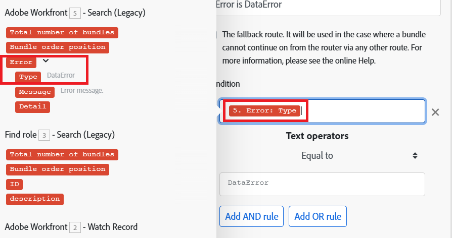
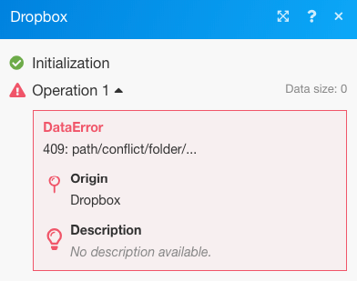
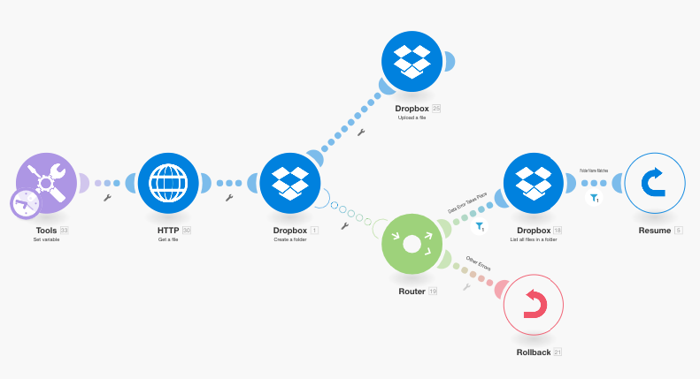
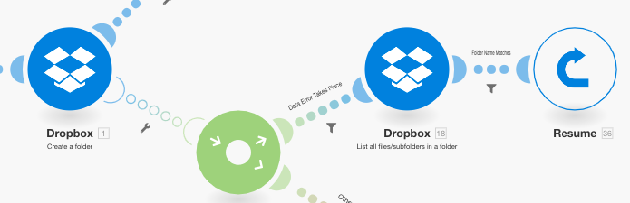
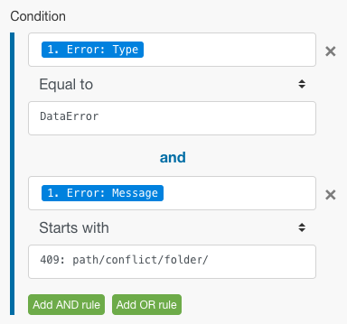
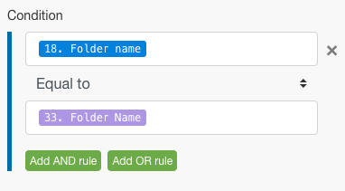
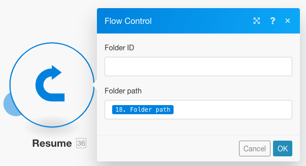
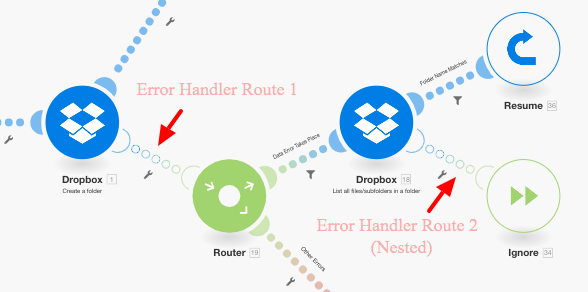

# エラー処理ルートへのフィルタリングとネストの追加

フィルターとネストを含めることで、エラー処理ルートに高度なエラー処理技術を追加できます。

## アクセス要件

+++ 展開すると、この記事の機能のアクセス要件が表示されます。

<table style="table-layout:auto">
 <col> 
 <col> 
 <tbody> 
  <tr> 
   <td role="rowheader">Adobe Workfront パッケージ</td> 
   <td> 
任意の Adobe Workfront Workflow パッケージと任意の Adobe Workfront Automation および Integration パッケージ

Workfront Ultimate

Workfront Fusion を追加購入した Workfront Prime および Select パッケージ。
 </td> 
  </tr> 
  <tr data-mc-conditions=""> 
   <td role="rowheader">Adobe Workfront ライセンス</td> 
   <td> 
標準

Work またはそれ以上
 </td> 
  </tr> 
  <tr> 
   <td role="rowheader">製品</td> 
   <td>
   
組織が Workfront Automation および Integration を含まない Select またはPrime Workfront パッケージを持っている場合は、Adobe Workfront Fusion を購入する必要があります。</li></ul>
   </td> 
  </tr>
 </tbody> 
</table>

この表の情報について詳しくは、[ドキュメントのアクセス要件](/help/workfront-fusion/references/licenses-and-roles/access-level-requirements-in-documentation.md)を参照してください。

+++

## フィルタリング

エラーハンドラールートで実行できるフィルタリングには 2 種類あります。

* [エラーハンドラーのルートにフィルターを追加する](#add-a-filter-to-the-error-handler-route)
* [ルーターを追加し、その後にフィルターをエラーハンドラールートに追加します](#add-a-router-followed-by-filters-to-the-error-handler)

### エラーハンドラーのルートにフィルターを追加する

フィルターを使用して、エラーハンドラールートで処理されるエラーを制御できます。 これにより、特定のタイプのエラーのみを処理できます。 エラーがフィルターを通過しない場合は、指定されたモジュールに対してエラーハンドラールートが定義されていないものとして扱われます。

これらのフィルターは、Fusionの他のフィルターと同様に設定されます。 手順については、[&#x200B; シナリオへのフィルターの追加](/help/workfront-fusion/create-scenarios/add-modules/add-a-filter-to-a-scenario.md)を参照してください。

### ルーターを追加し、その後にフィルターをエラーハンドラーに追加します

ルータをエラー処理ルートに追加すると、異なるタイプのエラーに対して異なるルートを設定できます。

例えば、エラーがDataErrorの場合に実行するルートを1つ設定するには、マッピングされたエラータイプがDataErrorと等しい場合にデータを通過させるフィルターを設定できます。

Fusionが様々なデータタイプを評価および処理する方法について詳しくは、[&#x200B; エラータイプ &#x200B;](/help/workfront-fusion/references/errors/error-processing.md)を参照してください。

### 例：フィルターを使用したエラー処理

>[!BEGINSHADEBOX]

このシナリオの例では、これらのフィルターがエラー処理でどのように機能するかを示します。

Dropbox/Create a folder moduleを使用し、同じ名前のフォルダーが既に存在する場合、そのフォルダーはDataErrorをスローします。

完全なシナリオは次のように機能します。

1. ツール/変数を設定モジュールには、フォルダー名が含まれます
1. HTTP/ファイルを取得モジュールは、フォルダーにアップロードする必要があるファイルを取得します
1. Dropbox/Create a folder モジュールは、モジュールにマッピングされているフォルダーと同じ名前のフォルダーが既に存在する場合にエラーをスローします
1. エラーハンドラーのルート（透明なバブル）には、エラーをフィルタリングするルーターが含まれています
最初のルートは、`DataError`という指定されたタイプのエラーです。

   1. `DataError`が発生し、エラーの詳細がフィルターを通過した場合、Dropbox/フォルダーモジュール内のすべてのファイル/サブフォルダーを一覧表示すると、Dropbox内のすべてのフォルダーが一覧表示されます。
   1. 後続のフィルターは、フォルダー名と一致します。
   1. **Resume** ディレクティブは、既存のフォルダーのフォルダーIDとフォルダーパスを指定し、シナリオの実行はDropbox/フォルダーモジュールの作成から再開します。 ただし、新しいフォルダーを作成する代わりに、FusionはResume ディレクティブの値を使用して次のモジュールに移動し、既存のフォルダーにファイルをアップロードします。

1. 2つ目のルートは、他のすべてのエラーに対するもので、Rollback ディレクティブで終了します。これにより、シナリオがすぐに停止されます

以下に、DataError ルートの詳細な説明を示します。

ファイルのアップロードなど、後続のモジュールで既存のフォルダーを使用するには、モジュールにエラーハンドラーのルートを追加し、次に示すResume ディレクティブモジュールにマッピングするフォルダーパスを取得する必要があります。

最初のルートのフィルターは、同じ名前のフォルダーが既に存在する場合に表示される特定のエラー（DataError）のみを処理するように設定されています。

Dropbox/フォルダーモジュール内のすべてのファイルを一覧表示は、ターゲットフォルダー内のすべてのフォルダーを返すように設定されています。 次のフィルターは、最初に作成しようとしていたもののみを渡します。 （フォルダー名は33に保存されます。 フォルダー名項目。）

次に、「再開」ディレクティブは、失敗したモジュールの出力としてフォルダーパスを提供します。 フォルダーIDは、ファイルモジュールをアップロードする際に必要ではないため、空白のままになっています。

>[!ENDSHADEBOX]

## ネスト

エラーハンドラールートは、ルーターを除くすべてのモジュールで作成および設定できます。 したがって、既に既存のエラーハンドラールートの一部となっているモジュールに対して、エラーハンドラールートを作成できます。

>[!BEGINSHADEBOX]

例：

フィルターを含むネストされたエラーハンドラーのルート：

このシナリオでは、2番目のエラーハンドラールートは、最初のエラーハンドラールートの下にネストされます。

Dropbox/Create a folder モジュールでエラーが発生した場合、実行は最初のルートに移動します。 `DataError Takes Place` フィルターを渡すと、次のモジュールが実行され、Dropbox/フォルダーモジュール内のすべてのファイル/サブフォルダーを一覧表示でエラーが発生しない場合は、再開ディレクティブモジュールが続きます。

ただし、Dropbox/フォルダーモジュールのすべてのファイル/サブフォルダーを一覧表示でエラーが発生した場合、実行はError Handler Route 2に移動し、[!UICONTROL Ignore] ディレクティブで終了します。 この場合、[!UICONTROL 再開ディレクティブ]モジュールは実行されません。

>[!ENDSHADEBOX]
