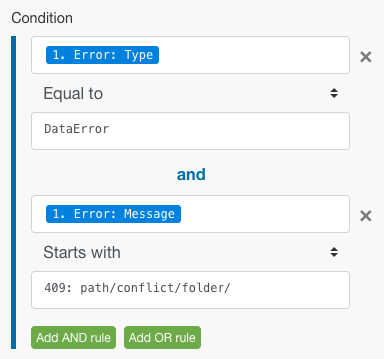

# エラー処理ルートへのフィルタリングとネストの追加

フィルタリングとネストを含めることで、エラー処理ルートに高度なエラー処理手法を追加できます。

## アクセス要件

+++ 展開すると、この記事の機能のアクセス要件が表示されます。

この記事で説明している機能を使用するには、次のアクセス権が必要です。

<table style="table-layout:auto">
 <col> 
 <col> 
 <tbody> 
  <tr> 
   <td role="rowheader">Adobe Workfront パッケージ 
   <td> 
任意
 </td> 
  </tr> 
  <tr data-mc-conditions=""> 
   <td role="rowheader">Adobe Workfront プラン</td> 
   <td> 
新規：標準

または

現在：ワーク以上
 </td> 
  </tr> 
  <tr> 
   <td role="rowheader">Adobe Workfront Fusion ライセンス**</td> 
   <td>
   
現在：Workfront Fusion ライセンス要件なし

   
または

   
レガシー：任意 

   </td> 
  </tr> 
  <tr> 
   <td role="rowheader">製品</td> 
   <td>
   
新規：
 <ul><li>Prime Workfront プランを選択する：組織がAdobe Workfront Fusion を購入する必要があります。</li><li>Ultimate Workfront プラン：Workfront Fusion が含まれています。</li></ul>
   
または

   
現在：Adobe Workfront Fusion を購入する必要があります。

   </td> 
  </tr>
 </tbody> 
</table>

このテーブルの情報について詳しくは、[ ドキュメントのアクセス要件 ](/help/workfront-fusion/references/licenses-and-roles/access-level-requirements-in-documentation.md) を参照してください。

Adobe Workfront Fusion ライセンスについて詳しくは、[Adobe Workfront Fusion ライセンス ](/help/workfront-fusion/set-up-and-manage-workfront-fusion/licensing-operations-overview/license-automation-vs-integration.md) を参照してください。

+++

## フィルタリング

エラーハンドラールートで実行できるフィルタリングには 2 種類あります。

* [エラーハンドラールートにフィルターを追加する](#add-a-filter-to-the-error-handler-route)
* [エラーハンドラールートにルーターを追加し、その後にフィルターを追加します](#add-a-router-followed-by-filters-to-the-error-handler)

### エラーハンドラールートにフィルターを追加する

フィルターを使用して、エラーハンドラールートで処理されるエラーを制御できます。これにより、特定のタイプのエラーのみを処理できます。エラーがフィルターを通過しない場合は、指定されたモジュールに対してエラーハンドラールートが定義されていないものとして扱われます。

これらのフィルターは、Fusion の他のフィルターと同様に設定されます。 手順については、[ シナリオへのフィルターの追加 ](/help/workfront-fusion/create-scenarios/add-modules/add-a-filter-to-a-scenario.md) を参照してください。

### ルーターを追加し、その後にフィルターを追加して、エラーハンドラーを削除します

エラー処理ルートにルータを追加すると、異なるタイプのエラーに対して異なるルートを設定できます。

例えば、エラーが DataError の場合に実行する 1 つのルートを設定するには、マッピングされたエラータイプが DataError の場合にデータを通過させるフィルターを設定できます。

Fusion が様々なデータタイプを評価して処理する方法について詳しくは、[ エラータイプ ](/help/workfront-fusion/references/errors/error-processing.md) を参照してください。

### 例：フィルターを使用したエラー処理

>[!BEGINSHADEBOX]

次のサンプルシナリオは、これらのフィルターがエラー処理でどのように機能するかを示しています。

Dropbox/フォルダーモジュールを作成を使用したときに、同じ名前のフォルダーが既に存在する場合は、モジュールが DataError をスローします。

完全なシナリオは次のように機能します。

1. ツール/変数を設定モジュールにフォルダー名が含まれています。
1. 「HTTP/ファイルを取得」モジュールは、フォルダーにアップロードする必要があるファイルを取得します
1. モジュールでマッピングされたフォルダーと同じ名前のフォルダーが既に存在する場合、Dropbox/フォルダーを作成モジュールはエラーをスローします
1. エラーハンドラールート（透明な泡）には、エラーをフィルタリングするルーターが含まれています
1 つ目のルートは、`DataError` と呼ばれる指定されたタイプのエラーに対するものです。

   1. `DataError` ラーが発生し、エラーの詳細がフィルターを通過する場合、Dropbox/フォルダーモジュール内のすべてのファイルやサブフォルダーを一覧表示には、Dropbox内のすべてのフォルダーが一覧表示されます。
   1. 後続のフィルターはフォルダー名と一致します。
   1. **Resume** ディレクティブは、既存フォルダーのフォルダー ID とフォルダーパスを指定し、Dropbox/フォルダーモジュールを作成からシナリオの実行が再開されます。 ただし、Fusion は、新しいフォルダーを作成する代わりに、再開ディレクティブの値を使用して次のモジュールに移動し、ファイルを既存のフォルダーにアップロードします。

1. 2 番目のルートは、他のすべてのエラーに対するルートで、最後にロールバックディレクティブが指定されます。これにより、シナリオがすぐに停止します

DataError ルートの詳細を以下に示します。

ファイルのアップロードなど、後続のモジュールで既存のフォルダーを使用するには、モジュールにエラーハンドラールートを追加し、次に示す再開ディレクティブモジュールにマッピングするフォルダーパスを取得する必要があります。

最初のルートのフィルターは、同じ名前のフォルダーが既に存在する場合に表示される特定のエラー（DataError）のみを処理するように設定されています。

Dropbox/フォルダーモジュール内のすべてのファイルをリストは、ターゲットフォルダー内のすべてのフォルダーを返すように設定されます。 次のフィルターは、最初に作成しようとしたフィルターのみを通過します。 （フォルダー名は 33 に保存されます。 フォルダー名項目。）

次に、再開ディレクティブは、失敗したモジュールの出力としてフォルダーパスを提供します。 フォルダー ID は、「ファイルをアップロード」モジュールでは必要ないので、空白のままです。

>[!ENDSHADEBOX]

## ネスト

エラーハンドラールートは、ルーターを除くすべてのモジュールで作成および設定できます。 そのため、既存のエラーハンドラールートに既に含まれているモジュールのエラーハンドラールートを作成できます。

>[!BEGINSHADEBOX]

例：

フィルターを含むネストされたエラーハンドラールート：

このシナリオでは、2 つ目のエラーハンドラールートが 1 つ目のエラーハンドラールートの下にネストされています。

「Dropbox/フォルダーを作成」モジュールでエラーが発生した場合、実行は最初のルートに移動します。 `DataError Takes Place` フィルターが渡されると、次のモジュールが実行され、Dropbox / フォルダーモジュール内のすべてのファイルやサブフォルダーのリストでエラーが発生しない場合は、再開ディレクティブモジュールが続きます。

ただし、Dropbox/フォルダーモジュール内のすべてのファイル/サブフォルダーをリストでエラーが発生した場合、実行はエラーハンドラールート 2 に移動し、[!UICONTROL &#x200B; 無視 &#x200B;] ディレクティブで終了します。 この場合、[!UICONTROL 再開ディレクティブ]モジュールは実行されません。

>[!ENDSHADEBOX]
