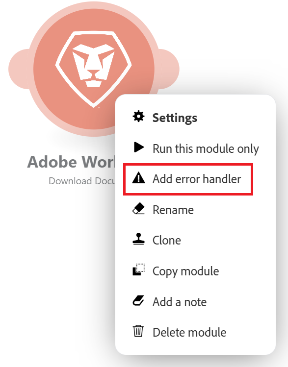
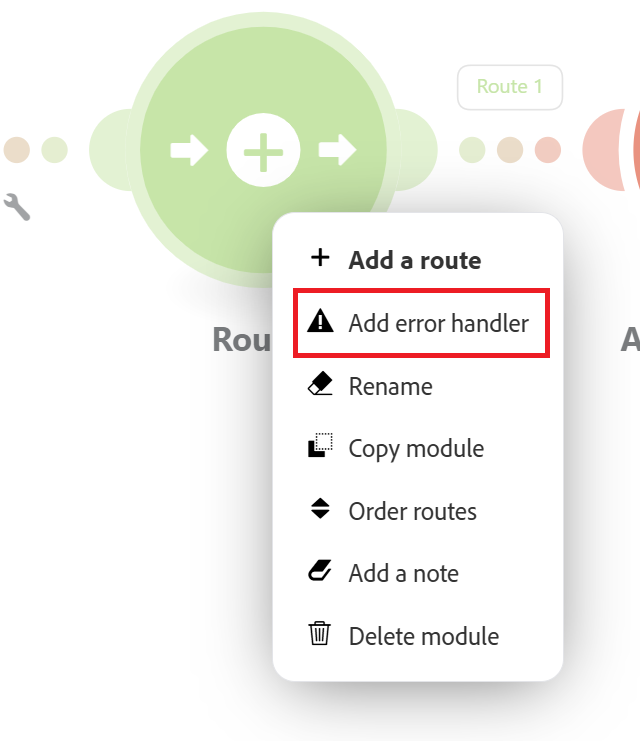

# エラー処理の追加

シナリオの実行中にエラーが発生する場合があります。

例えば、次の理由でエラーが発生する可能性があります。

* エラーのためサービスを利用できません
* サービスが予期しないデータで応答する
* 入力データの検証に失敗しました
* その他の理由

シナリオの実行中にモジュールがエラーに遭遇し、モジュールやそのルートにエラー処理ルートが添付されていない場合、デフォルトのエラー処理ロジックが実行されます。

エラーハンドラーをモジュールまたはルートに追加すると、デフォルトのエラー処理ロジックを独自のロジックに置き換えることができます。 Adobe Workfront Fusion には、エラーハンドラールートの末尾に挿入できる 5 つの異なるディレクティブが用意されています。

デフォルトのエラー処理について詳しくは、「[&#x200B; エラータイプ &#x200B;](/help/workfront-fusion/references/errors/error-processing.md)」を参照してください。

エラー処理ディレクティブについて詳しくは、「[&#x200B; エラー処理用のディレクティブ &#x200B;](/help/workfront-fusion/references/errors/directives-for-error-handling.md)」を参照してください。

>[!NOTE]
>
>Workfront Fusion は、ルートレベルのエラー処理をサポートしており、個々のモジュールにエラーハンドラーを付加するのではなく、ルートごとに 1 回、エラー処理のロジックを定義できます。
>ルートレベルのエラー処理は、特に高度な複数ブランチの自動化において、エラーを管理するためのよりスケーラブルで一貫性があり、アーキテクチャ上クリーンな方法なので、ベストプラクティスとしてルートレベルのエラー処理を使用することをお勧めします。

## アクセス要件

+++ 展開すると、この記事の機能のアクセス要件が表示されます。

<table style="table-layout:auto">
 <col> 
 <col> 
 <tbody> 
  <tr> 
   <td role="rowheader">Adobe Workfront パッケージ</td> 
   <td> 
任意の Adobe Workfront Workflow パッケージと任意の Adobe Workfront Automation および Integration パッケージ

Workfront Ultimate

Workfront Fusion を追加購入した Workfront Prime および Select パッケージ。
 </td> 
  </tr> 
  <tr data-mc-conditions=""> 
   <td role="rowheader">Adobe Workfront ライセンス</td> 
   <td> 
標準

Work またはそれ以上
 </td> 
  </tr> 
  <tr> 
   <td role="rowheader">製品</td> 
   <td>
   
組織が Workfront Automation および Integration を含まない Select またはPrime Workfront パッケージを持っている場合は、Adobe Workfront Fusion を購入する必要があります。</li></ul>
   </td> 
  </tr>
 </tbody> 
</table>

この表の情報について詳しくは、[ドキュメントのアクセス要件](/help/workfront-fusion/references/licenses-and-roles/access-level-requirements-in-documentation.md)を参照してください。

+++

## エラーハンドラーの場所と階層

エラーハンドラーは、個々のモジュールまたはルーターに追加できます。

モジュールに添付されたエラーハンドラーは、その特定のモジュールの処理中に発生したエラーのみをトリガーします。

ルータに接続されているエラーハンドラは、そのルータのルート上のモジュールで発生したエラーをトリガーします。 これには、独自のルーターにエラーハンドラーがない子ルートで発生したエラーが含まれます。

エラーは、次の階層で処理されます。

1. モジュール
2. ルーター
3. 親ルーター
4. デフォルトのエラー処理

>[!BEGINSHADEBOX]

### 例

次のシナリオ例について考えてみます。

1. このモジュールにはエラーハンドラーがあります。 このモジュールのエラーはすべてコミットディレクティブで処理されます。
1. このモジュールにはエラーハンドラーがありません。 このモジュールでエラーが発生した場合、エラーはモジュールのルートを作成したルーター上のハンドラーによって処理されます。 このモジュールのエラーはすべて、ロールバックディレクティブで処理されます。
1. このモジュールにはエラーハンドラも、モジュールのルートを作成したルータも含まれていませんが、次のルータ上にエラーハンドラがあります。 このモジュールのエラーは、Break ディレクティブで処理されます。

>[!NOTE]
>
>* モジュールがモジュール、そのルーター、または親ルーターにエラーハンドラーを持たない場合、そのモジュールのエラーはデフォルトのエラー処理で処理されます。
>* グローバルエラーハンドラーを作成するには、シナリオの先頭付近にルーターを作成し、そのルーターにエラー処理を添付します。

>[!ENDSHADEBOX]

## エラーハンドラーの追加

エラーハンドラーは、モジュールまたはルーターに追加できます。

* [モジュールへのエラーハンドラーの追加](#add-an-error-handler-to-a-module)
* [ルーターへのエラーハンドラーの追加](#add-an-error-handler-to-a-router)

### モジュールへのエラーハンドラーの追加

モジュールにエラーハンドラーを追加するには：

1. 左側のパネルで「**[!UICONTROL シナリオ]**」タブをクリックします。
1. エラー処理ルートを追加するシナリオを選択します。
1. シナリオの任意の場所をクリックして、シナリオエディターに移動します。
1. エラーハンドラールートを追加するモジュールを右クリックし、「**[!UICONTROL エラーハンドラーを追加]**」を選択します。

   

   エラーハンドラールートがモジュールに追加されます。 モジュールがルート内の最後のモジュールである場合、エラーハンドラーはモジュールの直後に配置されます。 モジュールの後にさらにモジュールがある場合は、別のエラーハンドラールートが追加されます。

   エラー処理モジュールは、ディレクティブのリストと、シナリオで使用されているアプリを表示します。

   

1. いずれかのディレクティブを選択します。

   または

   1 つ以上のモジュールをエラーハンドラールートに追加します。

   ルートにさらにモジュールを追加する場合、デフォルトで無視ディレクティブが適用されます。 エラーが発生した場合、そのルート上の後続のモジュールが処理されます。

   ディレクティブについて詳しくは、この記事の [&#x200B; エラー処理ディレクティブ &#x200B;](#error-handling-directives) を参照してください。

1. （任意）エラー処理ルートにフィルターを追加します。 手順については、[&#x200B; エラー処理ルートへのフィルタリングとネストの追加 &#x200B;](/help/workfront-fusion/create-scenarios/config-error-handling/advanced-error-handling.md) を参照してください。

>[!NOTE]
>
>エラーハンドラルートは透明な円で示され、通常のルートは不透明の円で示されます。

### ルーターへのエラーハンドラーの追加

1. 左側のパネルで「**[!UICONTROL シナリオ]**」タブをクリックします。
1. エラー処理ルートを追加するシナリオを選択します。
1. シナリオの任意の場所をクリックして、シナリオエディターに移動します。
1. エラーハンドラールートを追加するルーターを右クリックし、「**[!UICONTROL エラーハンドラーを追加]**」を選択します。

   

   エラーハンドラールートがルーターに追加されます。

   エラー処理モジュールは、ディレクティブのリストと、シナリオで使用されているアプリを表示します。

   

1. いずれかのディレクティブを選択します。

   または

   1 つ以上のモジュールをエラーハンドラールートに追加します。

   ルートにさらにモジュールを追加する場合、デフォルトで無視ディレクティブが適用されます。 エラーが発生した場合、そのルート上の後続のモジュールが処理されます。

   ディレクティブについて詳しくは、この記事の [&#x200B; エラー処理ディレクティブ &#x200B;](#error-handling-directives) を参照してください。

1. （任意）エラー処理ルートにフィルターを追加します。 手順については、[&#x200B; エラー処理ルートへのフィルタリングとネストの追加 &#x200B;](/help/workfront-fusion/create-scenarios/config-error-handling/advanced-error-handling.md) を参照してください。

## エラー処理ディレクティブ

ディレクティブについて、以下で簡単に説明します。詳しくは、「エラー処理のディレクティブ [&#x200B; を参照してください &#x200B;](/help/workfront-fusion/references/errors/directives-for-error-handling.md)。

5 つのディレクティブがあり、エラーの後にシナリオの実行が継続するかどうかに基づいて、次のカテゴリにグループ化できます。

次のディレクティブを使用して、シナリオの実行が継続されるようにします。

* **[!UICONTROL 再開]**：エラーを含むモジュールの代替出力を指定できます。シナリオの実行ステータスは成功とマークされます。
* **[!UICONTROL 無視]**：エラーを無視します。シナリオの実行ステータスは成功とマークされます。
* **[!UICONTROL 一時停止]**：入力を不完全な実行のキューに保存します。シナリオの実行ステータスは、警告とマークされます。

  詳しくは、[&#x200B; 不完全な実行の表示と解決 &#x200B;](/help/workfront-fusion/manage-scenarios/view-and-resolve-incomplete-executions.md) を参照してください。

エラーが発生したときにシナリオの実行が停止する場合は、次のいずれかのディレクティブを使用します。

* **[!UICONTROL ロールバック]**：シナリオの実行を直ちに停止し、ステータスをエラーとしてマークします。
* **[!UICONTROL コミット]**：シナリオの実行を直ちに停止し、ステータスを成功としてマークします。

## リソース

エラー処理について詳しくは、以下を参照してください。

* [Adobe Workfront Fusion でのエラー処理のディレクティブ](/help/workfront-fusion/references/errors/directives-for-error-handling.md)
* [エラー処理ルートへのフィルタリングとネストの追加](/help/workfront-fusion/create-scenarios/config-error-handling/advanced-error-handling.md)
