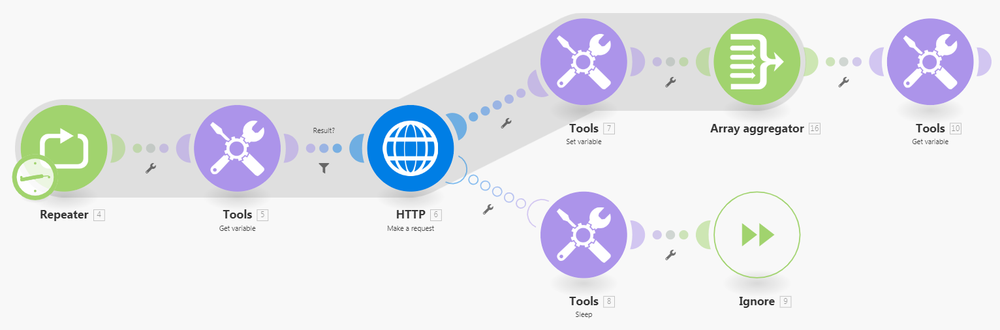

# `retry` エラー処理の回避策の設定

エラーの原因が迅速に解決される可能性がある場合は、エラーが発生したモジュールを再実行すると便利な場合があります。

Adobe Workfront Fusionでは現在、`retry` エラー処理ディレクティブは提供されていませんが、`retry`機能を模倣する2つの回避策を利用できます。

## アクセス要件

+++ 展開すると、この記事の機能のアクセス要件が表示されます。

<table style="table-layout:auto">
 <col> 
 <col> 
 <tbody> 
  <tr> 
   <td role="rowheader">Adobe Workfront パッケージ</td> 
   <td> 
任意の Adobe Workfront Workflow パッケージと任意の Adobe Workfront Automation および Integration パッケージ

Workfront Ultimate

Workfront Fusion を追加購入した Workfront Prime および Select パッケージ。
 </td> 
  </tr> 
  <tr data-mc-conditions=""> 
   <td role="rowheader">Adobe Workfront ライセンス</td> 
   <td> 
標準

Work またはそれ以上
 </td> 
  </tr> 
  <tr> 
   <td role="rowheader">製品</td> 
   <td>
   
組織が Workfront Automation および Integration を含まない Select またはPrime Workfront パッケージを持っている場合は、Adobe Workfront Fusion を購入する必要があります。</li></ul>
   </td> 
  </tr>
 </tbody> 
</table>

この表の情報について詳しくは、[ドキュメントのアクセス要件](/help/workfront-fusion/references/licenses-and-roles/access-level-requirements-in-documentation.md)を参照してください。

+++

## [!UICONTROL 再試行]エラー処理ディレクティブの回避策

Workfront Fusionは現在、`retry` エラー処理ディレクティブを提供していません。 次のいずれかの回避策を使用して、再試行機能を模倣します。

手順については、[&#x200B; エラー処理のディレクティブ &#x200B;](/help/workfront-fusion/references/errors/directives-for-error-handling.md)を参照してください。

* [Break ディレクティブの使用](#use-the-break-directive)
* [リピータモジュールの使用](#use-the-repeater-module)

### Break ディレクティブの使用

Break ディレクティブが実行されると、シナリオ実行の状態は不完全な実行のキューに保存されます。 このような場合は、不完全な実行を手動で解決できます。

手順については、[Break ディレクティブで処理されたエラーを解決する](/help/workfront-fusion/create-scenarios/config-error-handling/resolve-error-from-break-directive.md)を参照してください

不完全な実行の解決方法については、[不完全な実行の表示と解決](/help/workfront-fusion/manage-scenarios/view-and-resolve-incomplete-executions.md)を参照してください。

#### 欠点

* 最小再試行間隔は 1 分です。
* モジュールが複数のバンドルを処理していて、バンドルの処理が失敗した場合、部分的な実行（エラーの原因となったバンドルのみ）が未完了の実行フォルダーに移動され、[!UICONTROL 一時停止]ディレクティブの設定に従って再試行がスケジュールされます。 ただし、現在の実行は続行され、モジュールは後続のバンドルを処理し続けます。

  不完全な実行フォルダーに保存されている実行が正常に解決されるまで、シナリオが再度実行されないようにするには、[!UICONTROL &#x200B; シナリオ設定]で「[!UICONTROL &#x200B; シーケンシャル処理]」オプションを有効にします。

不完全な実行について詳しくは、[不完全な実行の表示と解決](/help/workfront-fusion/manage-scenarios/view-and-resolve-incomplete-executions.md)を参照してください。

### リピータモジュールの使用

リピータ モジュールの回避策は、より複雑ですが、よりカスタマイズ可能です。

#### エラーハンドラーのルートの設定

1. 左側のパネルの「**[!UICONTROL シナリオ]**」タブをクリックします。
1. 回避策を追加するシナリオを選択します。
1. シナリオの任意の場所をクリックして、シナリオエディターに入ります。
1. **フローコントロール** アイコン をクリックし、**リピーター**&#x200B;を選択します。
1. リピータモジュールで、**[!UICONTROL Repeats]** フィールドを、シナリオを再試行する最大回数に設定します。
1. **[!UICONTROL Repeater]** モジュールの後に、失敗する可能性のあるモジュールを添付します。
1. エラーが発生する可能性のあるモジュールにエラーハンドラーのルートを添付します。

   手順については、[&#x200B; エラー処理の追加](/help/workfront-fusion/create-scenarios/config-error-handling/error-handling.md)を参照してください。
1. **[!UICONTROL ツール &#x200B;] > [!UICONTROL &#x200B; スリープ]** モジュールをエラーハンドラーのルートに追加し、その&#x200B;**[!UICONTROL 遅延]** フィールドを再試行の間の秒数に設定します。

1. **[!UICONTROL ツール &#x200B;] > [!UICONTROL &#x200B; スリープ]** モジュールの後に&#x200B;**[!UICONTROL Ignore]** ディレクティブを追加します。
1. 引き続き[&#x200B; デフォルトのルートを設定](#configure-the-default-route)します。

#### デフォルトルートの設定

1. エラーが発生する可能性があるモジュールの後にある別の（エラーハンドラー以外の）ルートに&#x200B;**[!UICONTROL ツール &#x200B;] > [!UICONTROL 変数]** モジュールを追加し、モジュールの結果を`Result`などの名前の変数に格納するように設定します。

1. **[!UICONTROL Tools] > [!UICONTROL Set variable]**&#x200B;の後に&#x200B;**[!UICONTROL Array aggregator]** モジュールを追加し、Source Module フィールドで&#x200B;**[!DNL Repeater]** モジュールを選択します。

1. **[!UICONTROL Array aggregator]** モジュールの後に&#x200B;**[!UICONTROL Tools] > [!UICONTROL Get variable]** モジュールを追加し、`Result`変数の値をそれにマッピングします。

1. **[!UICONTROL Repeater]** モジュールと失敗する可能性のあるモジュールの間に&#x200B;**[!UICONTROL ツール &#x200B;] > [!UICONTROL 変数]** モジュールを挿入し、`Result`変数の値をそれにマッピングします。

1. `Result` 変数が存在しない場合にのみ続行するには、この&#x200B;**[!UICONTROL ツール]／[!UICONTROL 変数の取得]**&#x200B;モジュールと失敗する可能性があるモジュールの間にフィルターを挿入します。

>[!BEGINSHADEBOX]

**例：**

このシナリオの例では、[!UICONTROL HTTP] > [!UICONTROL &#x200B; リクエストを作成] モジュールは、失敗する可能性のあるモジュールを表しています。

>[!ENDSHADEBOX]

失敗する可能性のあるモジュールの結果が複雑すぎて単純な変数に格納できない場合は、データストアを使用して結果を保存および取得できます。 データストアにはレコードが 1 つだけ含まれます。 レコードのキーは、例えば `Result` などです。

データストアについて詳しくは、[&#x200B; データストア &#x200B;](/help/workfront-fusion/create-scenarios/map-data/data-stores.md)を参照してください。

#### 欠点

* この回避策はより複雑です。
* この回避策では、より多くの操作を使用します。

## リソース

* リピータ モジュールとブレーク ディレクティブについて詳しくは、[&#x200B; フロー制御](/help/workfront-fusion/references/apps-and-modules/tools-and-transformers/flow-control.md)を参照してください。
* 変数モジュールの取得について詳しくは、[&#x200B; ツール &#x200B;](/help/workfront-fusion/references/apps-and-modules/tools-and-transformers/tools-modules.md)を参照してください。
