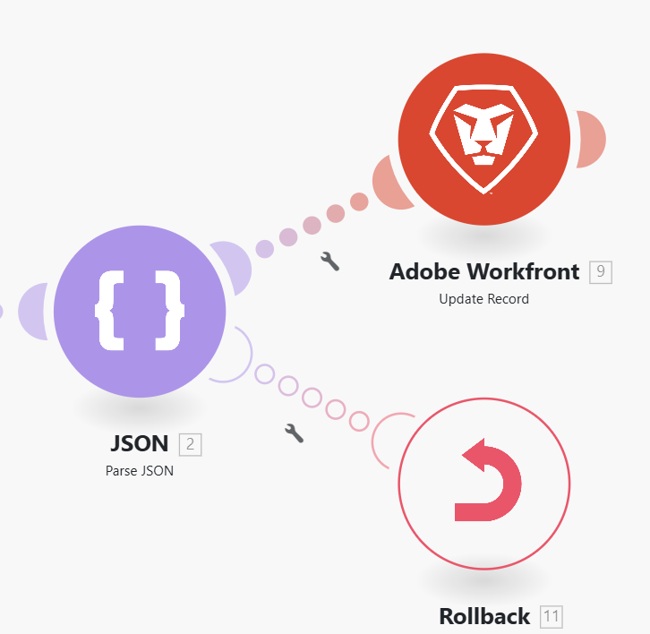

# `throw` エラー回避策の設定

場合によっては、シナリオ実行の後にロールバックまたはコミット フェーズを強制的に停止したり、ルートの処理を停止して、オプションで不完全な実行のキューに保存したりすることができます。

現在、エラー処理ディレクティブはエラーハンドラールートの範囲外で使用することはできず、Adobe Workfront Fusionには、条件付きでエラーを簡単に生成（スロー）できるモジュールは用意されていません。

次の回避策を使用して、`throw` エラー機能を模倣できます。

不完全な実行について詳しくは、[Adobe Workfront Fusion での不完全な実行の表示と解決](/help/workfront-fusion/manage-scenarios/view-and-resolve-incomplete-executions.md)を参照してください。

エラー処理ディレクティブについて詳しくは、[Adobe Workfront Fusionでのエラー処理に関するディレクティブ &#x200B;](/help/workfront-fusion/references/errors/directives-for-error-handling.md)を参照してください。

## アクセス要件

+++ 展開すると、この記事の機能のアクセス要件が表示されます。

<table style="table-layout:auto">
 <col> 
 <col> 
 <tbody> 
  <tr> 
   <td role="rowheader">Adobe Workfront パッケージ</td> 
   <td> 
任意の Adobe Workfront Workflow パッケージと任意の Adobe Workfront Automation および Integration パッケージ

Workfront Ultimate

Workfront Fusion を追加購入した Workfront Prime および Select パッケージ。
 </td> 
  </tr> 
  <tr data-mc-conditions=""> 
   <td role="rowheader">Adobe Workfront ライセンス</td> 
   <td> 
標準

Work またはそれ以上
 </td> 
  </tr> 
  <tr> 
   <td role="rowheader">製品</td> 
   <td>
   
組織が Workfront Automation および Integration を含まない Select またはPrime Workfront パッケージを持っている場合は、Adobe Workfront Fusion を購入する必要があります。</li></ul>
   </td> 
  </tr>
 </tbody> 
</table>

この表の情報について詳しくは、[ドキュメントのアクセス要件](/help/workfront-fusion/references/licenses-and-roles/access-level-requirements-in-documentation.md)を参照してください。

+++

## `throw`の回避策

条件付きでエラーをスローするには、モジュールを設定して、その操作中に意図的に失敗するようにします。 1つの可能性として、[!UICONTROL JSON] > [!UICONTROL JSON]を解析モジュールを使用し、オプションでエラーをスローするように設定します（この場合は`BundleValidationError`）。

次に、エラー処理ルートにエラー処理ディレクティブのいずれかを添付できます。

* **ロールバック**: シナリオの実行を強制的に停止し、ロールバック フェーズを実行します。
* **コミット**: シナリオ実行を強制的に停止し、コミット フェーズを実行します。
* **無視**：ルートの処理を停止します。
* **Break**: ルートの処理を停止し、不完全な実行フォルダーのキューに保存します。

[!DNL Rollback] ディレクティブの使用例を以下に示します。

