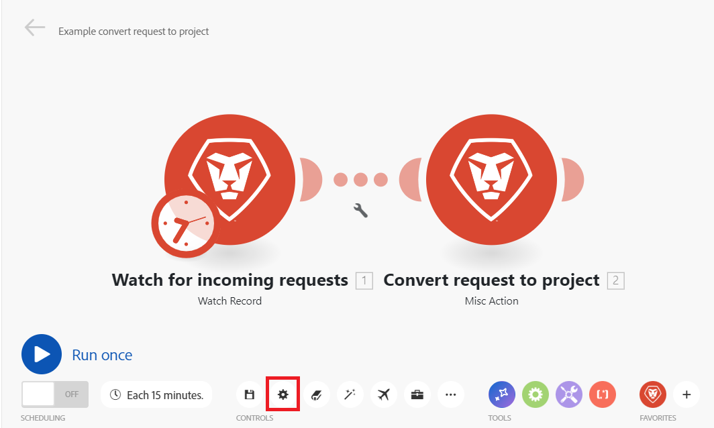
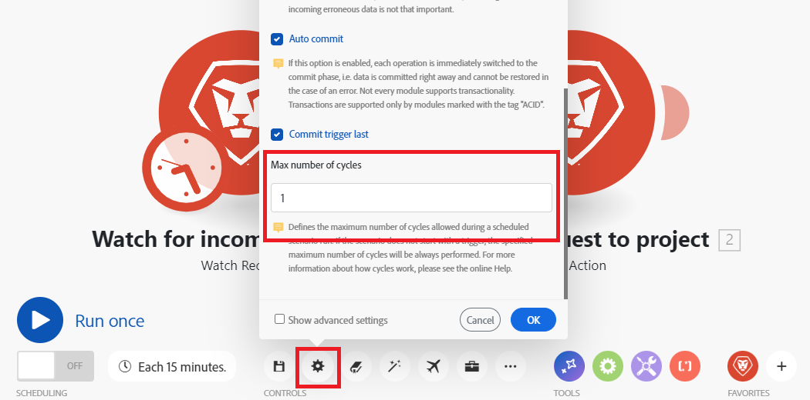
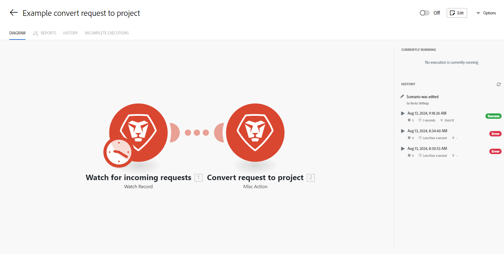

# シナリオ設定の指定

シナリオ設定パネルで、シナリオの特定の設定を行うことができます。

## アクセス要件

+++ 展開すると、この記事の機能のアクセス要件が表示されます。

<table style="table-layout:auto">
 <col> 
 <col> 
 <tbody> 
  <tr> 
   <td role="rowheader">Adobe Workfront パッケージ</td> 
   <td> 
任意の Adobe Workfront Workflow パッケージと任意の Adobe Workfront Automation および Integration パッケージ

Workfront Ultimate

Workfront Fusion を追加購入した Workfront Prime および Select パッケージ。
 </td> 
  </tr> 
  <tr data-mc-conditions=""> 
   <td role="rowheader">Adobe Workfront ライセンス</td> 
   <td> 
標準

Work またはそれ以上
 </td> 
  </tr> 
  <tr> 
   <td role="rowheader">製品</td> 
   <td>
   
組織が Workfront Automation および Integration を含まない Select またはPrime Workfront パッケージを持っている場合は、Adobe Workfront Fusion を購入する必要があります。</li></ul>
   </td> 
  </tr>
 </tbody> 
</table>

この表の情報について詳しくは、[ドキュメントのアクセス要件](/help/workfront-fusion/references/licenses-and-roles/access-level-requirements-in-documentation.md)を参照してください。

+++

## シナリオ設定を開く

1. 左側のパネルで「**シナリオ**」をクリックします。
1. 必要なシナリオを見つけて、名前をクリックします。
1. シナリオの任意の場所をクリックして、シナリオエディターに入ります。
1. ページの左下隅付近にある歯車アイコンをクリックします。

   

   表示される[!UICONTROL シナリオ設定]パネルで、シナリオの様々な詳細設定ができます。
1. 必要に応じて、シナリオ設定を有効または無効にします。 以下の[ シナリオ設定オプション ](#scenario-settings-options)を参照してください。

## シナリオ設定オプション

### 説明

ここでは、シナリオの説明を入力できます。この説明は、シナリオ リストに表示されます。 説明は240文字に制限されています。

### [!UICONTROL 順番に処理]

このオプションは、すべての実行を順番に実行することを強制し、主にWebhookと不完全な実行に関連しています。

シーケンシャル処理が有効になっている場合、シナリオの並列実行は無効になります。

**インスタント Webhook**: Webhook トリガーが`instant`として設定され、「シーケンシャル処理」が有効になっている場合、すべてのインスタント Webhook ペイロードは、到着した順序でキューに入れられ、処理されます。 これは、外部システムからのイベントを正確な順序で処理する場合に便利です。

>[!NOTE]
>
>各ペイロードが処理されるたびに、次のペイロードが開始される前に自動処理の遅延が発生します。

**不完全な実行**:「不完全な実行」も有効になっている場合、シナリオの実行中にエラーが発生した場合、シナリオは一時停止されます。 その後、次のいずれかが発生します。

* シーケンシャル処理オプションが&#x200B;**enabled**&#x200B;の場合、Workfront Fusionは、すべての不完全な実行が解決されるまで、既存のシーケンスの処理を停止します。
* シーケンシャル処理オプションが&#x200B;**disabled**&#x200B;の場合、シナリオはスケジュールに従って実行され続け、不完全な実行を再実行する試みが繰り返されます。

  不完全な実行について詳しくは、[不完全な実行の表示と解決](/help/workfront-fusion/manage-scenarios/view-and-resolve-incomplete-executions.md)を参照してください。

  >[!NOTE]
  >
  >順番に処理を行うと、シナリオの実行に遅延が生じる場合があります。 インスタントシナリオがトリガーされた時、またはスケジュールされたシナリオが実行される時に、キューにまだ未完了の実行がある場合、そのシナリオは、キュー内の前の実行が全て完了してから実行されます。
  >
  >シナリオのユースケースで順番に処理することが必要ない場合は、順番処理のオプションを無効にすることをお勧めします。

  スケジュール設定について詳しくは、[ シナリオのスケジュール ](/help/workfront-fusion/create-scenarios/config-scenarios-settings/schedule-a-scenario.md)を参照してください。

### データは機密情報

シナリオを実行すると、シナリオ内のモジュールでどのデータが処理されたかに関する情報をデフォルトで表示できます。 この情報を保存しない場合は、「[!UICONTROL データは機密情報]」オプションを有効にします。

>[!IMPORTANT]
>
>このオプションを有効にすると、シナリオの実行中に発生する可能性のあるエラーを解決するのが困難になる場合があります。

### [!UICONTROL 不完全な実行の保存を許可]

このオプションは、シナリオの実行中にエラーが発生した場合にAdobe Workfront Fusionがどのように処理されるかを指定します。 このオプションを有効にすると、シナリオは一時停止され、不完全な実行フォルダーに移動します。 これにより、問題を修正し、シナリオが停止した場所から続行できます。 このオプションを無効にした場合、シナリオの実行が停止し、ロールバックフェーズが開始します。

不完全な実行について詳しくは、[不完全な実行の表示と解決](/help/workfront-fusion/manage-scenarios/view-and-resolve-incomplete-executions.md)を参照してください。

### データ損失を有効にする

このオプションは、Workfront Fusionが不完全な実行のキューにバンドルを保存できない場合（空き容量が不足しているなど）に、データ損失を有効にする場合に関係します。 このオプションを有効にすると、シナリオの実行全体で中断が発生しないように、データが失われます。 これは、最も優先度が高いものが継続して実行され、入力時の誤りのあるデータがそれほど重要でないシナリオで役立ちます。

その他、シナリオを実行する際に、モジュールで許容される最大サイズを超えるファイルが見つかることがあります。 この場合、Workfront Fusionは、[!UICONTROL  データ損失を有効にする] オプションの設定に従って進行し、警告メッセージが表示されます。

不完全な実行について詳しくは、[不完全な実行の表示と解決](/help/workfront-fusion/manage-scenarios/view-and-resolve-incomplete-executions.md)を参照してください。

最大ファイルサイズについて詳しくは、[Fusionのパフォーマンスガードレール ](/help/workfront-fusion/references/scenarios/fusion-performance-guardrails.md#files)を参照してください。

警告について詳しくは、[ エラーの種類](/help/workfront-fusion/references/errors/error-processing.md)を参照してください。

### [!UICONTROL 自動コミット]

[!UICONTROL 自動コミット]設定はトランザクションに適用され、シナリオの処理方法を定義するものです。 「自動コミット」オプションがオンの場合、各モジュールのコミットフェーズは、操作フェーズが完了した直後に開始します。 「自動コミット」オプションを無効にした場合、すべてのモジュールに対して操作が実行されるまでコミットは行われません（これはデフォルトのモードです）。

### サイクルの最大数

>[!NOTE]
>
>このオプションを表示するには、**詳細設定を表示** チェックボックスを有効にする必要があります。

サードパーティのサービスへの接続が中断されるのを防ぎ、1 回のシナリオ実行内にすべてのレコードが確実に処理されるようにする場合は、より多くのサイクルを設定すると便利です。

* ポーリングトリガーで始まるシナリオの場合、この設定で、シナリオの実行中に許可されるサイクルの最大数を定義します。

  ポーリングトリガーについて詳しくは、「モジュールの概要」の「[ ポーリングトリガー](/help/workfront-fusion/get-started-with-fusion/understand-fusion/module-overview.md#polling-triggers)」を参照してください。

* シナリオがインスタントトリガーで開始する場合、設定は無視され、1 回のシナリオの実行中にすべての保留中のイベントが処理されます（1 サイクルにつき 1 つのイベント）。

  インスタントトリガーについて詳しくは、「モジュールの概要」の「[ インスタントトリガー](/help/workfront-fusion/get-started-with-fusion/understand-fusion/module-overview.md#instant-triggers)」を参照してください。

* シナリオが（インスタントまたはポーリング）トリガーで始まらない場合は、指定された最大サイクル数が常に実行されます。

>[!BEGINSHADEBOX]

**例：** Workfront > [!UICONTROL  レコード ]が新しい問題を監視し、Workfront >[!UICONTROL Convert object]が新しいリクエストをプロジェクトに変換し、適切なテンプレートを割り当てます。

[!UICONTROL より多くのサイクル]設定は、シナリオの実行をスケジュールする場合にのみ適用されます。 「[!UICONTROL 1 回実行]」ボタンを使用する場合、サイクル設定を考慮します。

#### サイクルの最大数は 1 に設定されています（デフォルト）

Workfront/監視レコードモジュールの最大サイクル数は`10`に設定されています。
100件のリクエストがWorkfrontに送信され、「最大サイクル数」フィールドが10に設定されている場合、1回のシナリオ実行後に90個のファイルが未処理のままになります。 次の 10 個のファイルは、スケジュールされた次のシナリオの実行で処理されます。

#### サイクルの最大数を 10 に設定

Workfront/監視レコードモジュールの最大サイクル数は`10`に設定されています。

100個のファイルがDropbox フォルダーに追加され、最大サイクル数オプションが10に設定されている場合、すべてのファイルが処理されるまで、最初のサイクルで10個のファイル、2番目のサイクルで次の10個のファイル、3番目のサイクルで次の10個のファイルなどが処理されます。

すべてのファイルは、1 回のシナリオ実行の間に処理されます。

シナリオの詳細には、既に実行されたサイクルが表示されます。

このページについて詳しくは、[ シナリオの詳細](/help/workfront-fusion/get-started-with-fusion/navigate-fusion/scenario-details.md)を参照してください。

>[!ENDSHADEBOX]

### 連続エラー数

シナリオの実行が非アクティブ化されるまでの連続した実行試行の最大数を定義します（`DataError`、`DuplicateDataError`、`ModuleTimeoutError`、および`ConnectionError`を除く）。

エラーについて詳しくは、[ エラーの種類](/help/workfront-fusion/references/errors/error-processing.md)を参照してください。

>[!NOTE]
>
>シナリオがインスタントトリガーで始まる場合、設定が無視され、最初のエラーが発生するとシナリオは直ちに非アクティブ化されます。

### ワーカープール

>[!NOTE]
>
>この設定は、次の2つの条件が満たされている場合にのみ表示されます。
>
>* 組織の管理者または所有者です
>* 組織に関連付けられているワーカープールが複数あります

この設定では、組織に関連付けられている特定のワーカープールにシナリオを割り当て、優先度の高いシナリオにリソースを割り当てることができます。

<!--

>[!NOTE]
>
>Organizations can request provisioning of one additional worker pool (for a total of 2).

-->
