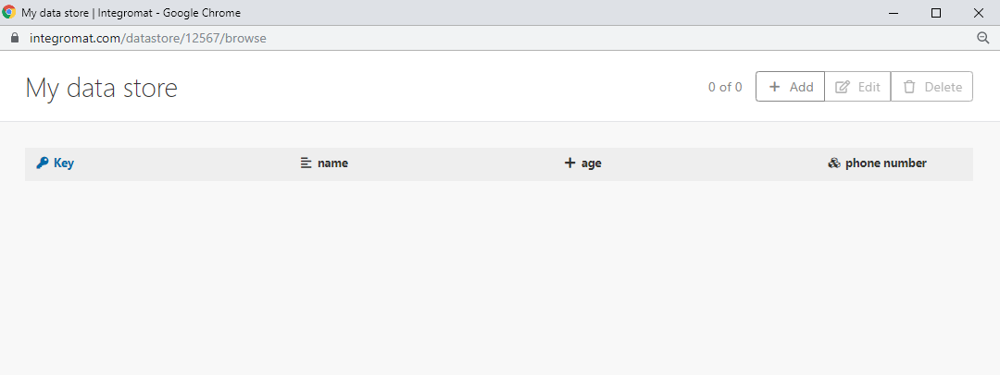

# データストアの作成と管理

データストアは、データベースやシンプルなテーブルと同様に、シナリオのデータを保存できるので、個々のシナリオ間やシナリオ実行間でデータを転送できるようになります。データストアを使用すると、同期中に様々なシステムから新しいデータを保存できます。

データストアモジュールを使用すると、Adobe Workfront Fusion データストアのレコードに対して次のアクションを実行できます。

* 追加
* 置き換え
* 更新
* 取得
* 削除
* 検索
* カウント

データストアモジュールの使用については、[[!UICONTROL データストア]モジュール](/help/workfront-fusion/references/apps-and-modules/tools-and-transformers/data-store-modules.md)を参照してください。

Workfront Fusion のデータストアの紹介ビデオについては、以下を参照してください。

* [データストア](https://video.tv.adobe.com/v/3427029/){target=_blank}

## アクセス要件

+++ 展開すると、この記事の機能のアクセス要件が表示されます。

<table style="table-layout:auto">
 <col> 
 <col> 
 <tbody> 
  <tr> 
   <td role="rowheader">Adobe Workfront パッケージ</td> 
   <td> 
任意の Adobe Workfront Workflow パッケージと任意の Adobe Workfront Automation および Integration パッケージ

Workfront Ultimate

Workfront Fusion を追加購入した Workfront Prime および Select パッケージ。
 </td> 
  </tr> 
  <tr data-mc-conditions=""> 
   <td role="rowheader">Adobe Workfront ライセンス</td> 
   <td> 
標準

Work またはそれ以上
 </td> 
  </tr> 
  <tr> 
   <td role="rowheader">製品</td> 
   <td>
   
組織が Workfront Automation および Integration を含まない Select またはPrime Workfront パッケージを持っている場合は、Adobe Workfront Fusion を購入する必要があります。</li></ul>
   </td> 
  </tr>
 </tbody> 
</table>

この表の情報について詳しくは、[ドキュメントのアクセス要件](/help/workfront-fusion/references/licenses-and-roles/access-level-requirements-in-documentation.md)を参照してください。

+++

## 利用可能なデータスペース

組織が新しいWorkfront プランモデル（Select、Prime、Ultimate パッケージ）を利用している場合、組織のプランは、Fusion インスタンスで使用可能なデータストアのサイズと数に影響します。

### Ultimate プラン

Ultimate パッケージのFusion インスタンスは、次を受け取ります。

* 100 MBのスペース
* 50 データストア

### SelectおよびPrime プラン

Select パッケージまたはPrime パッケージのFusion インスタンスは:-->を受け取ります

* 最初の500,000の操作には100 MBを使用します。

* 10万の追加作業ごとに10MB。

  例えば、600,000の操作を持つ組織は110 MBを受け取ります。

組織の各チームには、最大50個のデータストアを設定できます。 これらのデータストアの合計サイズは、組織のデータストアの合計サイズを超えることはできません。

## Workfront Fusionでのデータストアの作成

* [データストアの設定](#set-up-the-data-store)
* [データ構造の設定](#set-up-the-data-structure)

### データストアの設定

モジュールでデータストアを使用する前に、Workfront Fusionでデータストアを作成する必要があります。

>[!NOTE]
>
>組織で使用可能なデータストアの数には制限があります。使用可能なデータストアよりも多くのデータストアを作成しようとすると、Workfrontは[!UICONTROL 最大ストア数が]に達しました。
>
>詳しくは、この記事の[「ストアの最大数に達しました」エラー](#maximum-stores-reached-error)を参照してください。

1. Workfront Fusion アカウントにログインします。
1. 左ナビゲーションパネルの「**[!UICONTROL データストア]**」をクリックします。
1. 画面の右上隅にある「**[!UICONTROL データストアを追加]**」をクリックします。
1. 新規データストアの設定を入力します。

   Workfront Fusion モジュールのフィールドの太字のタイトルは、必要な設定を示します。

   <table style="table-layout:auto">
    <col> 
    <col> 
    <tbody> 
     <tr> 
      <td>[!UICONTROL Data store name] </td> 
      <td> 
データストアの名前を入力します。 
 </td> 
     </tr> 
     <tr> 
      <td> 
[!UICONTROL Data Structure]
 </td> 
      <td> 
データ構造はテーブルの列のリストです。このリストは列名とデータタイプを示します。
 
次のいずれかの操作を行います。
 
       <ul> 
        <li><b>作成済みのデータ構造を選択する</b></li> 
        <li><b>新しいデータ構造を追加</b> 
「<strong>[!UICONTROL Add]</strong>」をクリックして、新しいデータ構造を作成します。
 
詳しくは、この記事で<a href="#set-up-the-data-structure" class="MCXref xref">データ構造の設定</a>の節を参照してください。
 </li> 
        <li style="font-weight: bold;"> 
フィールドを空のままにする
 
データ構造を選択または追加しない場合、データベースにはプライマリキーのみが含まれます。このようなデータベースタイプが役に立つのは、キーのみを保存する必要があり、特定のキーがデータベースに存在するかどうかにのみ関心がある場合です。
 </li> 
       </ul> </td> 
     </tr> 
     <tr> 
      <td>データストレージサイズ （MB単位）</td> 
      <td> 
内部データストレージの合計から、データストアのサイズを割り当てます。
 
 デフォルト値は 10 MB です。95 MB の割り当てのうち、未割り当てのデータストア容量が 10 MB 未満の場合、デフォルトのサイズは未割り当てのストレージの容量になります。  
メモ：予約容量はいつでも変更できます。
  </td> 
     </tr> 
    </tbody> 
   </table>

### データ構造の設定

1. データストアを作成または編集する際に、「データ構造」フィールドの横にある「**[!UICONTROL 追加]**」をクリックします。
1. 表示される&#x200B;**[!UICONTROL データ構造を追加]**&#x200B;ボックスで、次のフィールドを設定します。

   <table style="table-layout:auto">
    <col> 
    <col> 
    <tbody> 
     <tr> 
      <td>[!UICONTROL Data structure name]</td> 
      <td> 
 新しいデータ構造の名前を入力します。
 </td> 
     </tr> 
     <tr> 
      <td> 
[!UICONTROL Specification]
 </td> 
      <td> 
データストアの列を設定するには、次のいずれかの操作を行います。
 
       <ul> 
        <li> 
「<strong>[!UICONTROL Add item]</strong>」をクリックして、1 つの列のプロパティを手動で指定します。
 
データストア列の「<strong>[!UICONTROL Name]</strong>」と「<strong>[!UICONTROL Type]</strong>」を入力して、対応するプロパティを定義します。
 </li> 
        <li> 
「<strong>[!UICONTROL Generator]</strong>」をクリックして、入力したサンプルデータの列を特定します。
 
         
Example: </b>">
          <b>例：</b> 
          
例えば、次の JSON サンプルデータは、「name」、「age」、「phone number」の 3 つの列を作成します。「phone number」は、携帯電話と固定電話の電話番号をまとめたものです。
 
          
<code>&lbrace;</code> 
 
          
<code>"name":"John",</code> 
 
          
<code>"age":30,</code> 
 
          
<code>"phone number": &lbrace;</code> 
 
          
<code>"mobile":"987654321",</code> 
 
          
<code>"landline":"123456789"</code> 
 
          
<code>&rbrace;</code> 
 
          
<code>&rbrace;</code> 
 
          
データストアビューでは空の列は次のように表示されます。
 
          
  
 
          
データストアに値を手動で追加することも、Workfront Fusion データストアモジュールを使用して値を追加することもできます。
 
         
 </li> 
       </ul> </td> 
     </tr> 
     <tr> 
      <td>[!UICONTROL Strict] </td> 
      <td> 
このオプションを有効にすると、ペイロードをデータ構造に確実に一致させることができます。データ構造で規定されていない追加の項目を含んだペイロードは却下されます。
 </td> 
     </tr> 
    </tbody> 
   </table>

## 既存のデータストアの編集

既存のデータストアのプロパティとコンテンツは、Workfront Fusionの[!UICONTROL  データストア ]領域で編集できます。

* [データストアのプロパティの編集](#edit-the-properties-of-a-data-store)
* [データストアの内容の編集](#edit-the-contents-of-a-data-store)

### データストアのプロパティの編集

データストアのプロパティには、データストアで使用されているデータ構造と、データストアのサイズが含まれます。

1. 左側のナビゲーションパネルの&#x200B;**[!UICONTROL データストア]** をクリックして、[!UICONTROL  データストア ]領域を開きます。
1. 編集するデータストアの横にあるチェックボックスをクリックし、画面の下部にあるバナーの「**編集**」をクリックします。
1. （オプション）このデータストアで使用するデータ構造を別の既存のデータ構造に変更する場合は、**[!UICONTROL データ構造]**&#x200B;ドロップダウンから選択します。

   または

   （オプション）このデータストアで使用するデータ構造をまったく新しいデータ構造に変更する場合は、この記事の[データ構造の設定](#set-up-the-data-structure)を参照してください。

1. （オプション）データストアのサイズを変更する場合は、新しいサイズを「**[!UICONTROL データストレージサイズ (MB)]**」フィールドに入力します。
1. 「**[!UICONTROL 保存]**」をクリックします。

### データストアの内容の編集

1. 左側のナビゲーションパネルの&#x200B;**[!UICONTROL データストア]** アイコン をクリックして、[!UICONTROL  データストア ]領域を開きます。
1. 編集するデータストアの横にあるチェックボックスをクリックし、画面の下部にあるバナーの「**参照**」をクリックします。
1. （オプション）データストアに新しい項目を追加する場合は、「**[!UICONTROL 追加]**」をクリックしてから新しい項目の情報を入力します。
1. （オプション）その項目のチェックボックスをクリックし、画面の右上隅にある&#x200B;**選択した項目を削除**&#x200B;または&#x200B;**すべてを削除**&#x200B;をクリックして、データストアから1つ以上の項目を削除します。
1. **[!UICONTROL 保存]**&#x200B;をクリックします。

## トラブルシューティング

* [失われたデータをデータストアから復元](#restoring-lost-data-from-a-data-store)
* [「容量不足」エラー](#out-of-space-error)
* [「ストアの最大数に達しました」エラー](#maximum-stores-reached-error)

### 失われたデータをデータストアから復元

現在、失われたデータの復元を自動化できるツールはありません。

#### 回避策

1. 項目がデータストアに挿入されたシナリオのすべての実行ログを調べます。

   実行ログの調査について詳しくは、[ シナリオの実行履歴の表示](/help/workfront-fusion/manage-scenarios/view-scenario-execution-history.md)を参照してください。

1. データをコピーします。
1. データをデータストアに再度挿入します。

   データストアにデータの挿入する方法については、[データストアのコンテンツの編集](#edit-the-contents-of-a-data-store)を参照してください。

### 「[!UICONTROL 容量不足]」エラー

「[!UICONTROL 容量不足]」エラーが発生するのは、以前に作成したデータストアに、割り当て済みのデータストアストレージが既に割り当てられている場合です。

#### 回避策

1. 既存のデータストアのいずれかを編集して、使用するスペースを減らします。これにより、新しいデータストア用の空き容量ができます。

   詳しくは、[データストアのプロパティの編集](#edit-the-properties-of-a-data-store)を参照してください。

>[!NOTE]
>
>追加のデータストアが不要であることが確実でない限り、すべてのスペースを 1 つのデータストアに割り当てることがないようにすることをお勧めします。

### 「[!UICONTROL ストアの最大数に達しました]」エラー

組織が利用可能なすべてのデータストアを使用したため、[!UICONTROL 最大ストア数]に達しました。エラーが発生します。

#### 回避策

既存のデータストアの数を減らすには、次のいずれかの操作を検討します。

* 既存のデータストアを結合する
* 未使用のデータストアを削除する
