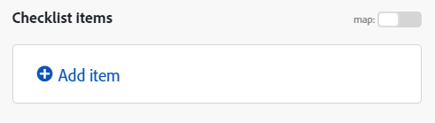
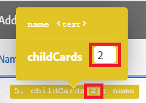
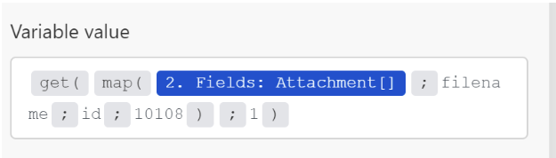
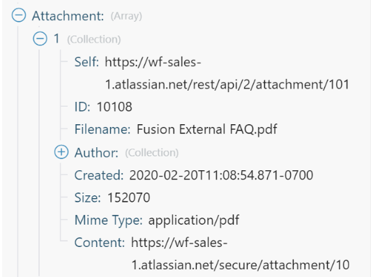
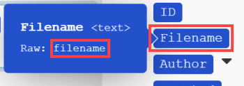
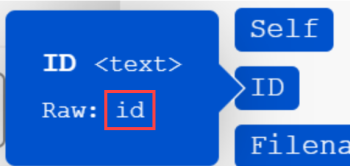
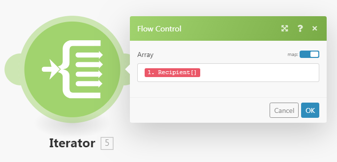

# 配列または配列要素のマッピング

配列は、次を含めることができるバンドルアイテムです。

* 同じタイプの1つ以上の値（単純な配列）
* 同じタイプの 1 つ以上のコレクション（複合配列）

>[!BEGINSHADEBOX]

**例：**

* **複雑な配列**: [!UICONTROL 電子メールを監視] モジュールは、電子メールごとに添付ファイルの配列を返します。 すべての添付ファイルは、名前、コンテンツ、サイズなどを含むコレクションを表します。

>[!ENDSHADEBOX]

## アクセス要件

+++ 展開すると、この記事の機能のアクセス要件が表示されます。

<table style="table-layout:auto">
 <col> 
 <col> 
 <tbody> 
  <tr> 
   <td role="rowheader">Adobe Workfront パッケージ</td> 
   <td> 
任意の Adobe Workfront Workflow パッケージと任意の Adobe Workfront Automation および Integration パッケージ

Workfront Ultimate

Workfront Fusion を追加購入した Workfront Prime および Select パッケージ。
 </td> 
  </tr> 
  <tr data-mc-conditions=""> 
   <td role="rowheader">Adobe Workfront ライセンス</td> 
   <td> 
標準

Work またはそれ以上
 </td> 
  </tr> 
  <tr> 
   <td role="rowheader">製品</td> 
   <td>
   
組織が Workfront Automation および Integration を含まない Select またはPrime Workfront パッケージを持っている場合は、Adobe Workfront Fusion を購入する必要があります。</li></ul>
   </td> 
  </tr>
 </tbody> 
</table>

この表の情報について詳しくは、[ドキュメントのアクセス要件](/help/workfront-fusion/references/licenses-and-roles/access-level-requirements-in-documentation.md)を参照してください。

+++

## 配列全体のマッピング

1. 左側のパネルの「**[!UICONTROL シナリオ]**」タブをクリックします。
1. 配列をマッピングするシナリオを選択します。
1. シナリオの任意の場所をクリックして、シナリオエディターに入ります。
1. 配列をマッピングするモジュールで、配列をマッピングするフィールドをクリックします。 これは、配列がマッピングされるフィールドです。

1. 表示されるボックスで、項目をマッピングします。

   パネルを使用すると、他のタイプの項目と同じ方法でフィールドをマッピングできます。 各項目に個別に入力しないで、別の配列をターゲットフィールドにマッピングする場合は、「[!UICONTROL マップ]」ボタンを使用します。 この場合、両方の配列（ソース配列とターゲット配列）の構造が同じであることを確認します。

   1 つの配列には、任意の数の項目を追加できます。

イテレータを使用して、配列を個々のバンドルに分割できます。 詳しくは、Adobe Workfront Fusion](/help/workfront-fusion/references/modules/iterator-module.md)の[[!UICONTROL Iterator] モジュールを参照してください。

## アイテムを新しい配列にマッピングする

Workfront Fusionの一部のフィールドでは、エレメントを配列にマッピングできます。 例えば、チェックリスト項目の配列をWorkfront ボード/チェックリスト項目を追加モジュールに作成できます。 モジュールを実行すると、すべてのチェックリスト項目がカードに追加されます。

「項目を追加」を表示するモジュールフィールドは、配列を作成します。

配列にエレメントを追加するには：

1. 「**項目を追加**」をクリック
1. 開いたパネルで、項目に関する詳細を入力します。
1. 「**追加**」をクリックします。
1. （オプション） 配列に追加する各要素について、手順1 ～ 3を繰り返します。

## 配列要素のマッピング

### 配列要素を数値でマッピング

配列要素は、配列名の後に角括弧で囲まれた数値として表示されます。 このインデックス番号を使用して、配列の個々の要素をフィールドにマッピングできます。

>[!NOTE]
>
>Workfront Fusionの配列のインデックス作成は1から始まります。

配列要素をマッピングするには：

1. エレメントをマッピングするフィールドをクリックします。

   マッピングパネルが開きます。

1. マッピングするエレメントを含む配列を探します。
1. 配列の横にあるドロップダウン矢印をクリックします。
1. マッピングする要素をクリックします。

   要素はマッピングされ、インデックスは1です。 これは配列内の最初の要素をマッピングします。

1. 配列の別の要素をマッピングするには、[1]をクリックし、マッピングする配列要素のインデックス番号を入力します。

   

### 指定されたキーで配列の要素をマッピングする

一部の配列には、メタデータや属性などのキー値アイテムを持つコレクションが含まれています。 これらの値のいずれかを使用するには、特定のキー値で要素を検索し、値アイテムから対応する値を取得できます。 `map()`関数と`get()`関数を組み合わせた数式を使用することをお勧めします。

>[!BEGINSHADEBOX]

次の例は、[!DNL Jira] アプリの出力を示しています。

次の使用例は、添付ファイルの配列から、IDが10108の特定の添付ファイルのファイル名を取得します。

この例では、次の出力を生成します。

式は次のように説明できます。

* `map`

   1. `map()` の最初のパラメーター関数は配列の項目全体です。
   1. 2 つ目のパラメーターは、値の項目の未加工の名前です。 未加工の名前を取得するには、[!UICONTROL マッピング]パネルの項目にポインタを合わせます。

      

      >[!NOTE]
      >
      >すべてのパラメーターでは大文字と小文字が区別されます。 この例では、アイテムのラベルが大文字のみ生の名前と異なっていても、生の名前を使用する必要があります。

   1. 3つ目のパラメーターは、キーアイテムの生の名前です。

      

   1. 4番目のパラメーターは、指定されたキー値です。

  `map()` 関数は配列を返すので（指定されたキー値を持つ他の要素が存在する可能性があるため）、その最初の要素を取得するために `get()` 関数を適用する必要があります。

* `get`

   1. `get()`関数の最初のパラメーターは、`map()`関数の結果です。

   1. 2番目のパラメーターは、要素のインデックスです。 この例では、インデックスは`1`です。

この例では、次の出力を生成します。

>[!ENDSHADEBOX]

`map()`関数について詳しくは、[配列関数](/help/workfront-fusion/references/mapping-panel/functions/array-functions.md)を参照してください。

`get()`関数について詳しくは、[一般関数](/help/workfront-fusion/references/mapping-panel/functions/general-functions.md)を参照してください。

## 配列要素を一連のバンドルに変換する

配列は[!UICONTROL イテレータ]モジュールを使用して、一連のバンドルに変換することができます。 詳しくは、[[!UICONTROL  イテレーター] モジュール ](/help/workfront-fusion/references/modules/iterator-module.md)を参照してください。

