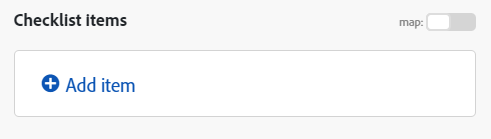

# 配列または配列要素のマッピング

配列は、次の内容を含めることができるバンドル項目です。

* 同じ型の 1 つ以上の値（単純配列）
* 同じタイプの 1 つ以上のコレクション（複合配列）

>[!BEGINSHADEBOX]

**例：**

* **複合配列**:[!UICONTROL Watch emails] モジュールは、すべてのメールの添付ファイルの配列を返します。 すべての添付ファイルは、名前、コンテンツ、サイズなどを含むコレクションを表します。

>[!ENDSHADEBOX]

## アクセス要件

+++ 展開すると、この記事の機能のアクセス要件が表示されます。

この記事で説明している機能を使用するには、次のアクセス権が必要です。

<table style="table-layout:auto">
 <col> 
 <col> 
 <tbody> 
  <tr> 
   <td role="rowheader">[!DNL Adobe Workfront] package</td> 
   <td> 
任意
 </td> 
  </tr> 
  <tr data-mc-conditions=""> 
   <td role="rowheader">[!DNL Adobe Workfront] ライセンス</td> 
   <td> 
新規： [!UICONTROL Standard]

または

現在：[!UICONTROL Work] 以上
 </td> 
  </tr> 
  <tr> 
   <td role="rowheader">[!DNL Adobe Workfront Fusion] ライセンス**</td> 
   <td>
   
現在：[!DNL Workfront Fusion] ライセンスは必要ありません。

   
または

   
レガシー：任意 

   </td> 
  </tr> 
  <tr> 
   <td role="rowheader">製品</td> 
   <td>
   
新規：
 <ul><li>[!UICONTROL Select] または [!UICONTROL Prime] [!DNL Workfront] プラン：組織は [!DNL Adobe Workfront Fusion] を購入する必要があります。</li><li>[!UICONTROL Ultimate] [!DNL Workfront] プラン：[!DNL Workfront Fusion] が含まれています。</li></ul>
   
または

   
現在：[!DNL Adobe Workfront Fusion] を購入する必要があります。

   </td> 
  </tr>
 </tbody> 
</table>

このテーブルの情報について詳しくは、[ ドキュメントのアクセス要件 ](/help/workfront-fusion/references/licenses-and-roles/access-level-requirements-in-documentation.md) を参照してください。

[!DNL Adobe Workfront Fusion] ライセンスについて詳しくは、[[!DNL Adobe Workfront Fusion] ライセンス](/help/workfront-fusion/set-up-and-manage-workfront-fusion/licensing-operations-overview/license-automation-vs-integration.md)を参照してください。

+++

## 配列全体のマッピング

1. 左側のパネルで「**[!UICONTROL Scenarios]**」タブをクリックします。
1. 配列をマッピングするシナリオを選択します。
1. シナリオの任意の場所をクリックして、シナリオエディターに移動します。
1. 配列をマッピングするモジュールで、配列をマッピングするフィールドをクリックします。 配列のマッピング先のフィールドです。

1. 表示されるボックスで、項目をマッピングします。

   パネルを使用すると、他のタイプの項目と同じ方法でフィールドをマッピングできます。各項目を個別に入力せずに、別の配列をターゲットフィールドにマッピングする場合は、「[!UICONTROL Map]」ボタンを使用します。 この場合、両方の配列（ソース配列とターゲット配列）の構造が同じであることを確認します。

   1 つの配列には、任意の数の項目を追加できます。

イテレータを使用して、配列を個々のバンドルに分割できます。詳しくは、 [!DNL Adobe Workfront Fusion]](/help/workfront-fusion/references/modules/iterator-module.md) の [[!UICONTROL Iterator] モジュールを参照してください。

## 新しい配列への項目のマッピング

Workfront Fusion の一部のフィールドでは、要素を配列にマッピングできます。 例えば、チェックリスト項目の配列を、Workfront ボード / チェックリスト項目を追加モジュールに作成できます。 モジュールを実行すると、すべてのチェックリスト項目がカードに追加されます。

「項目を追加」と表示されるモジュールフィールドは、すべて配列を作成します。

配列に要素を追加するには、次の手順に従います。

1. 「**項目を追加**」をクリックします
1. 開いたパネルに、項目の詳細を入力します。
1. 「**追加**」をクリックします。
1. （オプション）  配列に追加する各要素に対して、手順 1 ～ 3 を繰り返します。

## 配列要素のマッピング

### 数値別に配列要素をマッピングします

配列要素は、配列名の後に角括弧で囲まれた数字として表示されます。 このインデックス番号を使用して、配列の個々の要素をフィールドにマッピングできます。

>[!NOTE]
>
>Workfront Fusion の配列インデックス作成は 1 から開始します。

配列要素をマッピングするには：

1. 要素をマッピングするフィールドをクリックします。

   マッピングパネルが開きます。

1. マッピングする要素を含む配列を見つけます。
1. アレイの横にあるドロップダウン矢印をクリックします。
1. マッピングする要素をクリックします。

   要素がマッピングされます。インデックスは 1 です。 これにより、配列の最初の要素がマッピングされます。

1. 配列の別の要素をマッピングするには、[1 をクリックし ] マッピングする配列要素のインデックス番号を入力します。

   

### 指定されたキーで配列の要素をマッピングする

一部の配列には、メタデータや属性などのキー値項目を持つコレクションが含まれています。 これらの値の 1 つを使用するには、指定されたキー値で要素を検索し、対応する値を値項目から取得できます。 `map()` 関数と `get()` 関数を組み合わせた数式を使用することをお勧めします。

>[!BEGINSHADEBOX]

次の例は、[!DNL Jira] アプリの出力を示しています。

この例では、ID が 10108 の特定の添付ファイルについて、添付ファイルの配列からファイル名を取得します。

この例では、次の出力が生成されます。

この式は次のように説明できます。

* `map`

   1. `map()` の最初のパラメーター関数は配列の項目全体です。
   1. 2 つ目のパラメーターは、値の項目の未加工の名前です。生の名前を取得するには、[!UICONTROL mapping] のパネルの項目の上にマウスポインターを置きます。

      

      >[!NOTE]
      >
      >すべてのパラメーターでは大文字と小文字が区別されます。この例では、アイテムのラベルが生の名前と異なるのは大文字のみですが、生の名前を使用する必要があります。

   1. 3 番目のパラメーターは、キー項目の生の名前です。

      

   1. 4 番目のパラメーターは指定されたキー値です。

  `map()` 関数は配列を返すので（指定されたキー値を持つ他の要素が存在する可能性があるため）、その最初の要素を取得するために `get()` 関数を適用する必要があります。

* `get`

   1. `get()` 関数の最初のパラメーターは、`map()` 関数の結果です。

   1. 2 番目のパラメーターは要素のインデックスです。 この例では、インデックスは `1` です。

この例では、次の出力が生成されます。

>[!ENDSHADEBOX]

`map()` 関数の詳細については、[ 配列関数 ](/help/workfront-fusion/references/mapping-panel/functions/array-functions.md) を参照してください。

`get()` 関数の詳細については、[ 一般関数 ](/help/workfront-fusion/references/mapping-panel/functions/general-functions.md) を参照してください。

## 配列要素を一連のバンドルに変換します

配列は、[!UICONTROL Iterator] モジュールを使用して一連のバンドルに変換できます。 詳しくは、[[!UICONTROL Iterator] モジュール ](/help/workfront-fusion/references/modules/iterator-module.md) を参照してください。

