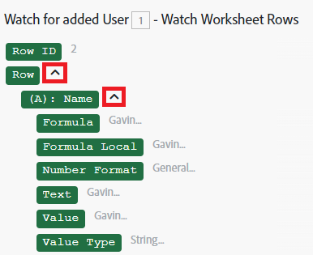

# モジュール間で情報をマッピングする

マッピングとは、モジュールの出力を別のモジュールの入力フィールドに割り当てるプロセスです。

マッピングパネルは、シナリオの前のモジュールから出力された値を挿入できるフィールドをクリックすると表示されます。

また、入力した静的テキストを使用して、マッピングパネルの関数とマッピングされた項目を任意に組み合わせて、数式を作成することもできます。 これらの要素は、互いに内部にネストできます。

## アクセス要件

+++ 展開すると、この記事の機能のアクセス要件が表示されます。

この記事で説明している機能を使用するには、次のアクセス権が必要です。

<table style="table-layout:auto">
 <col> 
 <col> 
 <tbody> 
  <tr> 
   <td role="rowheader">[!DNL Adobe Workfront] package</td> 
   <td> 
任意
 </td> 
  </tr> 
  <tr data-mc-conditions=""> 
   <td role="rowheader">[!DNL Adobe Workfront] ライセンス</td> 
   <td> 
新規： [!UICONTROL Standard]

または

現在：[!UICONTROL Work] 以上
 </td> 
  </tr> 
  <tr> 
   <td role="rowheader">[!DNL Adobe Workfront Fusion] ライセンス**</td> 
   <td>
   
現在：[!DNL Workfront Fusion] ライセンスは必要ありません。

   
または

   
レガシー：任意 

   </td> 
  </tr> 
  <tr> 
   <td role="rowheader">製品</td> 
   <td>
   
新規：
 <ul><li>[!UICONTROL Select] または [!UICONTROL Prime] [!DNL Workfront] プラン：組織は [!DNL Adobe Workfront Fusion] を購入する必要があります。</li><li>[!UICONTROL Ultimate] [!DNL Workfront] プラン：[!DNL Workfront Fusion] が含まれています。</li></ul>
   
または

   
現在：[!DNL Adobe Workfront Fusion] を購入する必要があります。

   </td> 
  </tr>
 </tbody> 
</table>

このテーブルの情報について詳しくは、[ ドキュメントのアクセス要件 ](/help/workfront-fusion/references/licenses-and-roles/access-level-requirements-in-documentation.md) を参照してください。

[!DNL Adobe Workfront Fusion] ライセンスについて詳しくは、[[!DNL Adobe Workfront Fusion] ライセンス](/help/workfront-fusion/set-up-and-manage-workfront-fusion/licensing-operations-overview/license-automation-vs-integration.md)を参照してください。

+++

## 項目のマッピング

2 つ以上のモジュールをリンクして一連のモジュールを作成した後、各モジュールは、それより前のモジュールが出力する項目の値を処理できます。

出力項目をモジュールの入力フィールドに割り当てるには：

1. 左側のパネルで「**[!UICONTROL Scenarios]**」タブをクリックします。
1. データをマッピングするシナリオを選択します。
1. シナリオの任意の場所をクリックして、シナリオエディターに移動します。
1. 前のモジュールまたはモジュールの出力を処理するモジュールをクリックします。
1. 表示されるモジュール設定パネルで、先行モジュールから出力された項目の値を使用するフィールドをクリックします。

   マッピングパネルが開きます。

1. （オプション）マッピングパネルで特定のフィールドを検索するには、マッピングパネルの検索バーをクリックし、検索する語句を入力します。リストに表示されるフィールドをクリックします。

   検索結果には検索語が含まれ、大文字と小文字は区別されません。
1. コレクションの要素である値を選択するには、コレクションの横にある矢印をクリックし、表示されたら要素を選択します。

   

1. マッピングパネルから項目をクリックして、フィールドに挿入します。

詳しくは、[ モジュールの設定 ](/help/workfront-fusion/create-scenarios/add-modules/configure-a-modules-settings.md) を参照してください。

## トラブルシューティング

### 問題：マッピングパネルに項目がありません

マッピングパネルには、以前のモジュールからの出力項目が表示されます。 このパネルに一部の項目が表示されない場合があります。 シナリオエディターで出力が欠落しているモジュールを実行すると、マッピングパネルでこれらの項目を後のモジュールに含めることができます。 厳密な手順は、モジュールのタイプによって異なります

* [インスタントトリガー](#instant-trigger)
* [ポーリングトリガー](#polling-trigger)
* [その他のモジュール](#other-modules)

#### インスタントトリガー

1. モジュールを右クリックし、表示されるメニューで **[!UICONTROL Run this module only]** をクリックします。

   これはインスタントトリガーなので、イベントを監視し始めます。

1. モジュールが監視しているイベントを作成します。

   例えば、モジュールがタスクの割り当てを監視しているWorkfront / Watch Events モジュールの場合は、（Fusion 接続で使用していないユーザーとして）Workfrontにログインしてタスクを割り当てます。

1. モジュールの実行が終了したら、モジュールの上のバブルをクリックして、その出力全体を確認します。

   後のモジュールのマッピングパネルに、モジュールの出力のすべての項目が含まれるようになりました。

#### ポーリングトリガー

1. モジュールを右クリックし、表示されるメニューで **[!UICONTROL Run this module only]** をクリックします。
1. 出力がない場合は、「**[!UICONTROL Choose where to start]**」をクリックして設定を調整します。
1. （条件付き）処理するイベントがない場合は、モジュールが監視するイベントを作成し、手順 2 を繰り返します。

   例えば、モジュールがタスクの割り当てを監視しているWorkfront / レコードを監視モジュールの場合、（Fusion 接続で使用していないユーザーとして）Workfrontにログインしてタスクを割り当ててから、モジュールを再度実行します。

1. モジュールの実行が終了したら、モジュールの上のバブルをクリックして、その出力全体を確認します。

   後のモジュールのマッピングパネルに、モジュールの出力のすべての項目が含まれるようになりました。

#### その他のモジュール

以下を実行することもできます。

* シナリオ全体（またはモジュールを含む部分のみ）
* 単一のモジュール

単一のモジュールを実行するには：

1. モジュールを右クリックし、表示されるメニューで **[!UICONTROL Run this module only]** をクリックします。
1. 入力項目のサンプル値を指定し、「**[!UICONTROL OK]**」をクリックします。
1. モジュールの実行が終了したら、モジュールの上のバブルをクリックして、その出力全体を確認します。

   後のモジュールのマッピングパネルに、モジュールの出力のすべての項目が含まれるようになりました。
