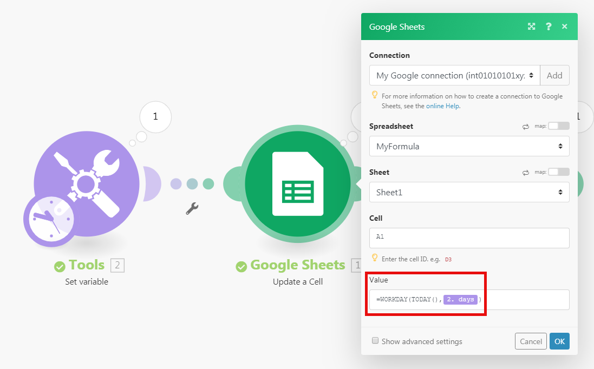

# 関数を使用した項目のマッピング

項目をマッピングする場合、関数を使用して単純な式や複雑な式を作成できます。 使用可能な関数は、Excel の関数や、一部のプログラミング言語の関数と似ています。

* 一般的なロジック、数学、テキスト、日付、配列を評価します。
* テキストの大文字への変換、テキストのトリミング、日付の別の形式への変換など、項目値の条件付きロジックと変換を実行できます。

## アクセス要件

+++ 展開すると、この記事の機能のアクセス要件が表示されます。

<table style="table-layout:auto">
 <col> 
 <col> 
 <tbody> 
  <tr> 
   <td role="rowheader">Adobe Workfront パッケージ</td> 
   <td> 
任意のAdobe Workfront ワークフローパッケージと任意のAdobe Workfront Automation and Integration パッケージ

WorkfrontUltimate

Workfront Fusion を追加購入したWorkfront Primeおよび Select パッケージ。
 </td> 
  </tr> 
  <tr data-mc-conditions=""> 
   <td role="rowheader">Adobe Workfront ライセンス</td> 
   <td> 
標準

ワークまたはそれ以上
 </td> 
  </tr> 
  <tr> 
   <td role="rowheader">製品</td> 
   <td>
   
組織がWorkfront Automation and Integration を含まない Select またはPrime Workfront パッケージを持っている場合は、Adobe Workfront Fusion を購入する必要があります。</li></ul>
   </td> 
  </tr>
 </tbody> 
</table>

このテーブルの情報について詳しくは、[ ドキュメントのアクセス要件 ](/help/workfront-fusion/references/licenses-and-roles/access-level-requirements-in-documentation.md) を参照してください。

+++

## フィールドに関数を挿入

フィールドに関数を挿入するには、次の手順に従います。

1. 左側のパネルで「**[!UICONTROL シナリオ]**」タブをクリックします。
1. データをマッピングするシナリオを選択します。
1. シナリオの任意の場所をクリックして、シナリオエディターに移動します。
1. 関数を挿入するフィールドをクリックします。
1. マッピングパネルで、挿入する関数を含むタブを選択します。

   マッピングパネルタブについて詳しくは、[ 関数の概要 ](/help/workfront-fusion/get-started-with-fusion/understand-fusion/function-overview.md) を参照してください。
   1. 関数名をクリックします。

      または

      関数をフィールドにドラッグします。
1. 関数パラメーターを設定します。

   関数パラメーターの説明については、マッピングパネルの関数にポインタを合わせてください。

   関数とそのパラメーターについて詳しくは、「[ 関数リファレンス：記事インデックス ](/help/workfront-fusion/references/mapping-panel/functions/functions-toc.md)」の記事を参照してください。

1. モジュールの設定を続行するか、[**OK**] をクリックします。

>[!TIP]
>
>他のフィールドで再利用する複雑な数式を作成する場合は、その組み合わせを含むフィールドをクリックし、Cmd + A または Ctrl + A キーを使用してその数式を選択します。その後、その数式をコピーして他のフィールドに貼り付けます。

>[!BEGINSHADEBOX]

**例：**&#x200B;一部のデータタイプでは、ユーザーが一定の文字数以上を入力できないよう設定されています。サブ文字列関数を使用して、値を特定の文字数に制限できます。

この例では、サブ文字列関数は、プロジェクト名を 50 文字に制限します。

>[!ENDSHADEBOX]

## 関数のネスト

関数を相互にネストすることができます。

>[!BEGINSHADEBOX]

**例：**

この例では、substring 関数を使用すると、トリミングされたプロジェクト名を 50 文字に制限しています。

>[!ENDSHADEBOX]

関数をネストするには、次の手順に従います。

1. 式を作成するフィールドをクリックします。

   マッピングパネルが開きます。

1. 追加する最初の関数をクリックします。 これは外側の関数です。 次の例の場合、これは `substring` 関数です。
1. その関数内で、ネストされた関数を配置する場所をクリックします。 この例では、ネストされた関数が最初のパラメーターの代わりに配置されます。
1. マッピングパネルで、ネストされた関数をクリックします。 この例では、これは `trim` 関数です。
1. 必要に応じて、関数の設定を続行します。
1. モジュールの設定を続行するか、[**OK**] をクリックします。

## [!DNL Google Sheets] 関数の使用

Workfront Fusion に使用したい関数が含まれていないが、[!DNL Google Sheets] で特集されている場合は、次の手順に従って使用できます。

1. [!DNL Google Sheets] で、新しい空のスプレッドシートを作成します。
1. Workfront Fusion で、シナリオを開きます。
1. **[!DNL Google Sheets]**／**[!UICONTROL セルを更新]**&#x200B;モジュールをシナリオに追加します。

1. モジュールを設定します。

   1. 「**[!UICONTROL スプレッドシート]**」フィールドで新しく作成したスプレッドシートを選択します。
   1. [!DNL Google Sheets] 関数を含む数式を「**[!UICONTROL 値]**」フィールドに挿入します。

      通常どおり、先行モジュールの出力を使用できます。

      

1. **[!UICONTROL Google Sheets]／[!UICONTROL セルを取得]**&#x200B;モジュールを挿入して、計算結果を取得します。
1. 手順 4 で使用した同じセル ID を使用して、モジュールを設定します。

   
