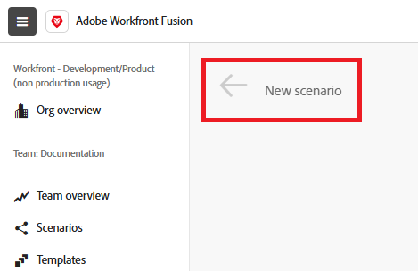

# シナリオ作成のワークフロー

シナリオは、組織のニーズを満たすように構築されており、ユースケースに対応するアプリケーションやモジュールが揃っています。 ただし、シナリオの作成は、ユースケースに関係なく、同じ基本ワークフローに従います。 この記事では、シナリオを作成する基本的なプロセスについて説明します。

* [シナリオの作成と名前の付け](#create-and-name-the-scenario)
* [最初のモジュールを追加して設定](#configure-the-first-module)
* [接続の作成](#create-connections)
* [追加モジュールの追加と設定](#add-and-configure-additional-modules)
* [モジュール間のデータのマッピング](#map-data-between-modules)
* [ルーティングの設定](#configure-routing)
* [エラー処理の設定](#configure-error-handling)
* [シナリオ設定の指定](#onfigure-scenario-settings)
* [テストと修正](#test-and-revise)
* [シナリオをアクティベート](#activate-the-scenario)
* [Workfront Fusion のシナリオのキーボードショートカット](#workfront-fusion-scenario-keyboard-shortcuts)

キーボードショートカット

## シナリオの作成と名前の付け

1. Workfront Fusion アカウントにログインします。
1. 左側のパネルで「**[!UICONTROL シナリオ]** 」をクリックします。

   >[!NOTE]
   >
   >左側のナビゲーションパネルまたはアイコンが表示されない場合は、メニュー  アイコンをクリックします。

1. （オプション） [!UICONTROL **フォルダー**] パネルで、**[!UICONTROL フォルダーを追加]** アイコン をクリックし、最初のフォルダーに「練習シナリオ」のような名前を入力します。

1. （オプション）フォルダーを開き、ページの右上隅にある「**[!UICONTROL 新しいシナリオを作成]**」をクリックします。

1. 左上隅にある「**[!UICONTROL 新規シナリオ]**」プレースホルダー名を選択し、「練習用シナリオ 1」などの名前を入力します。

   

1. 以下の最初のモジュール ](#2-connect-the-first-module)を[接続して続行します。

## 最初のモジュールを追加して設定

シナリオの最初のモジュールはトリガーモジュールで、特定の条件が満たされるとシナリオが開始されます。

シナリオに最初のモジュールを追加する手順については、「[ シナリオに最初のモジュールを追加する](/help/workfront-fusion/create-scenarios/add-modules/add-a-module-basic.md#add-the-first-module-to-a-scenario)」の「シナリオにモジュールを追加する」を参照してください。

モジュールの設定手順については、[ モジュールの設定](/help/workfront-fusion/create-scenarios/add-modules/configure-a-modules-settings.md)を参照してください

## 接続の作成

モジュールを設定する場合は、接続を入力または作成する必要があります。 モジュールは、この接続と、アプリケーションの日付にアクセスするために含まれる権限を使用します。

接続の作成方法に関する基本的な手順については、[接続の作成 – 基本的な手順](/help/workfront-fusion/create-scenarios/connect-to-apps/connect-to-fusion-general.md)を参照してください。

Google、Microsoft、または専用コネクタのないアプリケーションに関する特定のユースケースについては、[ アプリケーションへの接続：記事インデックス ](/help/workfront-fusion/create-scenarios/connect-to-apps/connect-to-apps-toc.md)の他の記事を参照してください。

## 追加モジュールの追加と設定

追加モジュールの追加と設定を続行します。

モジュールの追加方法については、[ モジュールの追加：記事インデックス ](/help/workfront-fusion/create-scenarios/add-modules/add-modules-toc.md)に記載されている記事を参照してください。

## モジュール間のデータのマッピング

以前のモジュールの出力を、後続のモジュールへの入力として使用できます。 例えば、1つのモジュールでWorkfront プロジェクトを作成し、後続のモジュールでそのモジュールにドキュメントをアップロードできます。

手順については、[ マップデータ：記事インデックス ](/help/workfront-fusion/create-scenarios/map-data/map-data-toc.md)の記事を参照してください。

## ルーティングの設定

ルーティングにより、シナリオはデータ値に基づいて異なるアクションを実行できます。

手順については、[ ルーターモジュールの追加とルートの設定](/help/workfront-fusion/create-scenarios/add-modules/router-module.md)を参照してください。

## エラー処理の設定

エラー処理を使用すると、シナリオをエラーから回復できます。 様々なエラー状況でシナリオがどのように反応するかを選択できます。

手順については、[ エラー処理の追加](/help/workfront-fusion/create-scenarios/config-error-handling/error-handling.md)を参照してください。

## シナリオ設定の指定

シナリオのスケジュール設定、メモの作成、データの保存方法の決定など、シナリオ全体の設定を行うことができます。

手順については、[ シナリオ設定の設定：記事インデックス ](/help/workfront-fusion/create-scenarios/config-scenarios-settings/config-scenario-settings-toc.md)の記事を参照してください。

## テストと修正

シナリオをテストすると、シナリオが意図したとおりに機能しているかどうかを判断できます。 その後、結果に基づいてシナリオを修正し、再テストします。

1. シナリオエディターの左下隅にある「**[!UICONTROL 1 回実行]**」をクリックします。
1. シナリオの実行が完了したら、各モジュールの上にある実行インスペクターのバブルをクリックして、情報の入力とそのモジュールの出力を確認します。

   * シナリオ実行情報の読み取りに関する一般的な情報については、[ シナリオ実行フロー](/help/workfront-fusion/references/scenarios/scenario-execution-flow.md)を参照してください。
   * 処理されたバンドルについて詳しくは、[Adobe Workfront Fusionでのシナリオ実行、サイクル、フェーズ ](/help/workfront-fusion/references/scenarios/scenario-execution-cycles-phases.md)を参照してください。

1. Workfront Fusionで、左下隅付近の&#x200B;**[!UICONTROL 保存]** をクリックして、シナリオの進行状況を保存します。

   >[!IMPORTANT]
   >
   >シナリオを改良、テストするたびに保存するようにしてください。

## シナリオをアクティベート

シナリオをアクティベートすると、デフォルトでは 15 分ごとに実行されます。 これは、実行するタイミングと頻度を定義することで変更できます。

シナリオのアクティブ化について詳しくは、[ シナリオのアクティブ化または非アクティブ化](/help/workfront-fusion/manage-scenarios/activate-deactivate-scenarios.md)を参照してください。

スケジュールについて詳しくは、[ シナリオのスケジュール ](/help/workfront-fusion/create-scenarios/config-scenarios-settings/schedule-a-scenario.md)を参照してください。

## Workfront Fusion のシナリオのキーボードショートカット

シナリオの作成または編集時に、以下のキーボードショートカットを使用できます。

<table style="table-layout:auto"> 
 <col data-mc-conditions=""> 
 <col data-mc-conditions=""> 
 <col data-mc-conditions=""> 
 <thead> 
  <tr> 
   <th> 
アクション
 </th> 
   <th>[!DNL Windows]</th> 
   <th> 
[!DNL MacOS]
 </th> 
  </tr> 
 </thead> 
 <tbody> 
  <tr> 
   <td role="rowheader">[!UICONTROL Save] </td> 
   <td>Ctrl + Shift + S</td> 
   <td>Cmd+Shift+S </td> 
  </tr> 
  <tr> 
   <td role="rowheader">[!UICONTROL Run Once]</td> 
   <td>Ctrl + Shift + Enter</td> 
   <td>Cmd+Shift+Enter </td> 
  </tr> 
  <tr> 
   <td role="rowheader">[!UICONTROL DevTool]を開く</td> 
   <td>F12</td> 
   <td>Ctrl+Fn+F12 </td> 
  </tr> 
  <tr> 
   <td role="rowheader">[!UICONTROL複数のモジュールを選択]</td> 
   <td>Shift+ドラッグ</td> 
   <td>Shift+ドラッグ  </td> 
  </tr> 
  <tr> 
   <td role="rowheader">[!UICONTROL Copy]</td> 
   <td>Ctrl+C</td> 
   <td>Cmd+C </td> 
  </tr> 
  <tr> 
   <td role="rowheader">[!UICONTROL Paste]</td> 
   <td>Ctrl+V</td> 
   <td>Cmd+V </td> 
  </tr> 
  <tr> 
   <td role="rowheader">[!UICONTROL モジュールの検索]</td> 
   <td>Ctrl+K</td> 
   <td>Cmd+K </td> 
  </tr> 
  <tr> 
   <td role="rowheader">シナリオにcURLをペーストしてHTTP モジュールを作成する</td> 
   <td colspan="2">cURLをコピーし、シナリオエディター内の任意の場所に貼り付けます。
詳しくは、<a href="/help/workfront-fusion/create-scenarios/add-modules/use-curl-create-http.md">cURLを使用してHTTP モジュールを追加する</a>を参照してください。</td> 
  </tr> 
 </tbody> 
</table>

