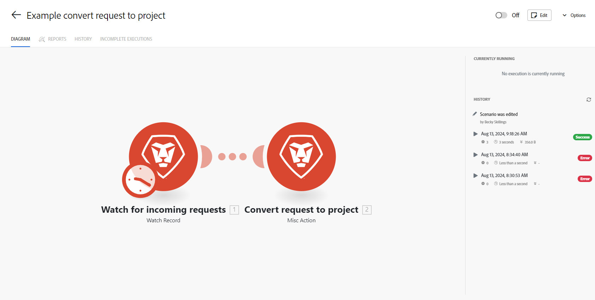

# シナリオの詳細の概要

シナリオの詳細ページは、特定のシナリオのホームページです。ページに表示されているシナリオの特定の情報へのアクセスを提供します。

また、シナリオエディターにアクセスして、シナリオを編集することもできます。

シナリオエディターについて詳しくは、[ シナリオエディター ](/help/workfront-fusion/get-started-with-fusion/navigate-fusion/scenario-editor.md) を参照してください

## アクセス要件

+++ 展開すると、この記事の機能のアクセス要件が表示されます。

この記事で説明している機能を使用するには、次のアクセス権が必要です。

<table style="table-layout:auto">
 <col> 
 <col> 
 <tbody> 
  <tr> 
   <td role="rowheader">[!DNL Adobe Workfront] package</td> 
   <td> 
任意
 </td> 
  </tr> 
  <tr data-mc-conditions=""> 
   <td role="rowheader">[!DNL Adobe Workfront] ライセンス</td> 
   <td> 
新規： [!UICONTROL Standard]

または

現在：[!UICONTROL Work] 以上
 </td> 
  </tr> 
  <tr> 
   <td role="rowheader">[!DNL Adobe Workfront Fusion] ライセンス**</td> 
   <td>
   
現在：[!DNL Workfront Fusion] ライセンスは必要ありません。

   
または

   
レガシー：任意 

   </td> 
  </tr> 
  <tr> 
   <td role="rowheader">製品</td> 
   <td>
   
新規：
 <ul><li>[!UICONTROL Select] または [!UICONTROL Prime] [!DNL Workfront] プラン：組織は [!DNL Adobe Workfront Fusion] を購入する必要があります。</li><li>[!UICONTROL Ultimate] [!DNL Workfront] プラン：[!DNL Workfront Fusion] が含まれています。</li></ul>
   
または

   
現在：[!DNL Adobe Workfront Fusion] を購入する必要があります。

   </td> 
  </tr>
  <tr data-mc-conditions=""> 
   <td role="rowheader">アクセスレベル設定*</td> 
   <td> 
     
組織の [!DNL Workfront Fusion] 管理者である必要があります。

     
チームの [!DNL Workfront Fusion] 管理者である必要があります。

   </td> 
  </tr> 
   </td> 
  </tr> 
 </tbody> 
</table>

このテーブルの情報について詳しくは、[ ドキュメントのアクセス要件 ](/help/workfront-fusion/references/licenses-and-roles/access-level-requirements-in-documentation.md) を参照してください。

[!DNL Adobe Workfront Fusion] ライセンスについて詳しくは、[[!DNL Adobe Workfront Fusion] ライセンス](/help/workfront-fusion/set-up-and-manage-workfront-fusion/licensing-operations-overview/license-automation-vs-integration.md)を参照してください。

+++

## [!UICONTROL Scenario detail] ページを開きます。

1. 左側のパネルで「**[!UICONTROL Scenario]**」タブをクリックし、詳細を表示するシナリオをクリックします。

   または

   シナリオエディターでシナリオに取り組んでいる場合は、ウィンドウの左上隅にある左矢印  をクリックします。

1. 表示されるページで、以下の表に示す要素を確認できます。

   

   <table style="table-layout:auto"> 
    <col> 
    <col> 
    <tbody> 
     <tr> 
      <td role="rowheader">[!UICONTROL Modules diagram] </td> 
      <td>このタブには、シナリオが視覚的に表示されます。図は、シナリオエディターで表示されるものと同じです。</td> 
     </tr> 
     <tr> 
      <td role="rowheader">[!UICONTROL Reports] タブ </td> 
      <td> 
このタブを開いて、過去 30 日間にこのシナリオで実行された操作数のグラフを表示します。
  </td> 
     </tr> 
     <tr> 
      <td role="rowheader">[!UICONTROL History] タブ </td> 
      <td> 
このタブを開いて、シナリオの編集内容を含むシナリオの履歴を表示します。 
 
「[!UICONTROL History]」タブには、各実行のシナリオ実行履歴も表示されます。次の情報が含まれます。
 
       <ul> 
        <li>各実行のステータス（成功またはエラー）</li> 
        <li>実行時間</li> 
        <li>操作の数</li> 
        <li>データ転送のサイズ</li> 
        <li>詳細情報へのリンク</li> 
       </ul> </td> 
     </tr> 
     <tr> 
      <td role="rowheader">[!UICONTROL Incomplete executions]</td> 
      <td> 
このタブには、シナリオの実行が不完全な場合に関する情報が提供されます。不完全な実行ごとに、次の情報が含まれます。
 
       <ul> 
        <li>作成日</li> 
        <li>データ転送のサイズ</li> 
        <li>再試行</li> 
        <li>解決済み</li> 
        <li>試行回数</li> 
       </ul> </td> 
     </tr> 
     <tr> 
      <td role="rowheader">[!UICONTROL Activate scenario] （オン/オフボタン）</td> 
      <td>シナリオを作成したら、スケジュールに従って実行するために、アクティブ化する必要があります。右上隅近くの「オン／オフ」ボタンをクリックすると、シナリオをアクティブ化または非アクティブ化できます。オンにすると、シナリオはスケジュールに従って実行されます。</td> 
     </tr> 
     <tr> 
      <td role="rowheader">[!UICONTROL Edit]</td> 
      <td>シナリオ図をクリックしてシナリオエディターを開き、シナリオを変更します。</td> 
     </tr> 
     <tr> 
      <td role="rowheader">[!UICONTROL Options]</td> 
      <td> 
このメニューを使用すると、シナリオエディターを開かなくても追加のオプションを使用できます。 改善点には、以下のものが含まれます。
 
       <ul> 
        <li>[!UICONTROL Scheduling]</li> 
        <li>[!UICONTROL Rename]</li> 
        <li>[!UICONTROL Clone]</li> 
        <li>[!UICONTROL Delete]</li> 
       </ul> </td> 
     </tr> 
     <tr> 
      <td role="rowheader">[!UICONTROL Currently running]</td> 
      <td>このエリアには、現在実行中の実行に関連する情報が表示されます。</td> 
     </tr> 
     <tr> 
      <td role="rowheader"> 
[!UICONTROL History] panel
 
 
 </td> 
      <td> 
このエリアには、シナリオの最後の実行に関連する情報が表示されます。実行ごとに、次の情報が表示されます。
 
       <ul> 
        <li>実行日</li> 
        <li>ステータス（成功または失敗）</li> 
        <li>実行時間</li> 
        <li>データ転送のサイズ</li> 
        <li>詳細情報へのリンク</li> 
       </ul> </td> 
     </tr> 
         <tr> 
      <td role="rowheader"> 
[!UICONTROL Events] panel
  </td> 
      <td>この領域には、シナリオに関連するイベントに関する情報が表示されます。  </td> 
     </tr> 
     <tr> 
      <td role="rowheader"> 
[!UICONTROL Processing banner]
  </td>

   <td>シナリオを最近実行した場合は、次のようなバナーが表示されることがあります。
<code>Data is still being processed. Only partial scenario history will show until processing is complete.</code>
これは、実行の詳細がストレージに書き込まれる間に表示されます。処理は、シナリオの実行直後に行われます。数分以上続くことはありません。シナリオ実行の処理中は、シナリオ実行の詳細が表示されない場合があります。</td> 
     </tr> 
    </tbody> 
   </table>
