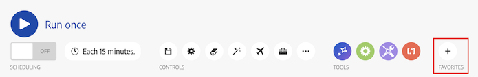

# シナリオエディター

シナリオエディターを使用すると、視覚的なインターフェイスでシナリオを作成および編集できます。

## アクセス要件

+++ 展開すると、この記事の機能のアクセス要件が表示されます。

<table style="table-layout:auto">
 <col> 
 <col> 
 <tbody> 
  <tr> 
   <td role="rowheader">Adobe Workfront パッケージ</td> 
   <td> 
任意のAdobe Workfront ワークフローパッケージと任意のAdobe Workfront Automation and Integration パッケージ

WorkfrontUltimate

Workfront Fusion を追加購入したWorkfront Primeおよび Select パッケージ。
 </td> 
  </tr> 
  <tr data-mc-conditions=""> 
   <td role="rowheader">Adobe Workfront ライセンス</td> 
   <td> 
標準

ワークまたはそれ以上
 </td> 
  </tr> 
  <tr> 
   <td role="rowheader">製品</td> 
   <td>
   
組織がWorkfront Automation and Integration を含まない Select またはPrime Workfront パッケージを持っている場合は、Adobe Workfront Fusion を購入する必要があります。</li></ul>
   </td> 
  </tr>
 </tbody> 
</table>

このテーブルの情報について詳しくは、[&#x200B; ドキュメントのアクセス要件 &#x200B;](/help/workfront-fusion/references/licenses-and-roles/access-level-requirements-in-documentation.md) を参照してください。

+++

## シナリオエディターを開き、モジュールを追加します。

1. 左側のパネルで **[!UICONTROL シナリオ]** をクリックします。
1. 疑問符アイコン  をクリックし、開始するアプリまたはサービスを見つけてクリックします。 モジュールの設定について詳しくは、「[&#x200B; モジュールの設定 &#x200B;](/help/workfront-fusion/create-scenarios/add-modules/configure-a-modules-settings.md)」を参照してください。

## 使用可能なシナリオエディターのアクション

### シナリオを実行

| アクション | 詳細 |
|----------|----------|
| シナリオのテスト実行を行う | シナリオをアクティベートする前に、シナリオが期待どおりに実行されることを確認します。 アクティブ化すると、シナリオはスケジュールに従って実行されます。すべてが期待どおりに実行されない場合は、[&#x200B; エラー処理の追加 &#x200B;](/help/workfront-fusion/create-scenarios/config-error-handling/error-handling.md) を参照して、エラーの処理方法を確認してください。 |

### スケジュール設定

| アクション | 詳細 |
|----------|----------|
| シナリオのスケジュール設定 | デフォルトでは、シナリオは 15 分ごとに実行されます。アクティブ化されたシナリオを実行するタイミングと頻度を定義することで、これを変更できます。Fusion シナリオは、5 分ごとに実行するようにスケジュールできます。 詳しくは、[&#x200B; シナリオのスケジュール設定 &#x200B;](/help/workfront-fusion/create-scenarios/config-scenarios-settings/schedule-a-scenario.md) を参照してください。 |

### コントロール

| アクション | 詳細 |
|----------|----------|
| 保存します。 | シナリオを保存した後、将来アクセスする必要がある場合、「...」メニューから新しいバージョンを使用できます。以前に保存したシナリオのバージョンは 60 日間のみ使用できます。 |
| シナリオ設定 | シナリオ設定パネルには、シナリオの詳細設定が含まれています。 使用可能な設定について詳しくは、[&#x200B; シナリオ設定の設定 &#x200B;](/help/workfront-fusion/create-scenarios/config-scenarios-settings/configure-scenario-settings.md) を参照してください。 |
| メモ | シナリオに関するメモを作成します。 他のユーザーは、シナリオ内でこれらのメモを表示できます。 |
| 自動整列 | シナリオ内のモジュールを自動整列します。 |
| 説明フロー | 移動するドットがシナリオ内でのデータのフローを示すアニメーションを表示します。 |
| 開発ツール | 開発ツールを使用すると、シナリオのすべての手動実行を確認し、実行されたすべての操作を確認し、実行されたすべての API 呼び出しの詳細を確認できます。 エラーの原因となったモジュール、操作、または単一の応答を確認し、その知識を使用してシナリオを絞り込むことができます。 詳しくは、[&#x200B; シナリオのデバッグ &#x200B;](/help/workfront-fusion/manage-scenarios/debug-a-scenario.md) を参照してください。 |
| その他 | その他メニューで、ブループリントを読み込みまたは書き出し、シナリオを以前のバージョンに復元することができます。 |

### ツール

| アクション | 詳細 |
|----------|----------|
| フロー制御 | 設定を構成して、データのフローを制御します。 詳しくは、「必要なリンク [ を参照してください ]。 |
| ツール | 「ツール」セクションには、シナリオを強化できる便利なモジュールがいくつか含まれています。 詳しくは、「必要なリンク [ を参照してください ]。 |
| テキストパーサー | テキストパーサーツールを使用して、他のシナリオモジュールで使用するテキストを解析します。 テキストパーサーは接続を必要としません。 詳しくは、「必要なリンク [ を参照してください ]。 |

### お気に入り

「お気に入り」アイコンを使用して、頻繁に使用するモジュールを追加できます。

