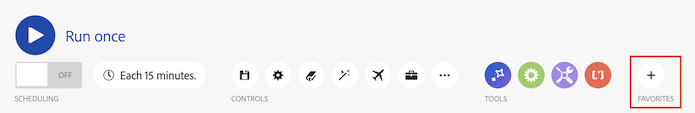

# シナリオエディター

シナリオエディターを使用すると、視覚的なインターフェイスでシナリオを作成および編集できます。

## アクセス要件

+++ 展開すると、この記事の機能のアクセス要件が表示されます。

<table style="table-layout:auto">
 <col> 
 <col> 
 <tbody> 
  <tr> 
   <td role="rowheader">Adobe Workfront パッケージ</td> 
   <td> 
任意の Adobe Workfront Workflow パッケージと任意の Adobe Workfront Automation および Integration パッケージ

Workfront Ultimate

Workfront Fusion を追加購入した Workfront Prime および Select パッケージ。
 </td> 
  </tr> 
  <tr data-mc-conditions=""> 
   <td role="rowheader">Adobe Workfront ライセンス</td> 
   <td> 
標準

Work またはそれ以上
 </td> 
  </tr> 
  <tr> 
   <td role="rowheader">製品</td> 
   <td>
   
組織が Workfront Automation および Integration を含まない Select またはPrime Workfront パッケージを持っている場合は、Adobe Workfront Fusion を購入する必要があります。</li></ul>
   </td> 
  </tr>
 </tbody> 
</table>

この表の情報について詳しくは、[ドキュメントのアクセス要件](/help/workfront-fusion/references/licenses-and-roles/access-level-requirements-in-documentation.md)を参照してください。

+++

## シナリオエディターを開き、モジュールを追加します。

1. 左側のパネルで「**[!UICONTROL シナリオ]** 」をクリックします。
1. 疑問符アイコン をクリックし、最初に使用するアプリまたはサービスを見つけてクリックします。 モジュールの設定について詳しくは、[&#x200B; モジュールの設定](/help/workfront-fusion/create-scenarios/add-modules/configure-a-modules-settings.md)を参照してください。

## 使用可能なシナリオエディターのアクション

### シナリオの実行

| アクション | 詳細 |
|----------|----------|
| シナリオのテスト実行を行う | シナリオをアクティブ化する前に、シナリオが期待どおりに実行されていることを確認します。 アクティブ化すると、シナリオはスケジュールに従って実行されます。 すべてが期待どおりに実行されない場合は、[&#x200B; エラー処理の追加](/help/workfront-fusion/create-scenarios/config-error-handling/error-handling.md)を参照して、エラーの処理方法を確認してください。 |

### スケジュール設定

| アクション | 詳細 |
| ---------- | ---------- |
| シナリオのスケジュール | デフォルトでは、シナリオは 15 分ごとに実行されます。 アクティブ化されたシナリオを実行するタイミングと頻度を定義することで、これを変更できます。 Fusion シナリオは、5 分ごとに実行するようにスケジュールできます。 詳細については、[&#x200B; シナリオのスケジュール &#x200B;](/help/workfront-fusion/create-scenarios/config-scenarios-settings/schedule-a-scenario.md)を参照してください。 |

### コントロール

これらのコントロールの一部を表示するには、コントロール領域の3点アイコンをクリックする必要がある場合があります。

| アクション | 詳細 |
| ---------- | ---------- |
| 保存します。 

 | シナリオを保存した後、将来アクセスする必要がある場合、「...」メニューから新しいバージョンを使用できます。 以前に保存したシナリオのバージョンは 60 日間のみ使用できます。 |
| シナリオ設定 

 | シナリオ設定パネルには、シナリオの詳細設定が表示されます。 使用可能な設定について詳しくは、[&#x200B; シナリオ設定の設定](/help/workfront-fusion/create-scenarios/config-scenarios-settings/configure-scenario-settings.md)を参照してください。 |
| メモ  

 | シナリオに関するメモを作成します。 他のユーザーは、シナリオ内にあるときに、これらのメモを表示できます。 |
| 自動整列 

 | シナリオ内のモジュールを自動調整します。 |
| 検索モジュール 
  
 | モジュールを検索するための検索語句を入力し、そのモジュールに移動する検索結果をクリックします。 モジュール名、ID、タイプ、またはアプリケーションで検索できます。 |
| フローを説明  
 
 | 動くドットがシナリオ内のデータの流れを示すアニメーションを表示します。 |
| 開発ツール 

 | DevToolを使用すると、シナリオのすべての手動実行を確認し、実行されたすべての操作を確認し、実行されたすべてのAPI呼び出しの詳細を確認できます。 エラーが発生したモジュール、操作または単一の応答を確認し、その知識を使用してシナリオを改良できます。 詳しくは、[&#x200B; シナリオのデバッグ &#x200B;](/help/workfront-fusion/manage-scenarios/debug-a-scenario.md)を参照してください。 |
| ブループリントの書き出し  
 
 | 現在のシナリオのブループリントを書き出します。 |
| ブループリントの読み込み  
 
 | 以前に書き出したシナリオブループリントを読み込みます。 |
| 以前のバージョン  
 
 | このシナリオの以前のバージョンを表示します。 |

### ツール

| アクション | 詳細 |
|---------- | ---------- |
| フロー制御 | データの流れを制御するための設定を構成します。 詳細については、[必要なリンク ]を参照してください。 |
| ツール | ツール セクションには、シナリオを強化するのに役立つモジュールがいくつか含まれています。 詳細については、[必要なリンク ]を参照してください。 |
| テキストパーサー | テキスト解析ツールを使用して、他のシナリオモジュールで使用するテキストを解析します。 テキストパーサーには接続は必要ありません。 詳細については、[必要なリンク ]を参照してください。 |

### お気に入り

「お気に入り」アイコンを使用して、頻繁に使用するモジュールを追加できます。

