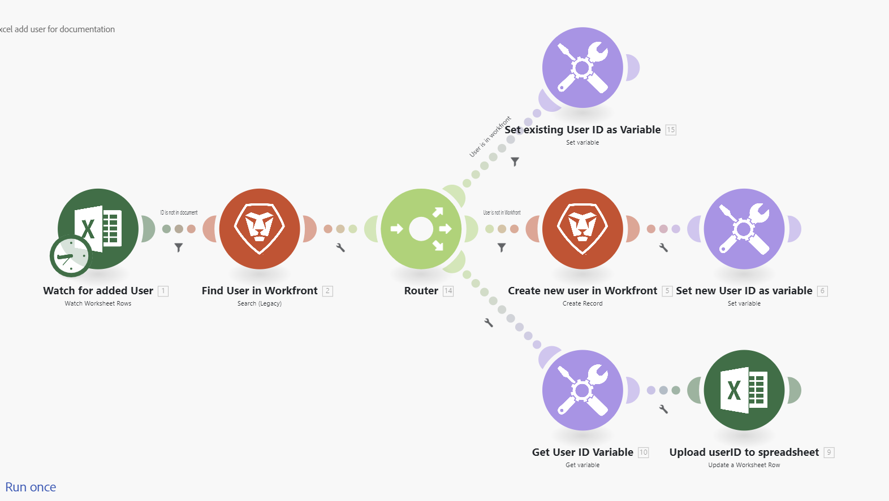

# Adobe Workfront Fusion 用語集

次の用語集では、Adobe Workfront Fusion の一般的な用語をいくつか説明します。

<table style="table-layout:auto">
 <col> 
 <col> 
 <tbody> 
  <tr> 
   <td role="rowheader"> 
アクション
 </td> 
   <td>選択したアプリやサービスに対するデータの読み取りや書き込みなどのアクションを実行できるモジュール。</td> 
  </tr> 
  <tr> 
   <td role="rowheader"> 
アグリゲータ
 </td> 
   <td> 
複数のバンドル（複数のデータのコレクション）を 1 つのバンドルに結合するモジュールのタイプ。 

詳しくは、<a href="/help/workfront-fusion/references/modules/aggregator-module.md" class="MCXref xref">アグリゲータモジュール</a>を参照してください。
 </td> 
  </tr> 
  <tr> 
   <td role="rowheader">API</td> 
   <td>アプリケーションプログラミングインターフェイス（API）は、アプリケーションとサービスが相互に通信する手段です。Fusion は API を使用して、接続先のアプリケーションと通信します。各アプリケーションには個別の API があります。 </td> 
  </tr> 
  <tr> 
   <td role="rowheader">API キー</td> 
   <td>ソフトウェアの API を呼び出すユーザー、開発者またはプログラムを識別する一意のコードで、認証に使用されます。Fusion モジュールは API を接続して動作するので、API キーが必要になる場合があります。API キーは、API キーを必要とするアプリによって配布されます。例えば、Fusion を Adobe Lightroom に接続するのに API キーが必要な場合、Adobe Lightroom アカウントを通じてリクエストします。</td> 
  </tr> 
  <tr> 
   <td role="rowheader">アプリまたはサービス</td> 
   <td> 
ソフトウェアアプリケーション。Fusion は、そのアプリケーション専用コネクターがなくても、ほとんどのアプリケーションに接続できます。
 
またアプリは、イテレータやアグリゲータなどのデータを操作する特別な関数である場合もあります。 
 
サービスは、web API、web ページ、様々なタイプのサーバー（FTP、SMTP、IMAP）などを含むデータのソースです。 
  </td> 
  </tr> 
  <tr> 
   <td role="rowheader"> 
バンドル
 </td> 
   <td> 
バンドルは、モジュールが返す、または受け取るデータの基本単位です。例えば、3 つのレコードを返す検索モジュールは、レコードごとに 1 つずつ、3 つのデータバンドルを出力します。バンドルは複数の項目で構成されます。
 </td> 
  </tr> 
  <tr>
   <td role="rowheader"> 
接続
 </td> 
   <td> 
接続は、特定のサービスに接続するための一連の資格情報を表します。 任意のモジュール内で接続を設定してから、その接続を他のモジュールで使用できます。Fusion がこれらの資格情報を使用してモジュールが必要とする情報にアクセスできるように、すべてのモジュールで接続を選択する必要があります。 

詳しくは、<a href="/help/workfront-fusion/get-started-with-fusion/understand-fusion/connection-overview.md" class="MCXref xref">接続の概要</a>を参照してください。
 </td> 
  </tr> 
  <tr> 
   <td role="rowheader">コネクター</td> 
   <td>コネクターは、特定のアプリケーション向けのモジュールのセットです。Workfront Fusion には、Workfront、Salesforce、Jira など、多くの一般的な作業アプリケーションへのコネクターが用意されています。</td> 
  </tr> 
  <tr> 
   <td role="rowheader"> 
サイクル
 </td> 
   <td> 
1 サイクルは、シナリオ実行の 2 つのフェーズである操作とコミットから成ります。このシナリオは、1 つ以上のサイクルで構成されます。詳しくは、<a href="/help/workfront-fusion/references/scenarios/scenario-execution-cycles-phases.md" class="MCXref xref">シナリオの実行、サイクルおよびフェーズ</a>を参照してください。
 </td> 
  </tr> 
  <tr> 
   <td role="rowheader"> 
データ保存
 </td> 
   <td> 
データストアは、シナリオからデータを保存したり、個々のシナリオ間やシナリオ実行間でデータを転送できるようにしたりします。 

詳しくは、<a href="/help/workfront-fusion/create-scenarios/map-data/data-stores.md" class="MCXref xref">データストア</a>を参照してください。
 </td> 
  </tr> 
  <tr> 
   <td role="rowheader"> 
フィルター
 </td> 
   <td> 
 フィルターは 2 つのモジュール間に適用でき、特定の条件に合致するバンドルのみを操作できます。適用できる様々なフィルターがあります。 

詳しくは、<a href="/help/workfront-fusion/create-scenarios/add-modules/add-a-filter-to-a-scenario.md" class="MCXref xref">シナリオへのフィルターの追加</a>を参照してください。
 </td> 
  </tr> 
  <tr> 
   <td role="rowheader"> 
ID 
 </td> 
   <td> 
バンドルを一意に識別するために使用される名前。ID は通常、特定のサービスから更新または削除されるバンドルを区別するのに使用されます。ID は、以前のモジュールの出力からマッピングできます。
 </td> 
  </tr> 
  <tr> 
   <td role="rowheader"> 
項目
 </td> 
   <td> 
バンドルの一部。バンドルは複数の項目で構成できます。項目には、テキスト、数値、ブール値（はい／いいえ）、日付、時刻、バッファー（バイナリデータ）、コレクション、選択メニュー、配列、検証など、様々なタイプがあります。

 詳しくは、<a href="/help/workfront-fusion/references/mapping-panel/data-types/item-data-types.md" class="MCXref xref">項目データタイプ</a>を参照してください。
 </td> 
  </tr>
  <tr> 
   <td role="rowheader"> 
イテレータ
 </td> 
   <td> 
1 つのデータのバンドル（データのコレクション）を取得し、別々のバンドルに分割できるモジュールのタイプ。その後、後のモジュールで、これらのバンドルを個別に処理できます。 

詳しくは、<a href="/help/workfront-fusion/references/modules/iterator-module.md" class="MCXref xref">[!UICONTROL Iterator] モジュール</a>を参照してください。
 </td> 
  </tr> 
  <tr> 
   <td role="rowheader"> 
モジュール
 </td> 
   <td> 
関連するアプリまたはサービス内で、レコードの作成などの機能を実行するシナリオ内の 1 つの手順。
 
それぞれのアプリやサービスには、リクエストへの応答方法を定義する様々なモジュールがあります。
  
  
 
詳しくは、<a href="/help/workfront-fusion/get-started-with-fusion/understand-fusion/module-overview.md" class="MCXref xref">モジュールの概要</a>を参照してください。
 </td> 
  </tr> 
  <tr> 
   <td role="rowheader"> 
操作
 </td> 
   <td> 
レコードの取得やファイルのアップロードなど、モジュールが実行するタスク。

詳しくは、<a href="/help/workfront-fusion/set-up-and-manage-workfront-fusion/licensing-operations-overview/operations-in-workfront-fusion.md" class="MCXref xref">操作</a>を参照してください。

  </tr> 
  <tr> 
   <td role="rowheader">公開鍵と秘密鍵</td> 
   <td>公開鍵と秘密鍵は、データの暗号化と復号化に使用されます。公開鍵は配布でき、公開鍵を持つすべてのユーザーがデータを暗号化できますが、復号化できるのは秘密鍵のみです。同様に、同様に、秘密鍵を持つユーザーは、公開鍵を持つ誰もが復号化できるデータを暗号化できます。秘密鍵による暗号化は、データが秘密鍵の所有者から送信されたことを保証し、データのソースの検証として機能します。</td> 
  </tr> 
  <tr> 
   <td role="rowheader"> 
ルーター
 </td> 
   <td>ルーターは、データを複製したり、シナリオに新しいルートを追加したりできるので、データを再ルーティングし、異なるデータグループを別々に処理できます。

 詳しくは、<a href="/help/workfront-fusion/create-scenarios/add-modules/router-module.md" class="MCXref xref">[!UICONTROL Router] モジュール</a>を参照してください。</td> 
  </tr> 
  <tr> 
   <td role="rowheader"> 
シナリオ
 </td> 
   <td> 
ユーザーが作成した一連の自動化された手順で、それぞれがモジュールによって表され、実行されます。シナリオの目的は、データの移動と操作です。
 
  
 
 詳しくは、<a href="/help/workfront-fusion/get-started-with-fusion/understand-fusion/scenario-overview.md" class="MCXref xref">シナリオの概要</a>を参照してください。
 </td> 
  </tr> 
  <tr> 
   <td role="rowheader"> 
シナリオセグメント
 </td> 
   <td> 
 シナリオセグメントは、同じアプリケーションに接続される一連のモジュールで構成される 1 つのシナリオの 1 つのセクションです。シナリオセグメントは、多くの場合、アプリケーションの短いワークフローを表します。
 </td> 
  </tr> 
  <tr> 
   <td role="rowheader"> 
トリガー
 </td> 
   <td> 
トリガーは、新しいデータや更新されたデータを監視し、モジュールで設定された特定の条件が適用されたときにシナリオを開始するモジュールの一種です。トリガーは、スケジュール（ポーリング）に従って、またはデータ変更が発生した場合（インスタントトリガーまたは Webhook）にシナリオを開始するように設定できます。
 
詳しくは、モジュールの概要の記事の<a href="/help/workfront-fusion/get-started-with-fusion/understand-fusion/module-overview.md" class="MCXref xref">トリガー</a>を参照してください。
 </td> 
  </tr> 
  <tr> 
   <td role="rowheader"> 
Webhook
 </td> 
   <td> 
新しいバンドルが使用できるになった直後にシナリオを実行できる特別なタイプのトリガー。 

詳しくは、<a href="/help/workfront-fusion/references/modules/webhooks-reference.md" class="MCXref xref">インスタントトリガー（Webhook）</a>を参照してください。
 </td> 
  </tr> 
 </tbody> 
</table>
