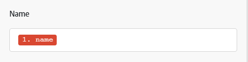

# マッピングの概要

マッピングとは、あるモジュールの出力を別のモジュールの入力フィールドに割り当てるプロセスです。

モジュールの操作により、その出力として 0 個、1 個または複数のバンドルが生成されます。バンドルは、1 つ以上の項目で構成されます。

これらの項目は、後のモジュールのフィールドにマッピングできます。

シナリオで前のモジュールから出力された値を挿入するフィールドをクリックすると、マッピングパネルが表示されます。ここでは、マッピングする項目を選択できます。マッピングには、次のうち 1 つ以上を含めることができます。

* 単一の項目
* 複数の項目
* 静的テキスト
* 関数

>[!BEGINSHADEBOX]

**例**:

単一の項目

テキストを含む複数の項目

複数の項目とテキストを含む関数

>[!ENDSHADEBOX]

マッピングの手順について詳しくは、[データのマッピング：記事インデックス](/help/workfront-fusion/create-scenarios/map-data/map-data-toc.md)の記事を参照してください。

>[!NOTE]
>
>[!UICONTROL イテレータ]および[!UICONTROL アグリゲータ]間でラップされたモジュールの出力は、[!UICONTROL アグリゲータ]モジュールから先にはアクセスできません。

## マッピングパネル

データをマッピングできるフィールドをクリックすると、マッピングパネルが開きます。

最初のタブのは、他のモジュールからマッピングできる項目を表示します。

その他のタブには、数式の作成に使用できる関数、演算子およびキーワードが含まれます。これらは、処理するデータのタイプに基づいて異なるタブに並べ替えられます。

関数タブについて詳しくは、[関数の概要](/help/workfront-fusion/get-started-with-fusion/understand-fusion/function-overview.md)を参照してください。

関数を使用した項目のマッピングについて詳しくは、[ 組み込み関数を使用した項目のマッピング ](/help/workfront-fusion/create-scenarios/map-data/map-using-functions.md) を参照してください。

## コレクション

項目には、様々なタイプの複数の値を含めることができます。これらはコレクションタイプの項目です。

コレクションタイプのバンドルは、モジュール出力のバンドルラベルの横に `(Collection)` を表示します。

ほとんどの場合、コレクション全体を表す項目ではなく、コレクションの要素をマッピングします。

マッピングパネルでコレクションの要素を見つけるには、コレクションの横にある矢印をクリックします。

配列について詳しくは、[項目データタイプ](/help/workfront-fusion/references/mapping-panel/data-types/item-data-types.md)を参照してください。

コレクションのマッピング手順について詳しくは、モジュール間での情報のマッピングの記事の[項目のマッピング](/help/workfront-fusion/create-scenarios/map-data/map-data-from-one-to-another.md#map-an-item)を参照してください。

## 配列

項目には、同じタイプの複数の値を含めることができます。これらは配列タイプの項目です。

配列タイプのバンドルは、モジュール出力のバンドルラベルの横に `(Array)` を表示します。

マッピングパネルでは、配列は角括弧で表示されます。配列タイプの項目は、項目のラベルの最後にある角括弧で識別できます。マッピングパネルで特定の配列要素を見つけるには、配列の横にある矢印をクリックします。

配列および配列要素のマッピングについて詳しくは、[配列および配列要素のマッピング](/help/workfront-fusion/create-scenarios/map-data/map-an-array.md)を参照してください。
