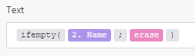

# モジュールの概要

Adobe Workfront Fusion は、次の 5 種類のモジュールを区別します。

* アクションモジュール
* 検索モジュール
* トリガーモジュール
* アグリゲータ
* イテレータ

アグリゲータとイテレータは、詳細なシナリオ用です。

## アクションモジュール

アクションモジュールは、最も一般的なタイプのモジュールです。一般的なアクションモジュールは、アクションを実行し、1 つのバンドルを返し、次のモジュールに渡して処理を行います。

トリガーモジュールとは異なり、アクションモジュールは、シナリオの最初、中間または最後に配置できます。

シナリオに含まれるアクションモジュールの数は無制限ですが、多数のモジュール（150 以上）がパフォーマンスに影響を与える可能性があります。

>[!BEGINSHADEBOX]

**例：**

* **Workfront／[!UICONTROL ファイルをアップロード]**&#x200B;で、Workfront にファイルを送信し、その識別子を返します。
* **[!UICONTROL 画像]／[!UICONTROL サイズ変更]**&#x200B;で画像を受け取り、指定した寸法にサイズ変更し、サイズ変更した画像を次のアクションに渡します。

>[!ENDSHADEBOX]

アクションタイプには、次の 4 つのサブタイプがあります。

* 作成
* 読み取り
* 更新
* 削除

更新サブタイプには、次の 3 つの操作が含まれます。

* **フィールドの内容を消去する**。この操作は、フィールドの内容が `erase` キーワードに評価されるときに行われます（`empty` と混同しないでください）。

  

* **フィールドの内容を変更しない**。この操作は、フィールドが空白のままになっているか、フィールドの内容が空白と評価される（JSON の null で表される）場合に実行されます。

  

* **フィールドの内容を置き換える**。この操作は、上記の 2 つ以外のすべての場合に実行されます。

>[!NOTE]
>
>* `erase` キーワードがマッピングパネルに表示されない場合、モジュールが更新モジュールでないか、アプリの最新の仕様に更新されていません。
>* `Empty` はフィールドの内容を変更しません。フィールドを消去する必要がある場合は、次の数式を使用できます。
>
>   
>
>* フィールドの内容が空として評価される場合にフィールドを変更しないままにすることは、現時点でサポートされていません。

## 検索モジュール

検索モジュールは、0 個、1 個または複数個のバンドルを返し、次のモジュールに渡して処理を行います。

シナリオの最初、中間または最後に検索モジュールを配置できます。

シナリオに含まれる検索モジュールの数は無制限ですが、多数のモジュール（150 以上）がパフォーマンスに影響を与える可能性があります。

>[!BEGINSHADEBOX]

**例：**

**Workfront／[!UICONTROL 関連レコードを読み取り]**&#x200B;では、特定の親オブジェクト内で、指定した検索クエリに一致するレコードを読み取ります。

>[!ENDSHADEBOX]

## トリガーモジュール

トリガーは、レコードの作成や更新など、特定のサービスに変更があった場合にバンドルを生成します。

トリガーは、0 個、1 個または複数個のバンドルを返し、次のモジュールに渡して処理を行います。

トリガーはシナリオの実行を開始させる原因となるので、シナリオの先頭にのみ配置できます。

各シナリオにはトリガーを 1 つだけ含めることができます。

Workfront Fusion は、ポーリングトリガーとインスタントトリガーの 2 種類のトリガーを使用します。

### ポーリングトリガー

ポーリングトリガーは、前回のシナリオ実行以降に変更がなかった場合でも、特定のサービスを定期的にポーリングします。ポーリングトリガーを含むシナリオを、一定の間隔で実行するようにスケジュールすることをお勧めします。トリガーの設定に一致する変更がある場合、トリガーは変更に関する情報を含むバンドルを返します。設定に一致する変更がない場合、トリガーはバンドルを出力しません。

シナリオのスケジュールの説明について詳しくは、[シナリオのスケジュール](/help/workfront-fusion/create-scenarios/config-scenarios-settings/schedule-a-scenario.md)を参照してください。

ポーリングトリガーを使用すると、トリガーを保存した後やトリガー設定を変更した後に自動的に表示されるパネルを介して出力される最初のバンドルを選択できます。この選択は、モジュールの最初の実行にのみ影響します。モジュールが 1 回実行された後に続く実行では、最後の実行後に行われた変更のみが監視されます。

詳しくは、[トリガーモジュールの開始場所の選択](/help/workfront-fusion/create-scenarios/add-modules/choose-where-trigger-module-starts.md)を参照してください。

>[!BEGINSHADEBOX]

**例：**

* **Workfront／[!UICONTROL レコードを監視]**&#x200B;は、前回のシナリオ実行以降に新しく追加されたレコードを返します。

* **[!DNL Google Sheets]／[!UICONTROL 行を監視]**&#x200B;は、前回のシナリオ実行以降に追加された新しい行を返します。

>[!ENDSHADEBOX]

### インスタントトリガー

インスタントトリガーを使用すると、サービスは、変更後すぐに Workfront Fusion に通知できます。即座に実行するインスタントトリガーを含むシナリオをスケジュールすることをお勧めします。

手順について詳しくは、[シナリオのスケジュール](/help/workfront-fusion/create-scenarios/config-scenarios-settings/schedule-a-scenario.md)を参照してください。

受信データがインスタントトリガーでどのように処理されるかについて詳しくは、[インスタントトリガー（Webhook）](/help/workfront-fusion/references/modules/webhooks-reference.md)を参照してください。

>[!BEGINSHADEBOX]

**例：**

* **Workfront／[!UICONTROL イベントを監視]**&#x200B;は、タスクの作成など、Workfront で特定の種類のイベントが発生したときに情報を返します。
* **[!DNL Google Sheets]／[!UICONTROL 変更を監視]**&#x200B;は、セルが更新されるたびに情報を返します。

>[!ENDSHADEBOX]

## アグリゲータ

アグリゲータモジュールは、複数のバンドルを 1 つのバンドルに蓄積します。

アグリゲータは 1 つのバンドルのみを返し、次のモジュールに渡してさらに処理を行います。

アグリゲータは、シナリオの途中にのみ配置できます。

シナリオに含まれるアグリゲータの数は無制限ですが、多数のモジュール（150 以上）がパフォーマンスに影響を与える可能性があります。

>[!BEGINSHADEBOX]

**例：**

* **[!UICONTROL アーカイブ]／[!UICONTROL アーカイブを作成]**&#x200B;は、複数のファイルを 1 つの zip アーカイブに圧縮します。
* **[!UICONTROL CSV]／[!UICONTROL CSV に集計]**&#x200B;は、CSV ファイルから複数の文字列を 1 行に結合します。
* **[!UICONTROL ツール]／[!UICONTROL テキストアグリゲータ]**&#x200B;は、複数の文字列を 1 つの文字列に組み合わせます。

>[!ENDSHADEBOX]

詳しくは、[アグリゲータモジュール](/help/workfront-fusion/references/modules/aggregator-module.md)を参照してください。

## イテレータ

イテレータは、配列を別々のバンドルに分割するモジュールの一種です。

イテレータは 1 つ以上のバンドルを返し、次のモジュールに渡して処理します。

イテレータは、シナリオの途中にのみ配置できます。

シナリオに含まれるイテレータの数は無制限ですが、多数のモジュール（150 以上）がパフォーマンスに影響を与える可能性があります。

>[!BEGINSHADEBOX]

**例：**

**[!UICONTROL メール]／[!UICONTROL 添付ファイルを取得]**&#x200B;は、添付ファイルの配列を別々のバンドルに分割します。

>[!ENDSHADEBOX]

詳しくは、[イテレータモジュール](/help/workfront-fusion/references/modules/iterator-module.md)および[配列のマッピング](/help/workfront-fusion/create-scenarios/map-data/map-an-array.md)を参照してください。
