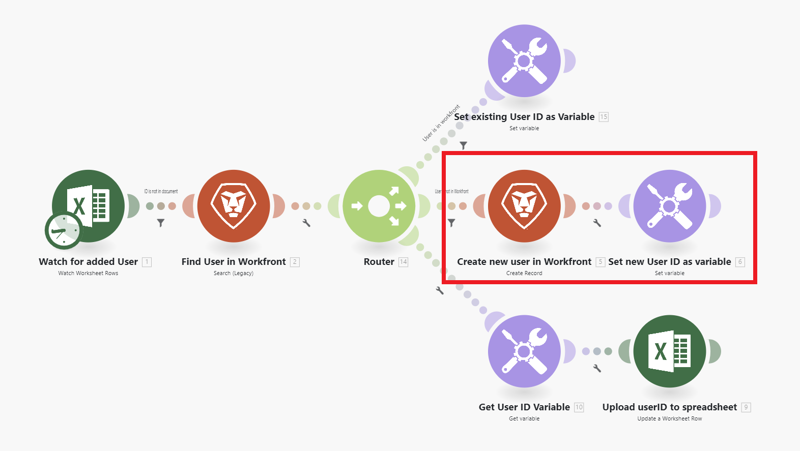

# シナリオの概要

Adobe Workfront Fusion の役割は、プロセスを自動化して、ユーザーが通常のタスクに多くの時間を費やす必要をなくすことです。 これは、アプリ内やサービス内、およびそれらの間でアクションをリンクし、データを自動的に転送および変換するシナリオを作成することで機能します。作成するシナリオは、アプリまたはサービス内のデータを監視し、そのデータを処理して必要な結果を提供します。

シナリオは、アプリ内でのデータの変換方法や、アプリと web サービスの間でのデータの転送方法を示す、一連のモジュールで構成されます。

## シナリオ要素の概要

シナリオは様々な要素で構成されています。 これらの要素の用語を理解すると、ドキュメントの使用が容易になります。

* [シナリオ](#scenario)
* [トリガー](#trigger)
* [モジュール](#module)
* [ルート](#route)
* [シナリオセグメント](#scenario-segment)
* [コネクタ](#connector)

### シナリオ

**シナリオ** は、データの移動と操作のために作成された、ユーザーが作成した一連の自動ステップです。 「シナリオ」という用語は、接続されたステップのグループ全体を指します。

### トリガー

シナリオが **0}トリガー} で始まる。**&#x200B;トリガーは、新しいデータおよび更新されたデータを監視し、モジュールで設定された特定の条件が適用されるとシナリオを開始します。 トリガーは、スケジュール（ポーリング）に従って、またはデータの変更が発生した場合（即時）にシナリオを開始するように構成できます。

### モジュール

トリガーの後に、多数の **modules** が続きます。 モジュールは、特定のアクションを実行するシナリオの 1 つの手順を表します。 モジュールは、シナリオを作成するために設定され、連結されています。

### ルート

シナリオは、**ルート** に分割できます。 ルートとは、特定のデータバンドルに使用される場合とされない場合がある、シナリオのセクションです。 ルートは、ルーターモジュールとフィルターを使用して設定されます。

### シナリオセグメント

シナリオセグメントは、同じアプリケーションに接続する一連の連続したモジュールで構成される、シナリオのセクションです。 シナリオセグメントは、多くの場合、アプリケーションの短いワークフローを表します。

### コネクタ

コネクタは、特定のアプリケーション用のモジュールのセットです。 Workfront Fusion には、Workfront、Salesforce、Jira など多くの一般的な作業アプリケーションへのコネクタに加え、任意の web サービスに使用できる汎用コネクタが用意されています。

## 例

以下のセクションを展開すると、シナリオの例とその説明が表示されます。

+++**Adobe Workfront内のプロセスの自動化**

Workfront Fusion を使用すると、Workfront内のシンプルなワークフローや複雑なワークフローを自動化して、時間を節約し、プロセスが一貫して実行されるようにします。

この例では、Workfrontのタスクまたは問題で指定したフィールドが変更されると、シナリオがトリガーします。 トリガーされると、シナリオは関連プロジェクトの情報を取得し、プロジェクトの特定の役割に割り当てられたユーザーに合わせて更新を作成します。

+++

+++**別のアプリまたは web サービスへのWorkfrontの接続**

>[!NOTE]
>
>従来のライセンスモデルを使用する場合、他のアプリケーションに接続するには、Workfront Fusion for Work Automation and Integration のライセンスが必要です。

Workfront Fusion は、他のアプリケーションや web サービスに接続できます。 他のアプリケーションからデータにアクセス、読み込み、操作またはエクスポートし、それらをWorkfrontまたは相互に統合することができます。

多くのアプリケーションには、専用のWorkfront Fusion コネクタがあります。 アクセスするアプリケーションに専用のコネクタがない場合は、Workfront Fusion の HTTP モジュールまたはSOAP モジュールを使用して、API を通じてアプリケーションに接続できます。

この例では、ユーザーが [!DNL Excel] スプレッドシートに追加されるとシナリオがトリガーされます。このシナリオでは、ユーザーがWorkfrontにいるかどうかを確認します。 そうでない場合は、Workfrontでユーザーが作成され、そのWorkfront ユーザー ID がスプレッドシートに返されます。

専用コネクタのリストについては、[Fusion アプリケーションとそのモジュールのリファレンス：記事のインデックス ](/help/workfront-fusion/references/apps-and-modules/apps-and-modules-toc.md) を参照してください。

>[!IMPORTANT]
>
>Adobe Workfront Fusion は、ほとんどの web サービスに接続できます。使用するアプリに専用のWorkfront Fusion コネクタがない場合は、ユニバーサルコネクタを使用してアプリまたはサービスに接続できます。
>
>ユニバーサルコネクタの一覧については、「ユニバーサルコネクタ [ を参照してください ](/help/workfront-fusion/references/apps-and-modules/apps-and-modules-toc.md#universal-connectors)

+++

## 参照

* Adobe Workfront Fusion で使用される用語については、[Workfront Fusion 用語集 ](/help/workfront-fusion/get-started-with-fusion/understand-fusion/fusion-glossary.md) を参照してください。
* 練習シナリオの作成を開始するには、[ 基本シナリオの作成 ](/help/workfront-fusion/build-practice-scenarios/create-basic-scenario.md) を参照してください。
* シナリオの作成と管理については、次の記事を参照してください。
   * [シナリオの作成](/help/workfront-fusion/create-scenarios/create-scenarios-toc.md)
   * [シナリオの管理](/help/workfront-fusion/manage-scenarios/manage-scenarios-toc.md)
