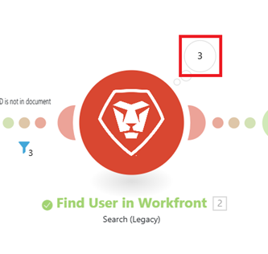

# 特定のシナリオの実行の表示

シナリオイベントのフィルタリングや検索など、特定のシナリオ実行の詳細を表示できます。

## アクセス要件

+++ 展開すると、この記事の機能のアクセス要件が表示されます。

<table style="table-layout:auto">
 <col> 
 <col> 
 <tbody> 
  <tr> 
   <td role="rowheader">Adobe Workfront パッケージ</td> 
   <td> 
任意の Adobe Workfront Workflow パッケージと任意の Adobe Workfront Automation および Integration パッケージ

Workfront Ultimate

Workfront Fusion を追加購入した Workfront Prime および Select パッケージ。
 </td> 
  </tr> 
  <tr data-mc-conditions=""> 
   <td role="rowheader">Adobe Workfront ライセンス</td> 
   <td> 
標準

Work またはそれ以上
 </td> 
  </tr> 
  <tr> 
   <td role="rowheader">製品</td> 
   <td>
   
組織が Workfront Automation および Integration を含まない Select またはPrime Workfront パッケージを持っている場合は、Adobe Workfront Fusion を購入する必要があります。</li></ul>
   </td> 
  </tr>
 </tbody> 
</table>

この表の情報について詳しくは、[ドキュメントのアクセス要件](/help/workfront-fusion/references/licenses-and-roles/access-level-requirements-in-documentation.md)を参照してください。

+++

## 特定の実行の表示

実行は、シナリオのシナリオ履歴から確認できます。

1. 左側のパネルで「**[!UICONTROL シナリオ]**」タブをクリックし、シナリオをクリックします。

   または

   シナリオエディターでシナリオに取り組んでいる場合は、ウィンドウの左上隅にある左矢印  をクリックします。

1. シナリオ名の近くにある **履歴** をクリックします。
   

1. 表示する実行を見つけて、その実行の行の右端にある **詳細** をクリックします。 [!UICONTROL 詳細]リンクは、実行に詳細が含まれる場合にのみ表示されます。

   シナリオダイアグラムが開き、右側に実行の詳細パネルが開きます。

   この実行の出力を生成したモジュールには、緑色のタイトルが付いています。

   実行されなかったモジュールは淡色表示されます。

1. モジュールからの出力を表示するには、モジュールの近くにある出力の詳細バブルをクリックします。 バブル内の数は、モジュールが出力するバンドルの数を表します。

   

1. フィルターを通過したバンドルを表示するには、フィルターをクリックします。 フィルターの近くの数字は、フィルターを通過したバンドルの数を表します。
1. 実行パネル内の特定のモジュールまたはイベントを検索するには、検索語句を **実行イベントを検索** ボックスに入力します。 入力中に結果が表示されます。
1. 実行パネルの検索結果を成功や警告などのステータスで制限するには、**ステータスフィルター** ドロップダウンをクリックし、ステータスを選択します。

>[!NOTE]
>
>特定のモジュールへのリンクを作成するには、次のページを表示する際に URL に `?moduleId=<module-id>` を追加します。
>
>* シナリオ編集ページ （URL は `/edit` で終わる）
>* 特定のシナリオの実行（URL は `/logs/<log-id>` で終わる）
>
>`<module-id>` は、シナリオを表示する際のモジュールラベルの横の番号を指します。
>
>これは、シナリオのデバッグやモジュール設定のコピーを行う際に役立ちます。
