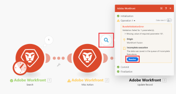

# 未完了の実行の表示と解決

「[!UICONTROL 未完了の実行]」フォルダーには、エラーが原因で正常に終了されなかったシナリオの実行が保存されます。 保存された未完了の実行は、手動または自動で解決できます。

>[!NOTE]
>
>デフォルトでは、未完了の実行の保存は無効になっています。 有効にするには、シナリオの詳細設定で「[!UICONTROL 未完了の実行の保存を許可]」オプションを有効にします。
>
>シナリオ設定について詳しくは、[&#x200B; シナリオ設定の設定](/help/workfront-fusion/create-scenarios/config-scenarios-settings/configure-scenario-settings.md)を参照してください。

## 記事全体を対象としたハイライト表示されたプレビュー {#highlighted-preview-article-level}

このページの情報は、まだ一般に提供されていない機能を指します。 サンドボックスのプレビュー環境でのみ使用できます。##不完全な実行を表示する

モジュールの処理中にエラーが発生した場合、新しい未完了の実行が「未完了の実行」フォルダーに追加されます。 未完了の実行にはそれぞれ、シナリオのブループリントと、失敗したモジュールにマッピングできるすべてのバンドルが含まれます。 不完全な実行のリストは、シナリオの詳細ページの「[!UICONTROL 不完全な実行]」タブをクリックして開くことができます。

<!--

-->

詳しくは、この記事の「[不完全な実行につながるエラー](#errors-resulting-into-incomplete-executions)」を参照してください。

>[!NOTE]
>
>シナリオごとの未解決の不完全な実行フォルダーの現在のサイズ制限は10 MBです。 シナリオがこの制限を超えると、次のエラーが表示される場合があります。
>
>`DLQ limit per scenario has been exceeded`
>
>未解決の不完全な実行の場合、チームは合計500 MBに制限されます。
>
>詳細については、「シナリオ設定の構成」の「[&#x200B; データ損失を有効にする](/help/workfront-fusion/create-scenarios/config-scenarios-settings/configure-scenario-settings.md#enable-data-loss)」を参照してください。

## 「不完全な実行」タブから不完全な実行を解決する

新しい未完了の実行が保存された場合、次のように解決できます。

1. 影響を受けるシナリオを開きます。
1. 「**[!UICONTROL 未完了の実行]**」タブをクリックします。
1. 解決する不完全な実行を見つけ、**[!UICONTROL 詳細]**&#x200B;をクリックします。
1. モジュールのログを開くと、モジュールのすべての操作が表示されます。
1. 失敗した操作を見つけ、「**[!UICONTROL 解決]**」をクリックします。

   

## 「履歴」タブから不完全な実行を解決する

未完了の実行を解決しようとする前に、すべてのモジュールの操作のログを確認したい場合は、「[!UICONTROL 履歴]」フォルダーから未完了の実行を解決できます。

1. 影響を受けるシナリオを開きます。
1. 「**[!UICONTROL 履歴]**」タブをクリックします。
1. シナリオの失敗した実行を探し、**[!UICONTROL 詳細]**&#x200B;をクリックします。
1. モジュールのログを開くと、モジュールのすべての操作が表示されます。
1. 失敗した操作を見つけ、「**[!UICONTROL 解決]**」をクリックします。

   

## 未完了の実行に関連するオプション

[!UICONTROL シナリオ設定]パネルの次のオプションは、未完了の実行を保存するかどうかと、その方法を決定します。

* 未完了の実行の保存を許可
* 順次処理
* データ損失を有効にする

これらのオプションについて詳しくは、[&#x200B; シナリオ設定の設定](/help/workfront-fusion/create-scenarios/config-scenarios-settings/configure-scenario-settings.md)を参照してください。

## 未完了の実行になるエラー

未完了の実行が保存される原因となるエラーには、いくつかのカテゴリがあります。 次のものが含まれます。

* 不完全なデータや誤ったデータから発生する検証エラー。主に、モジュールを通過するすべてのデータを正常に処理するために予期される項目が欠落していることが原因です。
* 最終的な宛先が使用できなかったことから発生するエラー。一時的または長期的な接続障害（メールまたはリモート FTP サーバーへの接続中など）が原因です。

シナリオの最初のモジュールでエラーが発生した場合、実行は直ちに停止し、未完了の実行は保存されません。

他のモジュールでエラーが発生し、エラーハンドラールートが添付されていない場合は、次のいずれかが発生します。

* 自動再試行を含む不完全な実行レコードは、次のエラータイプに対して保存されます。

   * `ConnectionError`
   * `RateLimitError`
   * `OutOfSpaceError`
   * `ModuleTimeoutError`

* 自動再試行のない不完全な実行レコードは、次のエラータイプに対して保存されます。

   * `DataError`
   * `InvalidConfigurationError`
   * `InvalidAccessTokenError`
   * `UnexpectedError`
   * `MaxFileSizeExceededError`
   * `MaxResultsExceededError`

* エラータイプが上記以外の場合、実行は失敗します。
