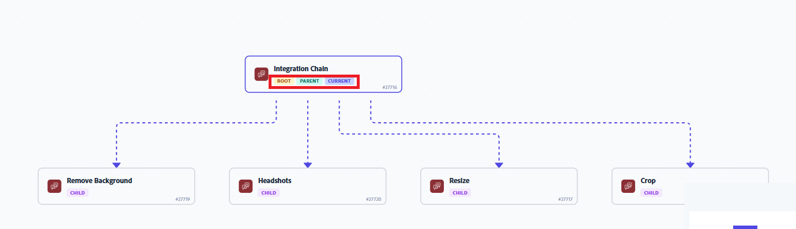

# チェーンされたシナリオ関係を表示および管理する

親シナリオと子シナリオ間の関係のマップを作成できます。 マップを使用して、チェーン内の様々なシナリオにジャンプすることもできます。

連鎖シナリオについて詳しくは、[複数のシナリオを連鎖](/help/workfront-fusion/create-scenarios/plan-a-scenario/chain-scenarios.md)を参照してください。

連鎖シナリオの設定について詳しくは、[ チェーンモジュール ](/help/workfront-fusion/references/apps-and-modules/tools-and-transformers/chain-modules.md)を参照してください

## アクセス要件

+++ 展開すると、この記事の機能のアクセス要件が表示されます。

<table style="table-layout:auto">
 <col> 
 <col> 
 <tbody> 
  <tr> 
   <td role="rowheader">Adobe Workfront パッケージ</td> 
   <td> 
任意の Adobe Workfront Workflow パッケージと任意の Adobe Workfront Automation および Integration パッケージ

Workfront Ultimate

Workfront Fusion を追加購入した Workfront Prime および Select パッケージ。
 </td> 
  </tr> 
  <tr data-mc-conditions=""> 
   <td role="rowheader">Adobe Workfront ライセンス</td> 
   <td> 
標準

Work またはそれ以上
 </td> 
  </tr> 
  <tr> 
   <td role="rowheader">製品</td> 
   <td>
   
組織が Workfront Automation および Integration を含まない Select またはPrime Workfront パッケージを持っている場合は、Adobe Workfront Fusion を購入する必要があります。</li></ul>
   </td> 
  </tr>
 </tbody> 
</table>

この表の情報について詳しくは、[ドキュメントのアクセス要件](/help/workfront-fusion/references/licenses-and-roles/access-level-requirements-in-documentation.md)を参照してください。

+++

## チェーン関係のマップを表示

現在のシナリオとその親または子シナリオのマップを表示できます。 マップには、連鎖したシナリオ全体のデータフローの図が表示されます。

<!--get a better picture-->

連鎖シナリオの関係マップを表示するには：

1. 左パネルの「**[!UICONTROL シナリオ]**」タブ、シナリオの順にクリックします。

   または

   シナリオエディターでシナリオを操作している場合は、ウィンドウの左上隅付近にある左矢印をクリックします。

1. 「**関係**」タブをクリックします。

   

1. 各チェーン付きシナリオの一般的な詳細については、タグを確認してください。

   各シナリオには、次の1つ以上のタグがあります。

   * ルート：シナリオはチェーンの始まりであり、親シナリオはありません。
   * 親：シナリオは親シナリオです。
   * 子：シナリオは子シナリオです。 シナリオは、親と子の両方にすることができます。
   * 現在：これは、ユーザーが現在表示しているシナリオです。 つまり、ユーザーが関係マップを開いた際のシナリオです。

   関係マップの
1. （オプション）シナリオの小さな図を表示するには、シナリオにカーソルを合わせます。
1. （オプション）マップから別のシナリオに直接移動するには、シナリオをクリックします。

   クリックしたシナリオは別のウィンドウで開きます。
1. （オプション）マップの水平表示と垂直表示を切り替えるには、シナリオの詳細ページの右上付近にある&#x200B;**水平表示**&#x200B;または&#x200B;**垂直表示**&#x200B;をクリックします。
1. （オプション）マップの簡略化されたビューを表示するには、ページの右下隅を確認します。

   これは、チェーンマップが大きい場合や複雑な場合に便利です。

   * マップの一部のみを表示する場合、その部分は簡略化されたマップ上で暗くなります。
   * 簡略化されたマップでは、現在のシナリオが青で示されます。

