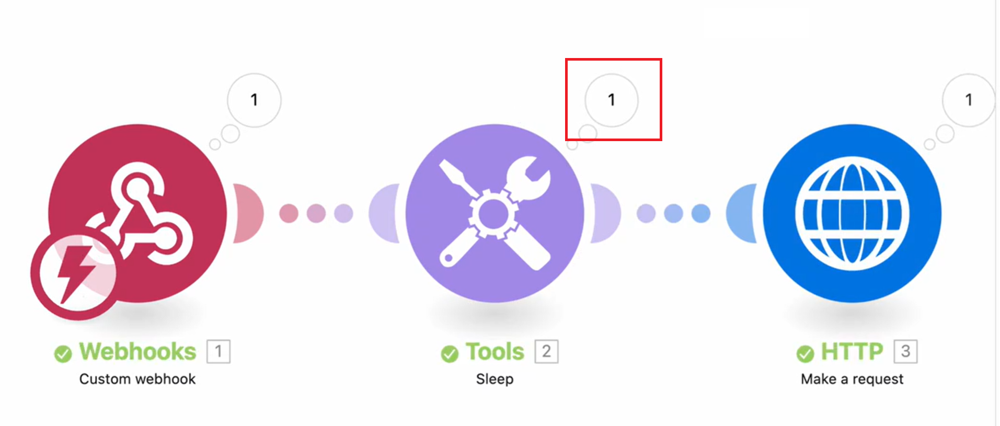

# 実行中のシナリオでのデータフローの表示

実行中のシナリオを見て、データがどのように流れるのかを確認できます。

シナリオが実行されている間、アクティブなモジュールは、モジュールの周囲に成長するリングでマークされます。 リングは、モジュールが実行中であることを示すだけで、進行状況は表示されません。 迅速に動作するモジュールは、リングの小さな部分しか表示されない場合があります。

の周囲をリング

モジュールを実行すると、出力インジケーターが表示されます。

モジュールが複数のバンドルを処理する場合、処理された各バンドルにリングが表示され、出力インジケーターは出力する各バンドルに対してカウントされます。

シナリオデータフローについて詳しくは、[ シナリオ実行フロー](/help/workfront-fusion/references/scenarios/scenario-execution-flow.md)を参照してください。

## アクセス要件

+++ 展開すると、この記事の機能のアクセス要件が表示されます。

<table style="table-layout:auto">
 <col> 
 <col> 
 <tbody> 
  <tr> 
   <td role="rowheader">Adobe Workfront パッケージ</td> 
   <td> 
任意の Adobe Workfront Workflow パッケージと任意の Adobe Workfront Automation および Integration パッケージ

Workfront Ultimate

Workfront Fusion を追加購入した Workfront Prime および Select パッケージ。
 </td> 
  </tr> 
  <tr data-mc-conditions=""> 
   <td role="rowheader">Adobe Workfront ライセンス</td> 
   <td> 
標準

Work またはそれ以上
 </td> 
  </tr> 
  <tr> 
   <td role="rowheader">製品</td> 
   <td>
   
組織が Workfront Automation および Integration を含まない Select またはPrime Workfront パッケージを持っている場合は、Adobe Workfront Fusion を購入する必要があります。</li></ul>
   </td> 
  </tr>
 </tbody> 
</table>

この表の情報について詳しくは、[ドキュメントのアクセス要件](/help/workfront-fusion/references/licenses-and-roles/access-level-requirements-in-documentation.md)を参照してください。

+++

## 実行中のシナリオでのデータフローの表示

1. 左側のパネルの「**[!UICONTROL シナリオ]**」タブをクリックします。
1. データフローを表示するシナリオを選択します。
1. シナリオが実行されていない場合は、シナリオをアクティブにするか、**1回実行**&#x200B;をクリックしてシナリオの実行を開始します。
1. 実行履歴パネルの「現在実行中」セクションで、表示する実行を選択します。

