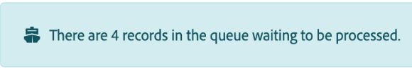

# Web フックのキューを表示する

多くのサービスでは、サービスで特定の変更が発生した場合に即座に通知を受け取る Web フックが用意されています。インスタントトリガー（Webhook とも呼ばれます）は、これらのイベントを使用してシナリオを開始できます。 イベントは、シナリオが既に実行中であるなど、処理を待っている間、Webhook のキューに移動します。 Webhook のキューを確認できます。

シナリオ設定パネルの「データは機密です」オプションの設定方法に関係なく、受信 Webhook データは常にキューに保存されます。 シナリオで処理されたデータは、キューから完全に削除されます。

Webhook について詳しくは、[ インスタントトリガー（Webhook） ](/help/workfront-fusion/references/modules/webhooks-reference.md) を参照してください。

## アクセス要件

+++ 展開すると、この記事の機能のアクセス要件が表示されます。

<table style="table-layout:auto">
 <col> 
 <col> 
 <tbody> 
  <tr> 
   <td role="rowheader">Adobe Workfront パッケージ</td> 
   <td> 
任意のAdobe Workfront ワークフローパッケージと任意のAdobe Workfront Automation and Integration パッケージ

WorkfrontUltimate

Workfront Fusion を追加購入したWorkfront Primeおよび Select パッケージ。
 </td> 
  </tr> 
  <tr data-mc-conditions=""> 
   <td role="rowheader">Adobe Workfront ライセンス</td> 
   <td> 
標準

ワークまたはそれ以上
 </td> 
  </tr> 
  <tr> 
   <td role="rowheader">製品</td> 
   <td>
   
組織がWorkfront Automation and Integration を含まない Select またはPrime Workfront パッケージを持っている場合は、Adobe Workfront Fusion を購入する必要があります。</li></ul>
   </td> 
  </tr>
 </tbody> 
</table>

このテーブルの情報について詳しくは、[ ドキュメントのアクセス要件 ](/help/workfront-fusion/references/licenses-and-roles/access-level-requirements-in-documentation.md) を参照してください。

+++

## Web フックのキューを表示する

受信 Web フックからのメッセージはすべて、Web フックのキューに保存されます。

シナリオに現在キューがある場合、そのシナリオにバナーが表示されます。

Webhook のキューを表示するには：

1. 左側のメニューで、「**[!UICONTROL Web フック]**」をクリックします。
1. キューを表示する Webhook を見つけます。
1. 「受信したイベント」ボタンでイベントの数を見つけます。

   

1. ボタンをクリックすると、キュー内のイベントに関する詳細が表示されます。
