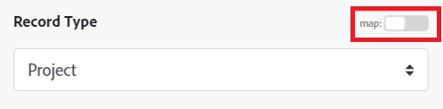
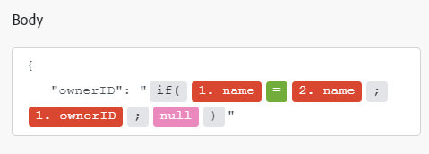

# [!DNL Azure Active Directory] モジュール

Adobe Workfront Fusion のシナリオでは、[!DNL Azure Active Directory] を使用するワークフローを自動化したり、複数のサードパーティのアプリケーションやサービスに接続したりできます。

シナリオの作成方法については、[&#x200B; シナリオの作成：記事のインデックス &#x200B;](/help/workfront-fusion/create-scenarios/create-scenarios-toc.md) の記事を参照してください。

モジュールについて詳しくは、「[&#x200B; モジュール：記事インデックス &#x200B;](/help/workfront-fusion/references/modules/modules-toc.md)」の記事を参照してください。

## アクセス要件

+++ 展開すると、この記事の機能のアクセス要件が表示されます。

この記事で説明している機能を使用するには、次のアクセス権が必要です。

<table style="table-layout:auto">
 <col> 
 <col> 
 <tbody> 
  <tr> 
   <td role="rowheader">Adobe Workfront パッケージ</td> 
   <td> 
任意
 </td> 
  </tr> 
  <tr data-mc-conditions=""> 
   <td role="rowheader">Adobe Workfront プラン</td> 
   <td> 
新規：標準

または

現在：仕事以上
 </td> 
  </tr> 
  <tr> 
   <td role="rowheader">Adobe Workfront Fusion ライセンス**</td> 
   <td>
   
現在：Workfront Fusion ライセンス要件なし

   
または

   
従来のバージョン：作業の自動化と統合のためのWorkfront Fusion 

   </td> 
  </tr> 
  <tr> 
   <td role="rowheader">製品</td> 
   <td>
   
新規：
 <ul><li>Prime Workfront パッケージを選択する：Adobe Workfront Fusion を購入する必要があります。</li><li>Ultimate Workfront パッケージ：Workfront Fusion が含まれています。</li></ul>
   
または

   
現在：Adobe Workfront Fusion を購入する必要があります。

   </td> 
  </tr>
 </tbody> 
</table>

このテーブルの情報について詳しくは、[&#x200B; ドキュメントのアクセス要件 &#x200B;](/help/workfront-fusion/references/licenses-and-roles/access-level-requirements-in-documentation.md) を参照してください。

Adobe Workfront Fusion ライセンスについて詳しくは、[Adobe Workfront Fusion ライセンス &#x200B;](/help/workfront-fusion/set-up-and-manage-workfront-fusion/licensing-operations-overview/license-automation-vs-integration.md) を参照してください。

+++

## 前提条件

[!DNL Azure Active Directory] モジュールを使用するには、[!DNL Azure Active Directory] アカウントが必要です。

## [!DNL Azure Active Directory] API 情報

Azure Active Directory コネクタでは、以下を使用します。

<table style="table-layout:auto"> 
 <col> 
 <col> 
 <tbody> 
  <tr> 
   <td role="rowheader">API バージョン</td> 
   <td> v1.0 </td> 
  </tr> 
  <tr> 
   <td role="rowheader">API タグ</td> 
   <td>v1.4.5</td> 
  </tr>
 </tbody> 
</table>

## [!DNL Azure Active Directory] モジュールとそのフィールド

[!DNL Azure Active Directory] モジュールを設定すると、Workfront Fusion には以下のフィールドが表示されます。これらとともに、アプリやサービスのアクセスレベルなどの要因に応じて、追加の「[!DNL Azure Active Directory]」フィールドが表示される場合があります。モジュール内の太字のタイトルは、必須フィールドを示します。

フィールドまたは関数の上にマップボタンが表示されている場合は、このボタンを使用すると、そのフィールドの変数や関数を設定できます。詳しくは、[Adobe Workfront Fusion でのモジュール間の情報のマッピング](/help/workfront-fusion/create-scenarios/map-data/map-data-from-one-to-another.md)を参照してください。

* [トリガー](#triggers)
* [アクション](#actions)
* [検索](#searches)

### トリガー

#### [!UICONTROL レコードを監視]（予定）

このポーリング（スケジュール）トリガーモジュールは、選択したオブジェクトのレコードが、[!DNL Azure Active Directory] での前回のスケジュールされた実行以降に作成された場合に、シナリオを実行します。また、レコードに関連付けられたすべての標準フィールドと、接続を介してアクセスされるカスタムフィールドおよび値を返します。この情報は、シナリオの後続モジュールにマッピングできます。

このモジュールを設定する際には、次のフィールドが表示されます。

<table style="table-layout:auto"> 
 <col> 
 <col> 
 <tbody> 
  <tr> 
   <td role="rowheader">[!UICONTROL Connection]</td> 
   <td> 
[!DNL Azure Active Directory] アカウントをAdobe Workfront Fusion に接続する手順については、<a href="/help/workfront-fusion/create-scenarios/connect-to-apps/connect-to-fusion-general.md" class="MCXref xref" data-mc-variable-override="">Workfront Fusion への接続の作成 – 基本手順 </a> を参照してください。
 </td> 
  </tr> 
  <tr> 
   <td role="rowheader">[!UICONTROL Type]</td> 
   <td>ユーザーレコードとグループレコードのどちらを監視するかを選択します。</td> 
  </tr> 
  <tr> 
   <td role="rowheader">[!UICONTROL Maximum Number of Records]</td> 
   <td>各シナリオの実行サイクル中に、モジュールが返すレコードの最大数を入力またはマッピングします。</td> 
  </tr> 
 </tbody> 
</table>

### アクション

* [[!UICONTROL レコードの読み取り]](#read-record)
* [[!UICONTROL レコードの作成]](#create-record)
* [[!UICONTROL カスタム API 呼び出し]](#custom-api-call)

#### [!UICONTROL レコードの読み取り]

このアクションモジュールは、[!DNL Azure Active Directory] の単一レコードからデータを読み取ります。

レコードの ID を指定します。

このモジュールは、レコードの ID および関連するフィールドと共に、接続を介してアクセスされるカスタムフィールドとその値を返します。この情報は、シナリオ内の後続のモジュールにマッピングできます。

この情報を取得するには、[!DNL Azure Active Directory] のレコードにアクセスするのに十分な権限が必要です。

このモジュールを設定する際には、次のフィールドが表示されます。

<table style="table-layout:auto">
 <col> 
 <col> 
 <tbody> 
  <tr> 
   <td role="rowheader">[!UICONTROL Connection]</td> 
   <td> 
[!DNL Azure Active Directory] アカウントをAdobe Workfront Fusion に接続する手順については、<a href="/help/workfront-fusion/create-scenarios/connect-to-apps/connect-to-fusion-general.md" class="MCXref xref" data-mc-variable-override="">Workfront Fusion への接続の作成 – 基本手順 </a> を参照してください。
 </td> 
  </tr> 
  <tr> 
   <td role="rowheader">[!UICONTROL Record Type]</td> 
   <td>[!UICONTROL User]レコードと[!UICONTROL Group]レコードのどちらを読み取るかを選択します。</td> 
  </tr> 
  <tr> 
   <td role="rowheader">[!UICONTROL Outputs]</td> 
   <td>このモジュールの出力バンドルに含める情報を選択します。</td> 
  </tr> 
  <tr> 
   <td role="rowheader">[!UICONTROL ID]</td> 
   <td>モジュールが読み取るレコードの一意の [!DNL Azure Active Directory] ID を入力またはマッピングします。</td> 
  </tr> 
 </tbody> 
</table>

#### [!UICONTROL レコードの作成]

このアクションモジュールは、新しいユーザーまたはグループレコードを作成します。

レコードのタイプを指定します。

このモジュールは、レコードの ID や関連するフィールドのほか、接続を介してアクセスされるカスタムフィールドおよび値を返します。この情報は、シナリオ内の後続のモジュールにマッピングできます。

このモジュールを設定する際には、次のフィールドが表示されます。

<table style="table-layout:auto">
 <col> 
 <col> 
 <tbody> 
  <tr> 
   <td role="rowheader">[!UICONTROL Connection]</td> 
   <td> 
[!DNL Azure Active Directory] アカウントをAdobe Workfront Fusion に接続する手順については、<a href="/help/workfront-fusion/create-scenarios/connect-to-apps/connect-to-fusion-general.md" class="MCXref xref" data-mc-variable-override="">Workfront Fusion への接続の作成 – 基本手順 </a> を参照してください。
 </td> 
  </tr> 
  <tr> 
   <td role="rowheader">[!UICONTROL Record Type]</td> 
   <td>[!UICONTROL User]レコードと[!UICONTROL Group]レコードのどちらを読み取るかを選択します。</td> 
  </tr> 
  <tr> 
   <td role="rowheader">[!UICONTROL Other Fields]</td> 
   <td>新しいレコードの値を設定するには、このフィールドに入力します。</td> 
  </tr> 
 </tbody> 
</table>

#### [!UICONTROL カスタム API 呼び出し]

このアクションモジュールは、[!DNL Azure Active Directory] API に対して認証済みのカスタム呼び出しを実行します。これにより、他の [!DNL Azure Active Directory] モジュールでは不可能なデータフロー自動処理を作成できます。

このモジュールを設定する際には、次のフィールドが表示されます。

<table style="table-layout:auto">
 <col> 
 <col> 
 <tbody> 
  <tr> 
   <td role="rowheader">[!UICONTROL Connection]</td> 
   <td> 
[!DNL Azure Active Directory] アカウントをAdobe Workfront Fusion に接続する手順については、<a href="/help/workfront-fusion/create-scenarios/connect-to-apps/connect-to-fusion-general.md" class="MCXref xref" data-mc-variable-override="">Workfront Fusion への接続の作成 – 基本手順 </a> を参照してください。
 </td> 
  </tr> 
  <tr> 
   <td role="rowheader">[!UICONTROL URL]</td> 
   <td>次に対してパスを入力またはマッピングします： <code>https://graph.microsoft.com/{version}/{resource}?{query-parameters}</code></td> 
  </tr> 
  <tr> 
   <td role="rowheader">[!UICONTROL Method]</td> 
   <td> 
API 呼び出しの設定に必要な HTTP リクエストメソッドを選択します。詳しくは、<a href="/help/workfront-fusion/references/modules/http-request-methods.md" class="MCXref xref" data-mc-variable-override="">HTTP リクエストメソッド </a> を参照してください。
 </td> 
  </tr> 
  <tr> 
   <td role="rowheader">[!UICONTROL Headers]</td> 
   <td> 
リクエストのヘッダーを標準 JSON オブジェクトの形式で追加します。
 
例： <code>{"Content-type":"application/json"}</code>
 </td> 
  </tr> 
  <tr> 
   <td role="rowheader">[!UICONTROL Query String]</td> 
   <td> 
API 呼び出しのクエリを標準 JSON オブジェクトの形式で追加します。
 
例： <code>{"name":"something-urgent"}</code>
 </td> 
  </tr> 
  <tr> 
   <td role="rowheader">[!UICONTROL Body]</td> 
   <td> 
標準の JSON オブジェクトの形式で、API 呼び出しの本文の内容を追加します。
 
メモ：  
<code>if</code> などの条件ステートメントを JSON で使用する場合は、条件ステートメントの外側に引用符を挿入します。
 
     
Example: </b>"> 
      
  
 
     
 
 </td> 
  </tr> 
 </tbody> 
</table>

### 検索

* [ユーザーの検索](#search-users)
* [ユーザー/グループデルタの検索](#search-usersgroups-delta)

#### [!UICONTROL ユーザーの検索]

この検索モジュールは、指定した検索クエリに一致する [!DNL Azure Active Directory] 内のオブジェクト内のレコードを検索します。この情報は、シナリオ内の後続のモジュールにマッピングできます。

このモジュールを設定する際には、次のフィールドが表示されます。

<table style="table-layout:auto">
 <col> 
 <col> 
 <tbody> 
  <tr> 
   <td role="rowheader">[!UICONTROL Connection]</td> 
   <td> 
[!DNL Azure Active Directory] アカウントをAdobe Workfront Fusion に接続する手順については、<a href="/help/workfront-fusion/create-scenarios/connect-to-apps/connect-to-fusion-general.md" class="MCXref xref" data-mc-variable-override="">Workfront Fusion への接続の作成 – 基本手順 </a> を参照してください。
 </td> 
  </tr> 
  <tr data-mc-conditions=""> 
   <td role="rowheader">[!UICONTROL Search Criteria]</td> 
   <td> 
検索に使用する条件を入力します。
 
「[!UICONTROL $filter]」など、使用するパラメーターについては、[!DNL Microsoft] API ドキュメントで<a href="https://docs.microsoft.com/ja-jp/graph/query-parameters">クエリパラメーターを使用した応答のカスタマイズ</a>を参照してください。
 </td> 
  </tr> 
  <tr data-mc-conditions=""> 
   <td role="rowheader">[!UICONTROL Outputs]</td> 
   <td>このモジュールの出力バンドルに含める情報を選択します。</td> 
  </tr> 
  <tr data-mc-conditions=""> 
   <td role="rowheader">[!UICONTROL Maximal count of records]</td> 
   <td>各シナリオの実行サイクル中に、モジュールが返すレコードの最大数を入力またはマッピングします。</td> 
  </tr> 
 </tbody> 
</table>

#### [!UICONTROL ユーザー／グループ差分の検索]

この検索モジュールは、[!DNL Azure AD] で作成、更新または削除されたレコードを検索します。この情報は、シナリオ内の後続のモジュールにマッピングできます。

<table style="table-layout:auto">
 <col> 
 <col> 
 <tbody> 
  <tr> 
   <td role="rowheader">[!UICONTROL Connection]</td> 
   <td> 
[!DNL Azure Active Directory] アカウントをAdobe Workfront Fusion に接続する手順については、<a href="/help/workfront-fusion/create-scenarios/connect-to-apps/connect-to-fusion-general.md" class="MCXref xref" data-mc-variable-override="">Workfront Fusion への接続の作成 – 基本手順 </a> を参照してください。
 </td> 
  </tr> 
  <tr data-mc-conditions=""> 
   <td role="rowheader">[!UICONTROL Limit]</td> 
   <td>各シナリオの実行サイクル中に、モジュールが返すレコードの最大数を入力またはマッピングします。</td> 
  </tr> 
 </tbody> 
</table>
