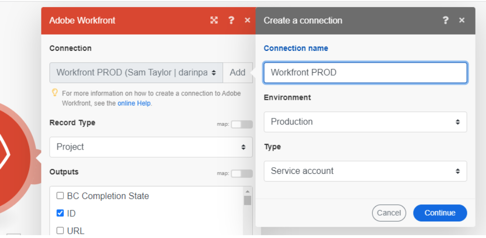

# 接続メタデータ

Fusion ではメタデータを使用して接続の重要な属性を識別します。

接続メタデータは、新しい接続を作成する際に設定できます。これらの属性は、接続の設定に使用するのと同じダイアログボックスに表示されます。

Fusion ユーザーは、「接続」エリアから接続を表示および編集できます。

## 環境タイプ

Fusion 接続は、実稼動システムと非実稼動システムの両方で使用できます。接続が接続する環境のタイプをマークでき、実稼動環境の保護に役立ちます。

他の接続メタデータと同様に、環境タイプは情報提供のみを目的として使用されます。 ユーザーは、この属性を正確に設定し、シナリオで正しい環境との接続を使用する責任があります。

## 認証タイプ

Fusion 接続は、サービスアカウントと個人アカウントの両方に使用できます。Fusion としてシナリオが自動化される場合、サービスアカウントが認証に使用されます。個人アカウントは、特定の人物に基づく認証です。どの認証タイプを使用するかは、シナリオの要件によって異なります。自動化されたユーザーアクションには、個人アカウントを使用する必要があります。たとえば、Fusion シナリオで特定の人物による承認を自動化する場合、その人物の認証タイプを使用する必要があります。それ以外の場合、Fusion は Fusion として機能し、タイプはサービスアカウントにする必要があります。

他の接続メタデータと同様に、認証タイプは情報提供のみを目的として使用されます。 ユーザーは、この属性を正確に設定し、シナリオで適切な接続タイプを使用する必要があります。

認証タイプについて詳しくは、アドビの認証ガイドの[認証](https://developer.adobe.com/developer-console/docs/guides/authentication/)を参照してください。

## リソース

* 接続メタデータの管理手順については、[ 接続の管理 ](/help/workfront-fusion/create-scenarios/connect-to-apps/manage-connections.md) を参照してください。
