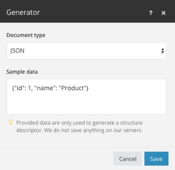

# データ構造

データ構造とは、Adobe Workfront Fusionで処理されるデータのフォーマットを詳細に記述する文書またはパターンです。 このドキュメントに基づいて、シナリオエディターはどのモジュールがどの種類のデータを返すか、または受け取るかを判断できます。 データ構造ドキュメントは、JSON、XML、CSV などのデータ形式をシリアル化したり、解析したりするために一般的によく使用されます。

データ構造を作成するには、「[!UICONTROL データ構造の概要]」セクションまたはデータ構造の仕様が必要なモジュールの設定にある「[!UICONTROL データ構造を新規作成]」ボタンをクリックします。

サポートされているデータ型については、[&#x200B; データ型](/help/workfront-fusion/references/mapping-panel/data-types/item-data-types.md)記事を参照してください。

## データ構造ジェネレーター

必ずしもデータ構造を構築する必要はありません。 Workfront Fusionは、既存のデータからデータ構造を生成できます。 データサンプルを指定すると、ジェネレーターはそのデータサンプルに基づいてデータ構造を自動的に作成します。 必要に応じて、作成したデータ構造を手動で変更できます。

データ構造を生成するには、「[&#x200B; データ ストアでデータ構造を設定する](/help/workfront-fusion/create-scenarios/map-data/data-stores.md#set-up-the-data-structure)」を参照してください。

