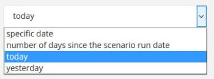

# 項目データタイプ

バンドルには、以下に示す項目のタイプを含めることができます。

Workfront Fusion で相互に変換できる項目のタイプについて詳しくは、[ 型強制 ](/help/workfront-fusion/references/mapping-panel/data-types/type-coercion.md) を参照してください。

<table style="table-layout:auto">
 <col> 
 <col> 
 <tbody> 
  <tr> 
   <td role="rowheader"> 
テキスト
 </td> 
   <td> 
最も一般的な項目タイプです。 一部のテキスト項目では、Adobe Workfront Fusion は、許可されている最大長または最小値を満たしているか、書式の検証（メール、URL、ファイル名）を行っているかを確認します。
 </td> 
  </tr> 
  <tr> 
   <td role="rowheader"> 
数値
 </td> 
   <td> 
一部の数値項目については、Workfront Fusion は、指定された範囲（許容される最小値または最大値）の入力を検証する場合があります。
 </td> 
  </tr> 
  <tr> 
   <td role="rowheader"> 
ブール値（はい／いいえ）
 </td> 
   <td> 
このタイプは、true または false の 2 つの値のみを持つ項目に使用します。 
 
モジュールを設定する際、ブール値タイプは次の 2 つの形式で表示できます。
 
    <ul> 
     <li> 
フィールドが必須で、入力が必要な場合は、必須のチェックボックスが表示されます。
 
  
 </li> 
     <li> 
空白のままにできるオプションのフィールドは選択ボックスとして表示され、<code>Yes</code>、<code>No</code>、<code>Not defined</code>（デフォルト）の 3 つの値から選択できます。
 
  
 </li> 
    </ul> 
値を別のモジュールの項目にマッピングする必要がある場合は、<strong>[!UICONTROL Map]</strong> をクリックします。
 </td> 
  </tr> 
  <tr> 
   <td role="rowheader"> 
日付
 </td> 
   <td> 
日付は、ISO 8601 の日付形式で入力します（例：<code>2015-09-18T11:58Z</code>）。 タイムゾーンはプロファイル設定で変更できます。 
 
日付を必要とするフィールドをクリックすると、モジュール設定にポップアップカレンダーが表示されます。一部の項目では時間は必須ではありません。
 
日付項目の値は、プロファイルで選択されたローカルタイムゾーンと web タイムゾーンを使用して形式設定されます。 項目の上にポインタを合わせると、日付項目の値の ISO 8601 バージョンを表示できます。
 
メモ：ISO 値が表示されない場合、項目はおそらくテキストで、日付ではありません。
 
時間は <code>hours:minutes:seconds</code> 形式で入力します（例：<code>14:03:52</code>）。
 </td> 
  </tr> 
  <tr> 
   <td role="rowheader"> 
バッファー（バイナリデータ）
 </td> 
   <td> 
ファイルコンテンツは、通常、バッファータイプのコンテンツ（画像コンテンツ、ビデオファイルなど）として送信されます。 場合によっては、テキストデータがこのタイプに含まれることがあります（テキストファイルなど）。 Workfront Fusion は、バイナリコードのテキストデータをテキストに、テキストをバイナリコードのテキストデータに自動変換できます。 詳細については、「<a href="/help/workfront-fusion/create-scenarios/map-data/map-files.md" class="MCXref xref"> ファイルをマップする </a>」を参照してください。
 </td> 
  </tr> 
  <tr> 
   <td role="rowheader"> 
コレクション
 </td> 
   <td> 
コレクションとは、複数のサブ項目で構成される項目です。 メールメッセージ内の送信者項目は、コレクションの一例です。このコレクションには、送信者名（テキストタイプ）と送信者のメールアドレス（テキストタイプ）が含まれています。
 </td> 
  </tr> 
  <tr> 
   <td role="rowheader"> 
選択（メニュー）
 </td> 
   <td> 
モジュール設定を指定する際、同じタイプの複数の項目から選択できます。 [!DNL Dropbox] モジュールでの設定のフォルダー選択メニューが一例です。 
 
モジュールを設定する際に、次の 2 つの形式で選択メニューが表示されます。
 
 
複数選択できる場合は、チェックボックス付きの項目が複数表示されます。
 
  
 
 
可能なオプションが 1 つだけの場合は、ドロップダウンメニューが表示されます。
 
  
 
別のモジュールから項目をマッピングする必要がある場合は、「<strong>マップ</strong>」ボタンを使用します。 このボタンをクリックすると、選択メニューの代わりにテキストフィールドが開きます。マッピングについて詳しくは、<a href="/help/workfront-fusion/get-started-with-fusion/understand-fusion/mapping-overview.md" class="MCXref xref"> マッピングの概要 </a> を参照してください。
 </td> 
  </tr> 
  <tr> 
   <td role="rowheader"> 
配列
 </td> 
   <td> 
配列タイプを使用すると、コレクションを含む同じタイプの複数の値を操作できます。 [!UICONTROL Email] モジュールの例では、添付ファイルの配列を返し、各添付ファイルには名前、コンテンツ、サイズなどが含まれます。 詳しくは、「<a href="/help/workfront-fusion/create-scenarios/map-data/map-an-array.md" class="MCXref xref"> 配列または配列要素のマッピング </a>」を参照してください。
 </td> 
  </tr> 
  <tr> 
   <td role="rowheader"> 
検証
 </td> 
   <td> 
Workfront Fusion は、各種類の項目に対して検証を実行する場合があります。 項目が検証に合格しない場合、モジュールはデータエラーが原因で処理を停止します。 詳しくは、<a href="/help/workfront-fusion/references/errors/error-processing.md" class="MCXref xref"> エラータイプ </a> を参照してください。 
 </td> 
  </tr> 
 </tbody> 
</table>
