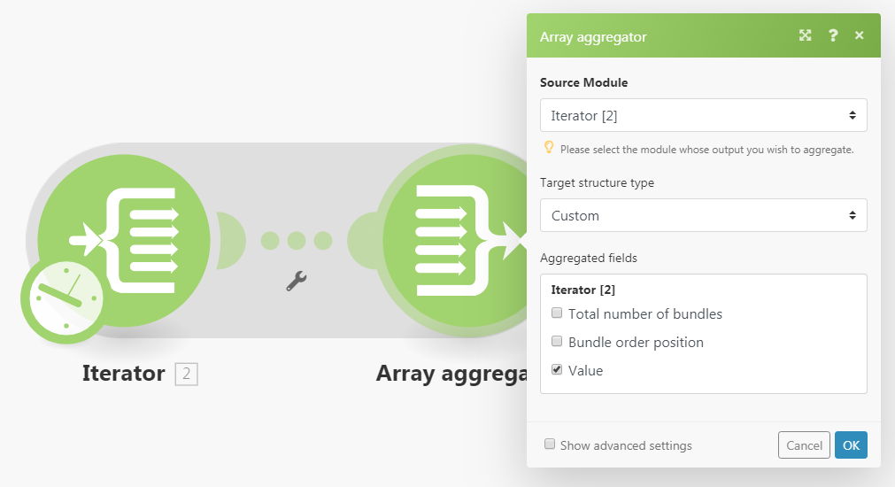
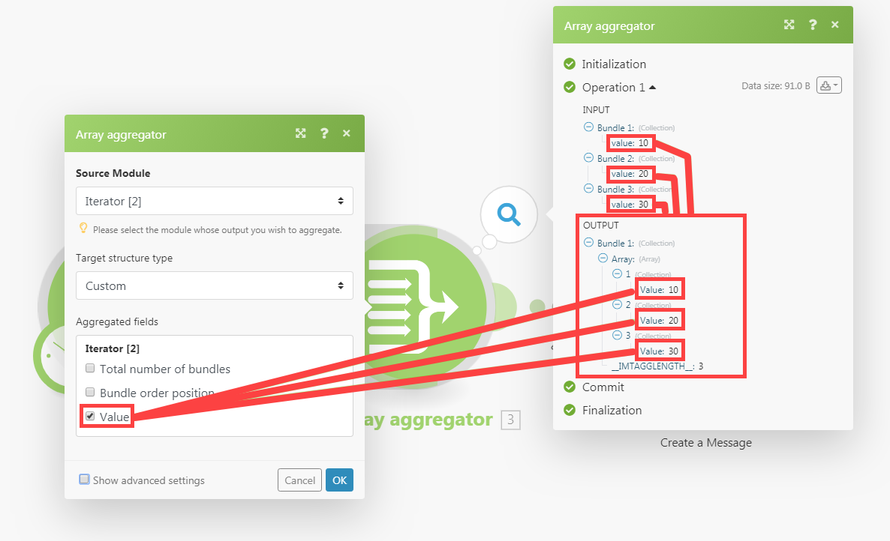
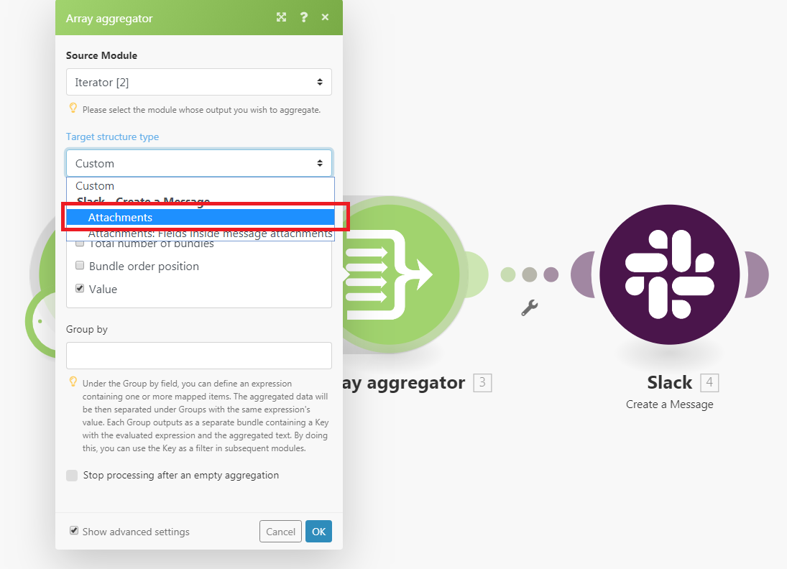
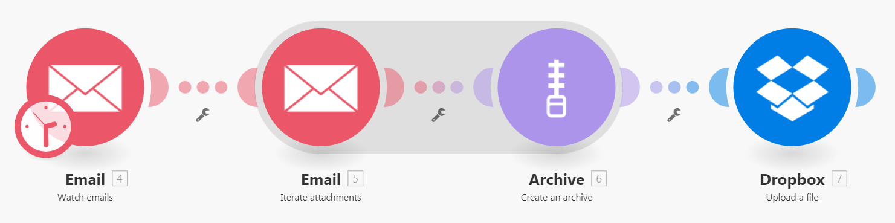
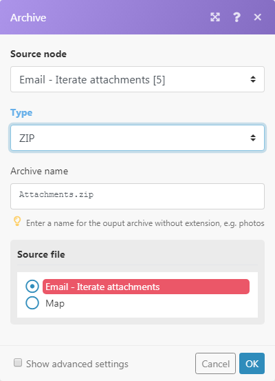

# [!UICONTROL アグリゲーター]モジュール

アグリゲータモジュールとは、複数のデータバンドルを1つのバンドルに統合するモジュールです。

## アクセス要件

+++ 展開すると、この記事の機能のアクセス要件が表示されます。

<table style="table-layout:auto">
 <col> 
 <col> 
 <tbody> 
  <tr> 
   <td role="rowheader">Adobe Workfront パッケージ</td> 
   <td> 
任意の Adobe Workfront Workflow パッケージと任意の Adobe Workfront Automation および Integration パッケージ

Workfront Ultimate

Workfront Fusion を追加購入した Workfront Prime および Select パッケージ。
 </td> 
  </tr> 
  <tr data-mc-conditions=""> 
   <td role="rowheader">Adobe Workfront ライセンス</td> 
   <td> 
標準

Work またはそれ以上
 </td> 
  </tr> 
  <tr> 
   <td role="rowheader">製品</td> 
   <td>
   
組織が Workfront Automation および Integration を含まない Select またはPrime Workfront パッケージを持っている場合は、Adobe Workfront Fusion を購入する必要があります。</li></ul>
   </td> 
  </tr>
 </tbody> 
</table>

この表の情報について詳しくは、[ドキュメントのアクセス要件](/help/workfront-fusion/references/licenses-and-roles/access-level-requirements-in-documentation.md)を参照してください。

+++

## [!UICONTROL Aggregator] モジュールの概要

[!UICONTROL アグリゲーター]モジュールが実行されると、次の処理が行われます。

* 1つのソースモジュールの操作からすべてのバンドルを累積します。
* 累積バンドルごとに1つの項目を含む配列を持つ1つのバンドルを出力します。 配列の項目の内容は、特定の[!UICONTROL Aggregator] モジュールとその設定によって異なります。

次の画像は、[!UICONTROL アグリゲーター]モジュールの通常の設定を表示します。

<table style="table-layout:auto">
 <col> 
 <col> 
 <tbody> 
  <tr> 
   <td> 
[!UICONTROL Source Module]
 </td> 
   <td> 
バンドル集計が開始されるモジュール。 ソースモジュールは通常、一連のバンドルを出力するイテレータまたは検索モジュールです。

アグリゲーターのソースモジュールを設定する場合（およびアグリゲーターの設定を閉じる場合）、ソースモジュールとアグリゲーターモジュールの間のルートはグレーの領域で囲まれるため、アグリゲーターの開始と終了を明確に確認できます。 
   
 
イテレーターについて詳しくは、<a href="/help/workfront-fusion/references/modules/iterator-module.md" class="MCXref xref">[!UICONTROL Iterator] モジュール </a>を参照してください。
 
   
検索モジュールについて詳しくは、モジュールの概要の<a href="/help/workfront-fusion/get-started-with-fusion/understand-fusion/module-overview.md#search-modules" class="MCXref xref">検索モジュール </a>を参照してください。
 </td> 
  </tr> 
  <tr> 
   <td> 
[!UICONTROL Target structure type]

（[!UICONTROL Array aggregator] モジュールにのみ適用されます）。
 </td> 
   <td> 
 データが集計されるターゲット構造。 デフォルトのオプションである[!UICONTROL Custom]を使用すると、[!UICONTROL Array aggregator]の出力バンドルの<code>Array </code>項目に集約する項目を選択できます。
 
  
 
[!UICONTROL Array aggregator] モジュールの後に追加のモジュールを接続し、アグリゲータモジュールの設定に戻ると、[!UICONTROL Target]構造タイプのドロップダウンメニューには、次のすべてのモジュールと「コレクションの配列」タイプであるフィールドが含まれます。 
この例では、[!DNL Slack] &gt;[!UICONTROL メッセージを作成] モジュールの[!UICONTROL Attachments] フィールドが、配列アグリゲーター/ターゲット構造タイプ フィールドに表示されます。 
 
  
 </td> 
  </tr> 
  <tr> 
   <td>[!UICONTROL Aggregated fields]</td> 
   <td>集約モジュール出力に含めるフィールド。</td> 
  </tr> 
  <tr> 
   <td> 
[!UICONTROL Group by]
 </td> 
   <td> 
「グループ別」フィールドを使用すると、1つ以上のマッピング済みアイテムを含む式を定義できます。 集約されたデータは、式の値でグループに分けられます。 各グループは、キーとデータの配列を含む個別のバンドルとして出力されます。 結果をグループ化することで、キーを後続のモジュールのフィルターとして使用できます。

   
各バンドルには、次の 2 つの項目が含まれます。
 
    <ul> 
     <li><code>Key</code>：グループ化する値。</li> 
     <li><code>Array</code>：数式が<code>Key</code>値に評価されたバンドルからの集計データ。</li> 
    </ul> </td> 
  </tr> 
  <tr> 
   <td> 
空の集計後に処理を停止
 </td> 
   <td> 
デフォルトでは、[!UICONTROL Aggregator] モジュールは、バンドルが[!UICONTROL Aggregator] モジュールに到達しなかった場合でも、集約の結果を出力します（例えば、すべてのバンドルが集約を含むパスからフィルタリングされたため）。 「[!UICONTROL Stop processing after an empty aggregation]」オプションが有効になっている場合、[!UICONTROL Aggregator] モジュールは、入力バンドルがない場合、出力バンドルを生成しません。 それどころか、流れが止まってしまいます。
 </td> 
  </tr> 
 </tbody> 
</table>

>[!NOTE]
>
>ソースモジュールと[!UICONTROL Aggregator] モジュールの間でモジュールによって生成されたバンドルは、[!UICONTROL Aggregator] モジュールによって出力されません。 これらのバンドルは、[!UICONTROL Aggregator]の後のフローのモジュールからアクセスできません。 ソースモジュールと[!UICONTROL Aggregator] モジュールの間でモジュールによって出力されたバンドルのデータが必要な場合は、必ず[!UICONTROL Aggregator] モジュールの設定（[!UICONTROL Array aggregator] モジュールの設定の[!UICONTROL 集計フィールド ] フィールドなど）に指定された項目を含めてください。

## アグリゲーターの仕組みの例

この例では、すべてのメール添付ファイルをzip形式で送信し、ZIPを[!DNL Dropbox]にアップロードする方法を示します。

以下のシナリオでは、次の方法を示します。

* 最初のモジュールは、受信メール用のメールボックスを監視します。 [!UICONTROL 電子メール ] >[!UICONTROL 電子メールを監視] トリガーは、すべての電子メールの添付ファイルを含む配列である項目`Attachments[]`を含むバンドルを出力します。

* 2番目のモデルは、電子メールの添付ファイルを繰り返します：[!UICONTROL 電子メール ] >[!UICONTROL 添付ファイルを繰り返し] イテレータは、`Attachments[]`配列のアイテムを1つずつ取り出し、さらに別のバンドルとして送信します。

* 3つ目のモジュールはアグリゲーターです。 [!UICONTROL 電子メール ] >[!UICONTROL 添付ファイルを繰り返し] モジュールによって出力されたバンドルを集計します。 [!UICONTROL  アーカイブ ] >[!UICONTROL  アーカイブアグリゲーターを作成]すると、受け取ったすべてのバンドルが蓄積され、ZIP ファイルを含む単一のバンドルが出力されます。

* 最後のモジュールは、結果として得られるZIP ファイルを[!DNL Dropbox]にアップロードします。[!DNL Dropbox] > [!UICONTROL  ファイルをアップロード ]は、[!UICONTROL  アーカイブ ] > [!UICONTROL  アーカイブ ] モジュールを作成し、[!DNL Dropbox]にアップロードします。

以下に、[!UICONTROL アーカイブ]／[!UICONTROL アーカイブを作成]アグリゲーターの設定例を示します。

