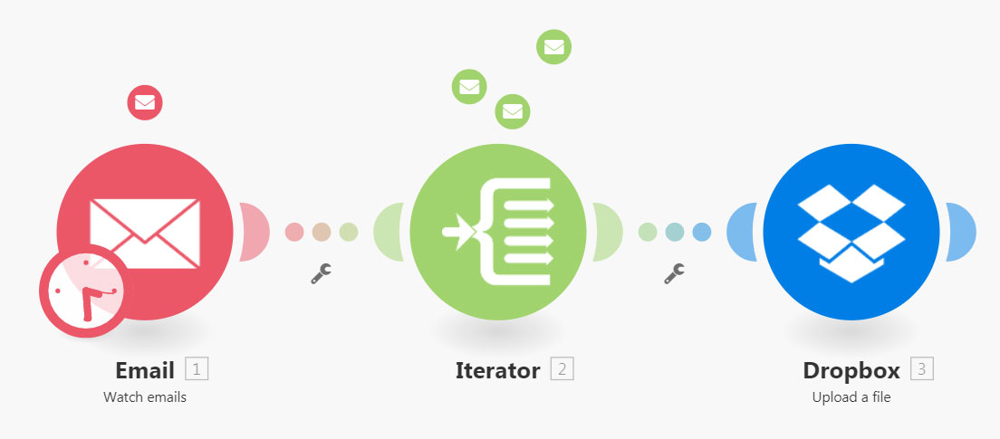

# [!UICONTROL Iterator] モジュール

[!UICONTROL  イテレータ ] は、配列を一連のバンドルに変換するモジュールの一種です。 各配列項目は、別々のバンドルとして出力されます。

## アクセス要件

+++ 展開すると、この記事の機能のアクセス要件が表示されます。

<table style="table-layout:auto">
 <col> 
 <col> 
 <tbody> 
  <tr> 
   <td role="rowheader">Adobe Workfront パッケージ</td> 
   <td> 
任意のAdobe Workfront ワークフローパッケージと任意のAdobe Workfront Automation and Integration パッケージ

WorkfrontUltimate

Workfront Fusion を追加購入したWorkfront Primeおよび Select パッケージ。
 </td> 
  </tr> 
  <tr data-mc-conditions=""> 
   <td role="rowheader">Adobe Workfront ライセンス</td> 
   <td> 
標準

ワークまたはそれ以上
 </td> 
  </tr> 
  <tr> 
   <td role="rowheader">製品</td> 
   <td>
   
組織がWorkfront Automation and Integration を含まない Select またはPrime Workfront パッケージを持っている場合は、Adobe Workfront Fusion を購入する必要があります。</li></ul>
   </td> 
  </tr>
 </tbody> 
</table>

このテーブルの情報について詳しくは、[ ドキュメントのアクセス要件 ](/help/workfront-fusion/references/licenses-and-roles/access-level-requirements-in-documentation.md) を参照してください。

+++## [!UICONTROL Iterator] モジュールの構成

一般的な Iterator モジュールには、[!UICONTROL  配列 ] フィールドという単一のフィールドがあります。 このフィールドには、別々のバンドルに変換または分割される配列が含まれています。

その他のコネクタには、そのイテレータに固有のイテレータモジュールを含めることができます。 これらにはSource モジュールフィールドが含まれ、反復したい配列を出力するモジュールを選択できます。

詳しくは、[ モジュールの設定 ](/help/workfront-fusion/create-scenarios/add-modules/configure-a-modules-settings.md) を参照してください。

>[!BEGINSHADEBOX]

**例：**

* 以下のシナリオは、添付ファイル付きのメールを取得し、その添付ファイルを選択した [!DNL Dropbox] フォルダーに 1 つのファイルとして保存する方法を示しています。

  メールには、添付ファイルの配列を含めることができます。最初のモジュールの後の [!UICONTROL Iterator] モジュールを使用すると、シナリオで各添付ファイルを個別に処理できます。 [!UICONTROL イテレータ]モジュールは、添付ファイルの配列を 1 つのバンドルに分割します。1 つの添付ファイルを含む各バンドルは、選択した [!DNL Dropbox] フォルダーに一度に 1 つずつ保存されます。Iterator モジュールの [!UICONTROL  配列 ] フィールドには、`Attachments` 配列を含める必要があります。

  

>[!ENDSHADEBOX]

## トラブルシューティング

### 問題：マッピングパネルの [!UICONTROL Iterator] モジュールの下にマッピング可能な項目が表示されない

[!UICONTROL Iterator] モジュールに配列の項目の構造に関する情報がない場合、[!UICONTROL Iterator] モジュールに続くモジュールのマッピングパネルには、[!UICONTROL Iterator] モジュールの下に 2 つの項目（`Total number of bundles` と `Bundle order position`）のみが表示されます。

これは、各モジュールが、出力する項目に関する情報を提供する責任を負い、これらの項目が後続のモジュールのマッピングパネルで適切に表示されるようにするためです。 ただし、モジュールによっては、この情報を提供できないことがあります。 例えば、データ構造が見つからない [!UICONTROL JSON]/[!UICONTROL JSON を解析 ] や [!UICONTROL Webhook]/[!UICONTROL  カスタム Webhook] モジュールでは、情報が提供されません。

#### ソリューション

解決策は、シナリオを手動で実行することです。 これにより、モジュールは出力を作成します。 その後、Fusion は、この出力の形式をシナリオの新しいモジュールに適用できます。

例えば、シナリオにデータ構造のない [!UICONTROL JSON]/[!UICONTROL JSON を解析 ] モジュールが含まれているとします。

この JSON モジュールに接続された [!UICONTROL Iterator] モジュールは、モジュールの出力を [!UICONTROL Iterator] モジュールのセットアップパネルの配列フィールドにマップできません。

これを解決するには：

シナリオエディターでシナリオを手動で開始する

>[!NOTE]
>
>シナリオ全体が実行されないようにするには、次の操作を行います。
>
>* [!UICONTROL JSON]/[!UICONTROL JSON を解析 ] モジュールの後のモジュールのリンクを解除して、フローがさらに進行しないようにします。
>  >   または
>* [!UICONTROL JSON]/[!UICONTROL JSON を解析 ] モジュールを右クリックし、コンテキストメニューから **[!UICONTROL このモジュールのみを実行]** を選択して、[!UICONTROL JSON]/[!UICONTROL JSON を解析 ] モジュールのみを実行します。

[!UICONTROL JSON]/[!UICONTROL JSON を解析 ] が実行されると、イテレータモジュールを含む後続のすべてのモジュールに出力に関する情報を提供できます。 イテレータの設定のマッピングパネルには、次の項目が表示されます。

さらに、[!UICONTROL Iterator] モジュールの後に接続されたモジュールのマッピングパネルには、配列に含まれる項目が表示されます。

