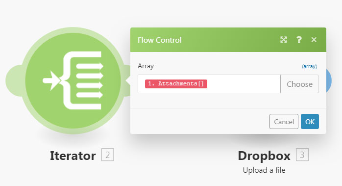
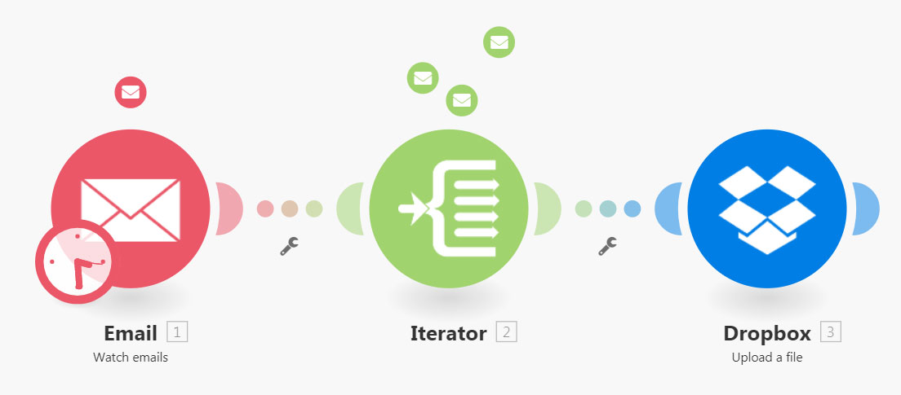
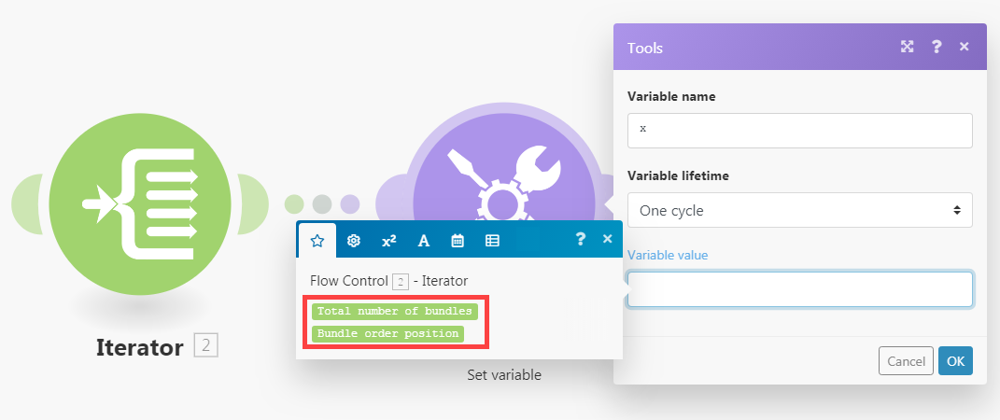
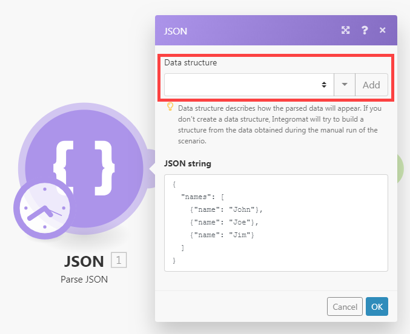
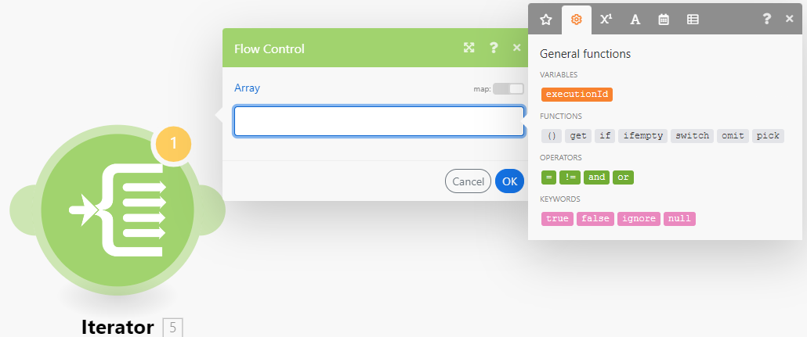
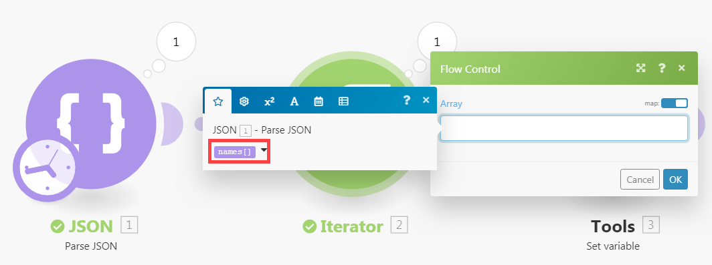
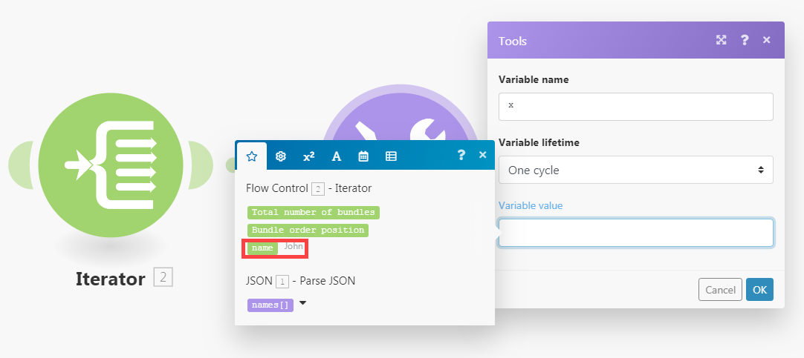

# [!UICONTROL  イテレーター] モジュール

[!UICONTROL  イテレーター]は、配列を一連のバンドルに変換するモジュールの一種です。 各配列項目は、別々のバンドルとして出力されます。

## アクセス要件

+++ 展開すると、この記事の機能のアクセス要件が表示されます。

<table style="table-layout:auto">
 <col> 
 <col> 
 <tbody> 
  <tr> 
   <td role="rowheader">Adobe Workfront パッケージ</td> 
   <td> 
任意の Adobe Workfront Workflow パッケージと任意の Adobe Workfront Automation および Integration パッケージ

Workfront Ultimate

Workfront Fusion を追加購入した Workfront Prime および Select パッケージ。
 </td> 
  </tr> 
  <tr data-mc-conditions=""> 
   <td role="rowheader">Adobe Workfront ライセンス</td> 
   <td> 
標準

Work またはそれ以上
 </td> 
  </tr> 
  <tr> 
   <td role="rowheader">製品</td> 
   <td>
   
組織が Workfront Automation および Integration を含まない Select またはPrime Workfront パッケージを持っている場合は、Adobe Workfront Fusion を購入する必要があります。</li></ul>
   </td> 
  </tr>
 </tbody> 
</table>

この表の情報について詳しくは、[ドキュメントのアクセス要件](/help/workfront-fusion/references/licenses-and-roles/access-level-requirements-in-documentation.md)を参照してください。

+++

## [!UICONTROL  イテレーター] モジュール設定

一般イテレーターモジュールには、1つのフィールド「[!UICONTROL 配列]」フィールドがあります。 このフィールドには、変換または個別のバンドルに分割する配列が含まれます。

その他のコネクタには、そのイテレーターに固有のイテレーターモジュールが含まれる場合があります。 これにはSource モジュールフィールドが含まれています。このフィールドを使用すると、反復する配列を出力するモジュールを選択できます。

詳しくは、[ モジュールの設定](/help/workfront-fusion/create-scenarios/add-modules/configure-a-modules-settings.md)を参照してください。

>[!BEGINSHADEBOX]

**例：**

* 以下のシナリオは、添付ファイル付きのメールを取得し、その添付ファイルを選択した [!DNL Dropbox] フォルダーに 1 つのファイルとして保存する方法を示しています。

  メールには、添付ファイルの配列を含めることができます。 最初のモジュールの後の[!UICONTROL  イテレータ ] モジュールにより、シナリオで各添付ファイルを個別に処理できるようになります。 [!UICONTROL イテレータ]モジュールは、添付ファイルの配列を 1 つのバンドルに分割します。 1 つの添付ファイルを含む各バンドルは、選択した [!DNL Dropbox] フォルダーに一度に 1 つずつ保存されます。 Iterator モジュールの[!UICONTROL Array] フィールドには、`Attachments`配列を含める必要があります。

  

>[!ENDSHADEBOX]

## トラブルシューティング

### 問題：マッピングパネルに、[!UICONTROL  イテレーター] モジュールの下にマッピング可能なアイテムが表示されない

[!UICONTROL  イテレーター] モジュールに配列のアイテムの構造に関する情報がない場合、[!UICONTROL  イテレーター] モジュールに続くモジュールのマッピングパネルには、[!UICONTROL  イテレーター] モジュールの下に2つのアイテムのみが表示されます：`Total number of bundles`と`Bundle order position`。

これは、各モジュールが出力する項目に関する情報を提供する責任を負うため、これらの項目を後続のモジュールのマッピングパネルに適切に表示できるためです。 ただし、一部のモジュールでは、この情報を提供できない場合があります。 例えば、[!UICONTROL JSON] > [!UICONTROL JSON]を解析するか、[!UICONTROL Webhook] > [!UICONTROL Custom Webhook] モジュールでデータ構造が見つからない場合、情報は提供されません。

#### ソリューション

解決策は、シナリオを手動で実行することです。 これにより、モジュールは強制的に出力を作成します。 その後、この出力のフォーマットをシナリオ内の後のモジュールに適用できます。

例えば、シナリオには、データ構造を持たない[!UICONTROL JSON] > [!UICONTROL JSON]解析モジュールが含まれます。

このJSON モジュールに接続された[!UICONTROL  イテレーター] モジュールは、モジュールの出力を[!UICONTROL  イテレーター] モジュールのセットアップ パネルの配列フィールドにマッピングできません。

これを解決するには、以下を行います。

シナリオエディターでシナリオを手動で開始します。

>[!NOTE]
>
>シナリオ全体が実行されないようにするには、次の操作を行います。
>
>* [!UICONTROL JSON] > [!UICONTROL JSON]解析モジュールの後でモジュールのリンクを解除して、フローがさらに進まないようにします。
>   または
>* [!UICONTROL JSON] > [!UICONTROL JSONを解析] モジュールを右クリックし、コンテキストメニューから「**[!UICONTROL このモジュールのみを実行]**」を選択して、[!UICONTROL JSON] > [!UICONTROL JSONを解析] モジュールのみを実行します。

[!UICONTROL JSON] > [!UICONTROL JSON]を解析した後、その出力に関する情報をIterator モジュールを含む後続のすべてのモジュールに提供できます。 イテレータの設定のマッピングパネルには、次の項目が表示されます。

さらに、[!UICONTROL  イテレーター] モジュールの後に接続されたモジュールのマッピングパネルには、配列に含まれる項目が表示されます。

に含まれる項目
