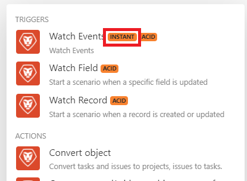
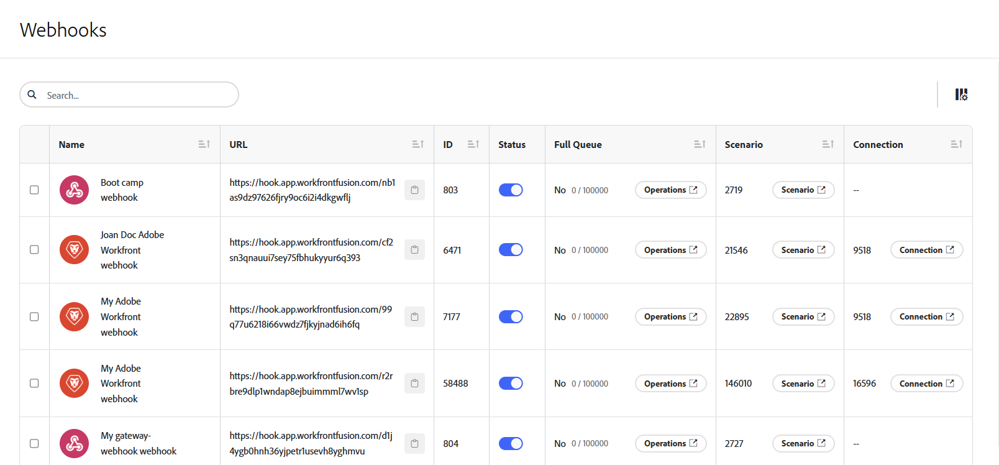
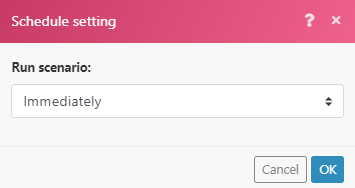

# インスタントトリガー（webhook）

多くのサービスでは、サービス内で特定の変更（イベント）が発生するたびに、即座に通知を配信するためのWebhookを提供しています。 これらのイベントを処理するには、インスタントトリガーを使用することをお勧めします。 インスタントトリガーは、特定のコネクタのモジュールのリストに`Instant` タグを表示します。

>[!TIP]
>
>コネクタ内のモジュールのリストを確認して、そのコネクタにインスタントトリガーがあるかどうかを確認できます。また、[Fusion アプリケーションとそのモジュールのリファレンス ](/help/workfront-fusion/references/apps-and-modules/apps-and-modules-toc.md)で、そのコネクタのドキュメントを確認できます。
>
>Adobe Workfrontのインスタントトリガーに関するドキュメントについては、Workfront トリガーの[ モジュール ](/help/workfront-fusion/references/apps-and-modules/adobe-connectors/workfront-modules.md#triggers)を参照してください。

コネクタにWebhookが含まれていない場合は、次のいずれかを実行できます。

* Webhook モジュールを使用してカスタム Webhookを作成します。
詳しくは、[Web フック](/help/workfront-fusion/references/apps-and-modules/universal-connectors/webhooks-updated.md)を参照してください。
* ポーリングトリガーを使用して、サービスを定期的にポーリングします。
詳細については、[ シナリオのスケジュール ](/help/workfront-fusion/create-scenarios/config-scenarios-settings/schedule-a-scenario.md)を参照してください

Workfront Fusion の web フックの概要ビデオについて詳しくは、次を参照してください。

* [Webhookの概要](https://video.tv.adobe.com/v/3427025/){target=_blank}
* [中間Webhook](https://video.tv.adobe.com/v/3427030/){target=_blank}

## アクセス要件

+++ 展開すると、この記事の機能のアクセス要件が表示されます。

<table style="table-layout:auto">
 <col> 
 <col> 
 <tbody> 
  <tr> 
   <td role="rowheader">Adobe Workfront パッケージ</td> 
   <td> 
任意の Adobe Workfront Workflow パッケージと任意の Adobe Workfront Automation および Integration パッケージ

Workfront Ultimate

Workfront Fusion を追加購入した Workfront Prime および Select パッケージ。
 </td> 
  </tr> 
  <tr data-mc-conditions=""> 
   <td role="rowheader">Adobe Workfront ライセンス</td> 
   <td> 
標準

Work またはそれ以上
 </td> 
  </tr> 
  <tr> 
   <td role="rowheader">製品</td> 
   <td>
   
組織が Workfront Automation および Integration を含まない Select またはPrime Workfront パッケージを持っている場合は、Adobe Workfront Fusion を購入する必要があります。</li></ul>
   </td> 
  </tr>
 </tbody> 
</table>

この表の情報について詳しくは、[ドキュメントのアクセス要件](/help/workfront-fusion/references/licenses-and-roles/access-level-requirements-in-documentation.md)を参照してください。

+++

## Webhookの詳細を表示

Webhook領域でWebhookのリストを表示できます。

1. Webhook領域を開くには、左側のナビゲーションのWebhook アイコン をクリックします。

   ここでは、Webhookのリストを確認できます。

   

1. 特定のWebhookを検索するには、検索ボックスに検索語を入力します。
1. Webhookをコピーするには、そのWebhookの行のURLの近くにある「をクリックします。
1. Webhookの優先度を設定するには、「優先度」列のドロップダウンをクリックし、新しい優先度を選択します。

   優先度の高いWebhookが最初に処理されます。これは、ワーカープールに多くの自動化がリソースを競合している場合に役立つ可能性があります。
1. Webhookを無効または有効にするには、そのWebhookの行のステータス列のトグルを無効または有効にします。
1. Webhook キューがいっぱいかどうかを確認するには、「Full Queue」列を確認します。 この列の数値は、現在キューにある項目の数です。
1. Webhookで処理された操作を表示するには、そのWebhookのフルキュー列の&#x200B;**操作**&#x200B;をクリックします。
1. Webhookの有効期限が切れているかどうかを確認するには、「期限切れ」列を確認します。 期限切れのWebhookは、シナリオにアタッチされていないか、120時間イベントを受信していません。
1. Webhookが使用されているシナリオを表示するには、そのWebhookの「シナリオ」列の「**シナリオ**」ボタンをクリックします。
1. このWebhookに使用されている接続を表示するには、そのWebhookの接続列にある&#x200B;**接続** ボタンをクリックします。
1. 列を非表示にしたり、以前に非表示にした列を表示したりするには、**列** アイコン をクリックし、列名をオンまたはオフにします。
1. Workfront Webhookに関連付けられたイベントサブスクリプションを表示するには、Webhookの横にあるボックスにチェックを入れ、ページ下部の&#x200B;**詳細を表示**&#x200B;を選択します。

   >[!NOTE]
   >
   > イベントのサブスクリプションの詳細は、新しいWorkfront コネクタで作成されたWorkfront Webhookでのみ使用できます。 Webhookの詳細は、現在、他のコネクタでは利用できません。

## インスタントトリガーをスケジュールする

インスタントトリガーを設定すると、実行時に選択するように求められます。

「`Immediately`」を選択すると、Workfront Fusionがサービスから新しいイベントを受信したときに、すぐにシナリオを実行できます。 これらのイベントは直ちにキューに送信され、データを受信するのと同じ順序で、シナリオで一度に1つずつ処理されます。

シナリオが実行されると、キュー内で待機している保留中のイベントの合計量がカウントされ、シナリオは保留中のイベントがある数だけサイクルを実行し、1 サイクルにつき1つのイベントを処理します。

サイクルについて詳しくは、[ シナリオ実行、サイクル、およびフェーズ ](/help/workfront-fusion/references/scenarios/scenario-execution-cycles-phases.md)を参照してください。

>[!NOTE]
>
>* サイクルは、シナリオ実行とは異なります。 1つのシナリオ実行に複数のサイクルを設定できます。
>* `Immediately`を実行するようにスケジュールされたインスタントトリガーでシナリオを実行する場合、次の例外が適用されます。
>
>     * 2回の実行の間隔は、料金プランに従った最小間隔の対象ではありません。
>
>       例えば、シナリオの実行が完了すると、Web フックのキューが再度チェックされます。 保留中の Web フックがある場合は、シナリオが直ちに再実行され、保留中の Web フックがすべて再度処理されます。
>   
>     * 「最大サイクル数」シナリオ設定は無視され、100に設定されます。つまり、保留中のWebhookは1回のシナリオ実行中に処理される数は100以下です（サイクルごとに1つのイベントの割合で）。
>

[!UICONTROL 即時]以外のスケジュール設定を使用する場合、シナリオは指定した間隔で実行されます。 インターバル中に複数のWebhookをキューに収集できるため、[!UICONTROL 最大サイクル数] オプションをデフォルトの1より大きな値に設定して、1回のシナリオ実行でより多くのWebhookを処理することをお勧めします。

1. シナリオの下部にある[!UICONTROL  シナリオ設定] アイコン をクリックします。
1. 表示される&#x200B;**[!UICONTROL シナリオ設定]** パネルで、**[!UICONTROL 最大サイクル数]** フィールドに数値を入力し、シナリオを実行するたびに実行するキューのイベント数を示します。

キューに残っているイベントは、次回シナリオが実行されるときに、「最大サイクル数」フィールドで設定された数まで処理されます。

## Webhook ガードレール

優れたパフォーマンスを確保するために、Workfront Fusionでは、webhookに対して次のガードレールを配置しています。

### レート制限

現在のレート制限は、1 秒あたり 5 Web フックです。 制限を超えると、`429` ステータスコードが返されます。

### 非アクティブな Web フックの有効期限

120 時間を超えてどのシナリオにも割り当てられていない Web フックは削除されます。

### Web フックペイロード

Workfront Fusion は、Webhook ペイロードを30 日間保存します。 作成から30日以上経過したWebhook ペイロードにアクセスすると、エラー[!UICONTROL `Failed to read file from storage.`]が発生します

### エラー処理

インスタントトリガーでシナリオにエラーが発生した場合は、次のようになります。

* シナリオの実行が設定されると、ただちに停止します[!UICONTROL ただちに]。
* シナリオがスケジュール通りに実行されるように設定されている場合、3回の試行が失敗（3回のエラー）した後に停止します。

シナリオの実行中にエラーが発生した場合、イベントはインスタントトリガーのロールバックフェーズ中にキューに戻されます。 そのような状況では、シナリオを修正して再度実行できます。

詳しくは、「シナリオの実行、サイクル、およびフェーズ」の記事の[ ロールバック ](/help/workfront-fusion/references/scenarios/scenario-execution-cycles-phases.md#rollback)を参照してください。

シナリオに Web フックの応答モジュールがある場合、エラーは Web フックの応答に送信されます。 Webhook応答モジュールは常に最後に実行されます（シナリオ設定の[!UICONTROL 自動コミット ] オプションが有効になっていない場合）。

詳しくは、Webhookの記事の「[Webhookへの応答](/help/workfront-fusion/references/apps-and-modules/universal-connectors/webhooks-updated.md#responding-to-webhooks)」を参照してください。

### Webhook の無効化

次のいずれかに該当する場合、Web フックは自動的に非アクティブ化されます。

* Web フックが 6 日以上どのシナリオにも接続されていない
* Web フックが、非アクティブなシナリオ（非アクティブになってから 30 日を超えたシナリオ）でのみ使用される。

非アクティブ化されたwebhookは、シナリオに接続されておらず、30日以上非アクティブ化されたステータスである場合、自動的に削除および登録解除されます。

## カスタム Web フック

独自の Web フックを作成できます。 詳しくは、[Web フック](/help/workfront-fusion/references/apps-and-modules/universal-connectors/webhooks-updated.md)を参照してください。

## リソース

サイクルについて詳しくは、[ シナリオ実行、サイクル、およびフェーズ ](/help/workfront-fusion/references/scenarios/scenario-execution-cycles-phases.md)を参照してください。
