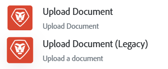

# 大きいファイルの操作

>[!IMPORTANT]
>
>大きなファイル機能は、Workfront Ultimate パッケージの組織でのみ使用できます。

強化されたデータ転送機能がWorkfront Fusionで利用できるようになりました。これにより、大幅に大きなファイルを処理するシナリオが可能になります。

大きなファイルを処理するには、シナリオを更新する必要があります。

## 大きなファイルをサポートするコネクタ

現在、次のコネクタは大きなファイルをサポートしています。

>[!NOTE]
>
>* 大きなファイルをサポートするモジュールを使用してファイルをダウンロードし、大きなファイルをサポートしないモジュールに渡した場合、そのモジュールはファイルを正常に処理できません。大きなファイルは、ワークフロー全体でサポートされているモジュールでのみ処理する必要があります。
>* 大きなファイルをサポートしないモジュールでは、最大200 MBのサイズのファイルを処理できます。

* Workfront
   * ドキュメントをアップロード
   * ドキュメントのダウンロード
* Adobe Experience Manager Assets
   * ドキュメントをアップロード
* Workfront Proof
   * ファイルをアップロード
   * プルーフをダウンロード
* Adobe Authenticator
   * カスタム API 呼び出しの実行
* Adobe Photoshop
   * PSDの編集を適用
* SharePoint
   * ファイルを作成
   * ファイルの作成（レガシー）
   * ファイルの取得
* Salesforce
   * ファイルをアップロード
* AWS S3
   * ファイルをアップロード
   * ファイルを取得
* HTTP

その他のコネクタは、今後のリリースでサポートされる予定です。

## 大きなファイルを処理するようにシナリオを更新する

Workfront/ドキュメントをアップロード モジュールが変更され、大きなファイルを処理できるようになりました。 このモジュールの以前のバージョンでは、モジュール名に`(Legacy)`が追加されるようになりました。 ほとんどの場合、レガシーモジュールは引き続き機能します。

大きなファイルを扱う場合は、従来のモジュールを新しいドキュメントアップロードモジュールに置き換えることをお勧めします。 新しいドキュメントのアップロードモジュールは、タイムアウトやその他のエラーを防ぎます。

## よくある質問

### 新しいファイルサイズの制限は何ですか？

ユーザーは、前の1 GBの制限を超えるファイルを処理できるようになり、効率と生産性が向上しました。  Workfront Fusion プラットフォームにはファイルサイズの制限は定義されていませんが、大きなファイルの使用に影響を与える可能性がある要因は他にもあります。

* **Fusionが接続しているサービスのファイルサイズの制限**: サービスがファイルサイズを制限している場合、Workfront Fusionはその制限を克服しません。 ファイルサイズの制限は、最終的にはFusionが接続するweb サービスに依存します。

* **シナリオ実行時間**: Fusionは、実行制限の40分に達するまで、任意のサイズのファイルを処理します。 大きなファイルは、Fusion シナリオでのアップロード、ダウンロード、処理に時間がかかる場合があります。 大きなファイルで実行に40分以上かかる場合、シナリオは失敗します。 シナリオの実行時間は、シナリオサイズ、モジュールの複雑さ、ネットワーク速度の影響を受ける可能性があります。 したがって、大きなファイルを使用する場合は、シナリオのこれらの側面を考慮することをお勧めします。

>[!NOTE]
>
>ベストプラクティスとして、ファイルサイズを15 GBに制限することをお勧めします。

### Fusionの新しいファイル転送の仕組み？

Fusionがファイルを処理すると、大きなファイルが永続ストレージ（S3 バケットまたはAzure Blob Storage）に追加されます。 Fusion モジュールがアップロードやダウンロードなどのファイルアクションを実行すると、Fusionは永続ストレージ内のファイルをアクティブメモリの代わりにソースとして使用します。

### 不完全な実行を使用して、大きなファイルを操作できますか？

はい。Fusionでは、大きなファイルを含む不完全な実行をサポートしています。 不完全な実行は、組織のサイズが限られており、積極的に管理する必要があります。

### 任意のコネクタで大きなファイルを使用できますか？

各Fusion コネクタは、大きなファイルをサポートするように更新する必要があります。 サポートされているコネクタには、Workfront、HTTP、AEM Assetsなどがあります。 Fusion コネクタは、web サービスでサポートされているファイルサイズによって引き続き制限されます。 ファイルサイズの制限は、通常、ファイルをダウンロードしてアップロードするweb サービスエンドポイントのAPI ドキュメントに含まれます。

### 運用への影響か？

いいえ、モジュールによって実行される操作の数は同じです。

### FusionのUIはいつ更新され、ファイル転送データが表示されますか？

この機能は既に完了しており、実稼動環境にデプロイされています。

### 新しいファイル処理の制限について、シナリオの設計に役立つ考え方を教えてください。

40分以内に実行できるシナリオを設計するのは複雑に思えるかもしれません。 シナリオを設計する際には、次の点に留意することをお勧めします。

* **実行時間に関するビジネス要件を理解する**:Fusionの実行時間のプラットフォーム制限は40分ですが、ほとんどのビジネスプロセス自動化は、より速く実行されることが期待されています。 例えば、結果に依存する続きを持つユーザーが開始する自動化は、40分の制限内で十分に完了することが期待されます。
* **設計する際は実行時間を考慮する**: シナリオを設計する際は、アップロードやダウンロードなどの個々のファイルアクションのモジュール実行時間を把握することが重要です。 この知識は、複数のファイルアクションを含むシナリオを計画するのに役立ちます。  設計の正確性を確保するために、モジュールの実行時間を丸めてバッファを含めることをお勧めします。
例えば、Fusionが144秒（2.4分）でドキュメントをダウンロードした場合、1つの実行で同様のアクションを複数回実行できると予測できます。 この例では、モジュールの実行に144秒かかり、ダウンロード用に3分間の実行時間を計画する必要があります。 要件にアップロードとダウンロードの両方が含まれる場合、予想される実行時間は約6分になります。 Fusionの実行時間は40分に制限されていることに注意してください。

* **ファイルアクションの統合**: Fusion シナリオでのファイルアクションの最も一般的な例は、1回のダウンロードと1回のアップロードです。 これら2つのアクションのみを含むほとんどのシナリオは、数分で実行されます。 可能であれば、Fusion デザイナーは、シナリオを1回のダウンロードと1回のアップロードに制限する必要があります。

* **マッピングパネルを使用してサイズを計算**: Workfrontおよびその他のweb サービスには、ダウンロードモジュールの出力に含まれるファイルのファイルサイズが含まれます。 このデータを使用して、モジュールのアップロードに対して大きすぎるファイルや、シナリオの実行時間に対して大きすぎるファイルをフィルタリングできます。

* **複数のファイルを操作する際に、独自のシナリオでファイルアクションを分離する**: Fusion デザイナーは、ファイルアクションを個別のシナリオに分離することを検討する必要があります。 例えば、複数の添付ファイルを含む新しいWorkfront リクエストによってトリガーされるFusion シナリオでは、最大30個のファイルに対応する必要があります。 各ファイルのアップロードとダウンロードに最大3分かかることを考えると、1回の実行ですべてのファイルを処理すると、Fusionの40分の実行制限を超えます。 解決策は、個々のファイルのアップロードとダウンロードを処理する専用のファイルアクションシナリオを作成することです。 リクエストトリガーされたシナリオは、HTTP モジュールを使用して各ファイルのファイルアクションシナリオを呼び出し、添付ファイルを反復処理します。 このアプローチにより、各ファイルは実行時間制限内に処理されます。

<!--
## Connectors that do not support large files

Some Fusion connectors do not support large files. For these connectors, Fusion's total processing capacity for files is **1 GB**. 

This limit is based on a total memory cost. Every operation contributes to that cost. If a single file of 400 MB is downloaded and uploaded then the total cost to the file capacity would be 800 MB.

The following connectors do **not** support large files. 

* Archive
* Box
* Convert
* CSV
* Datastores
* Flow control
* FTP
* JSON
* JWT
* Markdown
* Math
* Microsoft Word templates
* MIME
* Microsoft SQL
* SFTP
* Adobe Acrobat Sign
* SOAP
* Tools
* XML

If a connector is not on this list, it does not support large files. For these connectors, Fusion's total processing capacity for files is **1 GB**. 

This limit is based on a total memory cost. Every operation contributes to that cost. If a single file of 400 MB is downloaded and uploaded then the total cost to the file capacity would be 800 MB.
-->

<!--
## Connectors that support large files

The following connectors support large files.

Workfront
HTTP
Webhooks
Salesforce
Microsoft Email
Workfront Proof
AEM Assets
Email
Slack
Jira
Microsoft Excel
SharePoint
Frame.io
Adobe PDF Services
Marketo
Azure Devops 
Google Email
Jira Server
Google Sheets
Microsoft OneDrive
ServiceNow 
AWS S3
Bynder
OneDrive Business
Adobe Authenticator
Google Drive
Microsoft Dynamics
Google Docs
NetSuite
Airtable
Azure AD
QuickBase 
Adobe Target
Adobe Campaign Classic
Microsoft Calendar
Workfront Planning
HubSpot CRM  
DropBox
Cloud Convert
Egnyte
Adobe Firefly
OpenAI / Chat GPT
Allocadia
Cvent
GitLab 
Google Team Drive
Google Calendar
Workfront SDL Managed Translation
Widen
Workfront Boards
Google Slides
Qualtrics
Microsoft Power BI
Adobe Photoshop
Anaplan
DocuSign 
MariaDB
Adobe Creative Cloud Libraries
Figma
AEM Forms
Datadog
GitHub 
Google Forms
Adobe I/O Events
Trello
Workday
Adobe Journey Optimizer
Adobe Lightroom

If a file is not on this list, it does not support large files. For these connectors, Fusion's total processing capacity for files is **1 GB**. 

This limit is based on a total memory cost. Every operation contributes to that cost. If a single file of 400 MB is downloaded and uploaded then the total cost to the file capacity would be 800 MB.

-->
