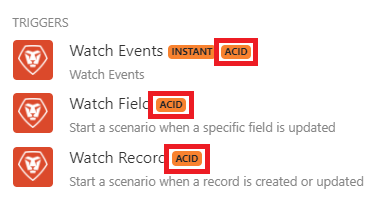

# シナリオの実行、サイクル、フェーズ

各シナリオ実行は初期化フェーズから始まり、操作フェーズとコミット/ロールバックフェーズで構成される少なくとも1つのサイクルで続き、最終化フェーズで終了します

* 初期化
* サイクル 1
   * 操作（読み取りまたは書き込み）
   * コミットまたはロールバック
* サイクル 2
   * 操作（読み取りまたは書き込み）
   * コミットまたはロールバック
* ...
* サイクル#n
   * 操作（読み取りまたは書き込み）
   * コミットまたはロールバック
* 最終化

小規模な場合は、各モジュールも次のフェーズに従います。 モジュールフェーズに関する情報は、シナリオが実行された後、各モジュールの右上にある番号付きバブルに表示される処理済みバンドル情報にあります。 処理されたバンドル情報の検索について詳しくは、「[処理されたバンドルに関する情報](/help/workfront-fusion/references/scenarios/scenario-execution-flow.md#information-about-processed-bundles)」を参照してください。

大規模なシナリオフェーズに関する情報は、実行の詳細にあります。

## シナリオ実行フェーズ

### 初期化

初期化フェーズでは、必要なすべての接続（データベースへの接続、メールサービスなど）が作成され、モジュールが意図した操作を実行できることを確認するためにチェックされます。

### サイクル

各サイクルは、一連の作業から構成される不可分の作業単位を表し、それぞれにコミットまたはロールバックが適用されます。

サイクルの最大数は、[!UICONTROL  シナリオ設定] パネルで設定できます。 デフォルト値は 1 です。

* [操作](#operation)
* [コミット](#commit)
* [ロールバック](#rollback)

#### 操作

運用段階では、読み取りまたは書き込み操作が実行されます。

* 読み取り操作は、サービスからデータを取得し、その後、事前に定義されたシナリオに従って他のモジュールによって処理される操作で構成されます。 例えば、[!UICONTROL Workfront] >[!UICONTROL Watch records] モジュールは、前回のシナリオ実行以降に作成された新しいバンドル（レコード）を返します。
* 書き込み操作は、さらに処理するために特定のサービスにデータを送信することから成ります。 例えば、Workfront >[!UICONTROL  ドキュメントをアップロード ] モジュールは、ファイルをWorkfrontにアップロードします。

#### コミット

操作フェーズが成功すると、コミット フェーズが開始され、その間にモジュールによって実行されたすべての操作がコミットされます。 つまり、Workfront Fusionでは、運用段階に関与するすべてのサービスに成功情報が送信されます。

### ロールバック

任意のモジュールの操作フェーズまたはコミットフェーズ中にエラーが発生した場合、フェーズは中止され、ロールバックフェーズが開始され、特定のサイクル中のすべての操作が無効になります。

>[!IMPORTANT]
>
>ロールバック（トランザクショナリティとも呼ばれます）をサポートするすべてのWorkfront Fusion モジュールには、ACID タグが付けられます。
>
>
>
>このタグでマークされていないモジュールは、他のモジュールでエラーが発生した場合でも、初期状態に戻すことはできません。 非 ACID モジュールの典型的な例は、[!UICONTROL メール]／[!UICONTROL メールの送信]アクションです。 メールの送信後は、送信を取り消すことはできません。

### 最終化

最終化フェーズでは、開いている接続（FTP 接続やデータベース接続など）が閉じられ、シナリオが完了します。

## リソース

詳しくは、[ シナリオ設定の設定](/help/workfront-fusion/create-scenarios/config-scenarios-settings/configure-scenario-settings.md)を参照してください。
