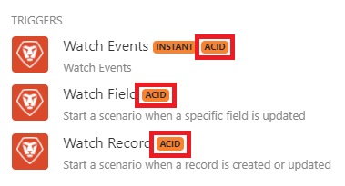

# シナリオの実行、サイクル、フェーズ

各シナリオの実行は、初期化フェーズから始まり、操作フェーズとコミット/ロールバックフェーズで構成される 1 つ以上のサイクルを経て、終了フェーズに進みます

* 初期化
* サイクル 1
   * 操作（読み取りまたは書き込み）
   * コミットまたはロールバック
* サイクル 2
   * 操作（読み取りまたは書き込み）
   * コミットまたはロールバック
* ...
* サイクル#n
   * 操作（読み取りまたは書き込み）
   * コミットまたはロールバック
* 最終化

小規模では、各モジュールもこれらのフェーズに従います。 モジュールフェーズに関する情報は、処理されたバンドルの情報で、シナリオの実行後に各モジュールの右上に表示される番号付きバブル内にあります。 処理されたバンドルの情報を見つける方法について詳しくは、「シナリオ実行フロー」の記事の [ 処理されたバンドルの情報 ](/help/workfront-fusion/references/scenarios/scenario-execution-flow.md#information-about-processed-bundles) を参照してください。

大規模なシナリオフェーズに関する情報は、実行の詳細で確認できます。

## シナリオの実行フェーズ

### 初期化

初期化フェーズでは、必要なすべての接続（データベースへの接続、メールサービスなど）が作成およびチェックされ、モジュールが意図した操作を実行できることが確認されます。

### サイクル

各サイクルは、コミットまたはロールバックを持つ一連の操作で構成される不可分の作業単位を表します。

[!UICONTROL scenario settings] ールパネルで最大サイクル数を設定できます。 デフォルト値は 1 です。

* [操作](#operation)
* [コミット](#commit)
* [ロールバック](#rollback)

#### 操作

動作フェーズでは、読み取りまたは書き込み動作が実行されます。

* 読み取り操作とは、サービスからデータを取得し、事前に定義されたシナリオに従って他のモジュールで処理することです。 例えば、[!UICONTROL Workfront] >[!UICONTROL Watch records] モジュールは、前回のシナリオの実行以降に作成された新しいバンドル（レコード）を返します。
* 書き込み操作は、さらに処理を行うために特定のサービスにデータを送信することです。 例えば、[!DNL Workfront] >[!UICONTROL Upload Document] モジュールはファイルをWorkfrontにアップロードします。

#### コミット

オペレーション・フェーズが正常に完了すると、コミット・フェーズが開始され、モジュールが実行したすべてのオペレーションがコミットされます。 つまり、[!DNL Workfront Fusion] では、操作フェーズに関与するすべてのサービスに、その成功に関する情報を送信します。

### ロールバック

モジュールのオペレーションまたはコミットフェーズでエラーが発生した場合、そのフェーズは中止され、ロールバックフェーズが開始されます。これにより、指定したサイクルのすべてのオペレーションが無効になります。

>[!IMPORTANT]
>
>ロールバック（トランザクション性とも呼ばれます）をサポートしているすべての [!DNL Workfront Fusion] モジュールは、ACID タグでマークされます。
>
>
>
>このタグでマークされていないモジュールは、他のモジュールでエラーが発生した場合でも、初期状態に戻すことはできません。ACID 以外のモジュールの典型的な例は、[!UICONTROL Email] >[!UICONTROL Send an Email] アクションです。 メールの送信後は、送信を取り消すことはできません。

### 最終化

最終化フェーズでは、開いている接続（FTP 接続やデータベース接続など）が閉じられ、シナリオが完了します。

## リソース

詳しくは、[ シナリオ設定の指定 ](/help/workfront-fusion/create-scenarios/config-scenarios-settings/configure-scenario-settings.md) を参照してください。
