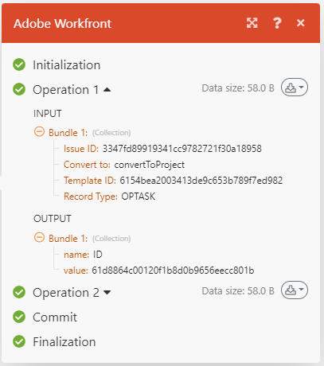

# シナリオ実行フロー

この記事では、シナリオの実行方法とデータの流れ、各モジュールで処理されるデータの表示方法について説明します。

アクティブなシナリオでのデータの流れを確認するには、[実行中のシナリオでのデータフローの表示](/help/workfront-fusion/manage-scenarios/view-scenario-data-flow.md)を参照してください。

## シナリオ実行フロー

シナリオは、正しく設定されてアクティブ化されると、定義されたスケジュールに従って実行されます。

シナリオが開始すると、最初のモジュールが、監視対象として設定されたイベントに応答します。 データを返すと、そのデータはバンドルにパッケージ化されます。 シナリオは、各イベントに1つのバンドルを返します。 例えば、モジュールが問題を監視するように設定されている場合、見つけた問題ごとにデータのバンドルを返します。

トリガーモジュールがデータのバンドルを返す場合、それらのバンドルは次のモジュールに渡され、シナリオは続き、バンドルを1つずつ連続する各モジュールに渡します。

すべてのモジュールでバンドルが正しく処理された場合、シナリオの詳細ページでシナリオが成功としてマークされます。

### 例：[!UICONTROL Workfront Fusion for Work Automation]

>[!BEGINSHADEBOX]

**例：**&#x200B;このシナリオでは、Workfrontで受信リクエストを監視し、それをWorkfront プロジェクトに変換すると、データは次のように流れます。

最初のモジュールで実行される、シナリオの最初のステップは、リクエストを監視することです。 見つかった各リクエストは、1つのバンドルと見なされます。 モジュールが実行されてもバンドルが見つからない場合、シナリオは最初のモジュールの後で終了します。

最初のモジュールがバンドルを返した場合、そのバンドルは残りのシナリオに渡されていきます。 この例では、バンドルは2番目のモジュールに移動し、リクエストをプロジェクトに変換します。

>[!ENDSHADEBOX]

### 例：[!UICONTROL Workfront Fusion for Work Automation and Integration]

>[!BEGINSHADEBOX]

**例：**&#x200B;このシナリオでは、Adobe Workfrontからドキュメントをダウンロードし、[!DNL Dropbox]のフォルダーに送信すると、データは次のように流れます。

最初のモジュールで実行されるシナリオの最初の手順は、Workfrontでドキュメントを監視することです。 見つかった各文書は1つのバンドルと見なされます。 モジュールが実行されてもバンドルが見つからない場合、シナリオは最初のモジュールの後で終了します。

バンドルが返されると、そのバンドルは残りのシナリオに渡されていきます。 この例では、シナリオの残りの部分は2番目のモジュールで構成され、バンドルが[!DNL Dropbox] フォルダーにアップロードされます。

最初のモジュールが複数のバンドルを返した場合、最初のバンドルが [!DNL Dropbox] にアップロードされてから、2 番目のバンドルがアップロードされます。 次に、2 番目のバンドルがアップロードされたあと、3 番目のバンドルがアップロードされ、以下同様の処理が繰り返されます。

>[!ENDSHADEBOX]

## 処理されたバンドルに関する情報

各モジュールについて、バンドルは次のモジュールに進むか、最終宛先に到達する前に4 ステップのプロセスを経ます。

* 初期化
* 操作
* コミット/ロールバック
* 最終化

>[!NOTE]
>
>より大きなシナリオでも、このプロセスを通ります。 このプロセスについてシナリオ レベルで詳しくは、[&#x200B; シナリオ実行、サイクル、およびフェーズ &#x200B;](/help/workfront-fusion/references/scenarios/scenario-execution-cycles-phases.md)を参照してください。

シナリオ実行が完了すると、各モジュールには、実行された操作数を示すアイコンが表示されます。 このアイコンをクリックすると、プロセスの各ステップで処理されたバンドルに関する詳細情報を表示できます。 どのモジュール設定が使用されたか、各モジュールによって返されたバンドルを確認できます。

この例では、モジュールは次のような入力情報を受け取りました。

* 見つかったイシューのID
* イシューが変換されるオブジェクト （プロジェクト）
* プロジェクトの作成に使用するテンプレートのID
* 見つかったオブジェクトのレコードタイプ（OPTASK。問題です）

処理の後、モジュールは次の出力情報を返しました。

* 新しく作成されたプロジェクトのID。

モジュールが複数の問題を発見した場合、情報は各バンドルごとに個別にキャプチャされます。 2つ目のバンドルを説明する入力セクションと出力セクションを含む操作2領域があります。

## シナリオの実行中のエラー

シナリオの実行中にエラーが発生する場合があります。 例えば、モジュールが新しいプロジェクトの作成に使用するテンプレートを削除した場合、シナリオはエラーメッセージで終了します。 エラーの処理方法について詳しくは、[&#x200B; エラーの種類](/help/workfront-fusion/references/errors/error-processing.md)を参照してください。

## リソース

* シナリオの設定について詳しくは、[&#x200B; シナリオエディター](/help/workfront-fusion/get-started-with-fusion/navigate-fusion/scenario-editor.md)を参照してください。
* シナリオの詳細ページについて詳しくは、[&#x200B; シナリオの詳細](/help/workfront-fusion/get-started-with-fusion/navigate-fusion/scenario-details.md)を参照してください。
* シナリオのアクティブ化について詳しくは、[&#x200B; シナリオのアクティブ化または非アクティブ化](/help/workfront-fusion/manage-scenarios/activate-deactivate-scenarios.md)を参照してください。
* シナリオのスケジュール設定について詳しくは、[&#x200B; シナリオのスケジュール &#x200B;](/help/workfront-fusion/create-scenarios/config-scenarios-settings/schedule-a-scenario.md)を参照してください。
* モジュールについて詳しくは、[&#x200B; モジュールの概要](/help/workfront-fusion/get-started-with-fusion/understand-fusion/module-overview.md)を参照してください。
