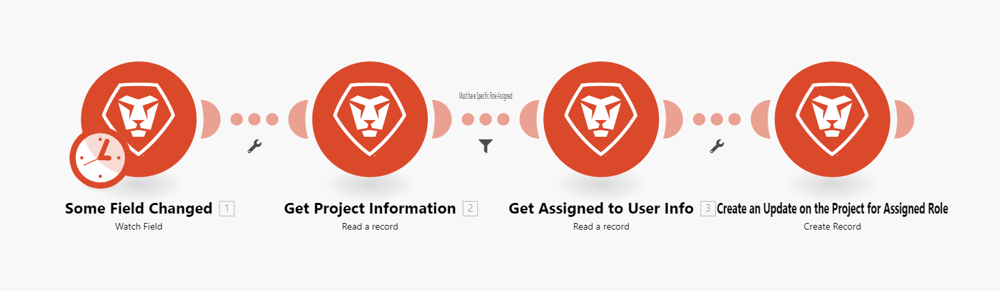
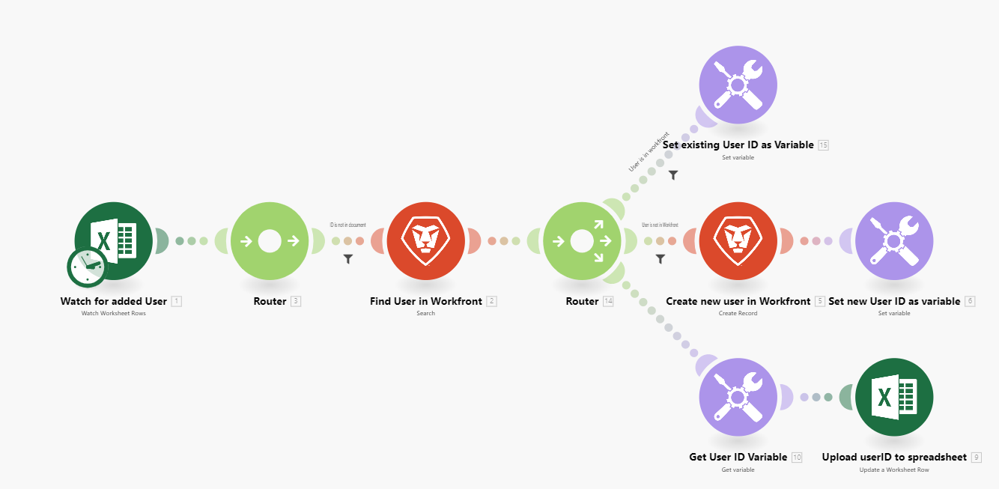

# Adobe Workfront Fusion ライセンス

Workfront Fusionには、2つのライセンスモデル、新しいオペレーションベースモデル、および従来のコネクタベースモデルがあります。

## 操作ベースのライセンスモデル（新規）

新しいWorkfront Fusion ライセンスモデルは、組織が使用する運用数に基づいています。 このモデルでは、すべての組織が同じ機能にアクセスできます。

組織にWorkfront Ultimate プランがある場合、Fusion インスタンスはプランに含まれ、1か月あたりのFusion オペレーションの数に制限はありません。 組織にWorkfront PrimeまたはSelect プランがある場合は、Fusionを購入でき、1か月に実行された運用数に基づいて価格が決まります。

新しいライセンス モデルの操作としてカウントされる操作については、[操作](/help/workfront-fusion/set-up-and-manage-workfront-fusion/licensing-operations-overview/operations-in-workfront-fusion.md)を参照してください。

## コネクタベースのライセンスモデル（従来）

Adobe Workfront Fusionの従来のライセンスモデルでは、Fusionは2つの異なるライセンスを提供し、アクセス可能な機能を決定します。 組織が Workfront Fusion を購入した際に、これらのライセンスの 1 つを選択しました。

* [Workfront Fusion for Work Automation](#workfront-fusion-for-work-automation)
* [Workfront Fusion for Work Automation and Integration](#workfront-fusion-for-work-automation-and-integration)

お客様の組織が保有するWorkfront Fusion ライセンスの種類については、Workfront Fusion管理者にお問い合わせください。

### Workfront Fusion for Work Automation

* [Workfront Fusion for Work Automationの利点](#benefits-of-workfront-fusion-for-work-automation)
* [Workfront Fusion for Work Automationで利用可能なコネクタとモジュール](#connectors-and-modules-available-for-workfront-fusion-for-work-automation)
* [Adobe Workfront Fusion for Work Automationの例](#example-of-workfront-fusion-for-work-automation)

#### Workfront Fusion for Work Automationの利点

Workfront Fusion for Work Automation ライセンスを使用すると、Workfrontワークフローを自動化できます。 Adobe Workfront Fusionを作業の自動化に活用すれば、組織固有の作業プロセスを自動化するシナリオを作成できます。

Workfrontプロセスを自動化する利点には、次のようなものがあります。

* 自動化は迅速で、エラーが発生しやすい一方です。
* 意思決定を必要としないワークフローや、意思決定があるワークフローは、「その場合」などの単純なロジックにもとづいています。
* Workfrontでは、自動処理により、自社のワークフロー内の特定のニーズに対応できます。これらのワークフローは、直接対応するものではありません。

#### Workfront Fusion for Work Automationで利用可能なコネクタとモジュール

Workfront Fusion for Work Automation ライセンスを使用すると、次の機能にアクセスできます。

* Adobe Workfront
* Workfront Proof
* Webhook
* 次のようなツールおよび変換サービスモジュール。

   * アーカイブ
   * CSV
   * データストア
   * 画像
   * JSON
   * 数学
   * MIME
   * XML

#### Adobe Workfront Fusion for Work Automationの例

次の例は、次のワークフローを示しています。

1. フィールドの変更を監視
1. オブジェクトの割り当て先を含む、フィールドが関連付けられているオブジェクトに関する情報を取得
1. オブジェクトが割り当てられているユーザーに対して、フィールドの変更に関する通知を送信

### Workfront Fusion for Work Automation and Integration

* [作業の自動化と統合におけるWorkfront Fusionのメリット](#benefits-of-workfront-fusion-for-work-automation-and-integration)
* [Workfront Fusion for Work Automation and Integrationで利用可能なコネクタとモジュール](#connectors-and-modules-available-for-workfront-fusion-for-work-automation-and-integration)
* [Adobe Workfront Fusionによる作業の自動化と統合の例](#example-of-workfront-fusion-for-work-automation-and-integration)

#### 作業の自動化と統合におけるWorkfront Fusionのメリット {#benefits-of-workfront-fusion-for-work-automation-and-integration}

Workfront Fusion for Work Automation and Integration ライセンスを使用すると、Workfront Fusion for Work Automation ライセンスのすべての機能にアクセスできます。 さらに、このライセンスを使用すると、シナリオで他のアプリやサービスを使用できます。 例えば、Workfront Fusionを使用して、Jira チケットをインポートした後、それらをWorkfrontのタスクに変換するプロセスを自動化できます。 また、Workfront Fusionに専用のコネクタがない場合でも、HTTPまたはSFTP コネクタを使用して、ほぼすべてのweb サービスに接続できます。

Workfront Fusion for Work Automation and Integration ライセンスの利点は次のとおりです。

* Workfront Fusion for Work Automation and Integrationには、Workfront Fusion for Work Automationに関連するすべての利点が含まれています
* 統合により、ワークフローの完了時に様々なアプリに出入りする必要が減ります。
* アプリケーション間でのデータ転送の自動化は、データを手動で転送するよりも迅速でエラーが発生しにくくなります。

#### Workfront Fusion for Work Automation and Integrationで利用可能なコネクタとモジュール

使用可能な専用コネクタのリストについては、[Fusion アプリケーションとそのモジュールの参照：記事インデックス &#x200B;](/help/workfront-fusion/references/apps-and-modules/apps-and-modules-toc.md)を参照してください。

>[!IMPORTANT]
>
>Workfront Fusionは、ほぼあらゆるweb サービスに接続できます。 操作するアプリに専用のコネクタがない場合は、[!UICONTROL HTTP]、[!UICONTROL SFTP] または [!UICONTROL JSON] コネクタを使って、web サービスに直接接続できます。

#### Adobe Workfront Fusionによる作業の自動化と統合の例

次の例は、次のワークフローを示しています。

1. 新規ユーザーに対してスプレッドシートを監視
1. ユーザーがWorkfrontにあるかどうかを確認します
1. ユーザーが存在しない場合は、Workfrontでユーザーを作成します
1. Workfront ユーザーIDをスプレッドシートにアップロードし直します。

