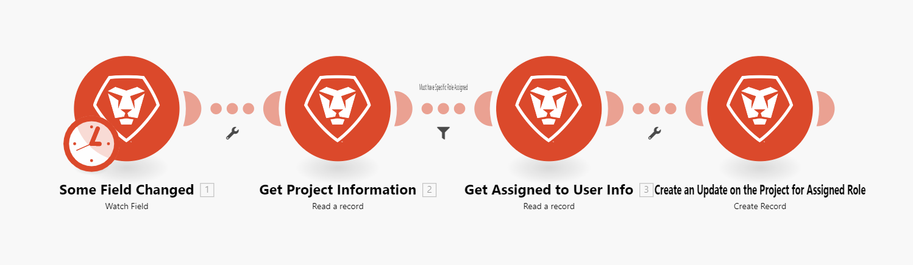

# Adobe Workfront Fusion ライセンス

Workfront Fusion には、新しいオペレーションベースのモデルと従来のコネクタベースのモデルの 2 つのライセンスモデルがあります。

## 操作ベースのライセンスモデル（新規）

新しいWorkfront Fusion ライセンスモデルは、組織で使用するオペレーションの数に基づいています。 このモデルでは、すべての組織が同じ機能にアクセスできます。

お客様の組織がWorkfront Ultimate プランを持っている場合、お客様の Fusion インスタンスはお客様のプランに含まれ、1 か月あたりの Fusion 操作の数に制限はありません。 Workfront Primeまたは Select プランをお持ちの場合、Fusion は購入でき、価格は 1 か月に実施した作業回数に基づきます。

新しいライセンスモデルで 1 つの操作としてカウントされるものについて詳しくは、[ 操作 ](/help/workfront-fusion/set-up-and-manage-workfront-fusion/licensing-operations-overview/operations-in-workfront-fusion.md) を参照してください。

## コネクタベースのライセンスモデル（従来）

Adobe Workfront Fusion の従来のライセンスモデルでは、Fusion は、アクセスできる機能を決定する 2 つの異なるライセンスを提供します。 組織が Workfront Fusion を購入した際に、これらのライセンスの 1 つを選択しました。

* [作業の自動化のためのWorkfront Fusion](#workfront-fusion-for-work-automation)
* [Workfront Fusion for Work Automation and Integration](#workfront-fusion-for-work-automation-and-integration)

Workfront Fusion のライセンスの種類については、Workfront Fusion 管理者にお問い合わせください。

### 作業の自動化のためのWorkfront Fusion

* [作業の自動化のためのWorkfront Fusion のメリット](#benefits-of-workfront-fusion-for-work-automation)
* [作業自動化用のWorkfront Fusion で使用できるコネクタとモジュール](#connectors-and-modules-available-for-workfront-fusion-for-work-automation)
* [作業を自動化するためのWorkfront Fusion の例](#example-of-workfront-fusion-for-work-automation)

#### 作業の自動化のためのWorkfront Fusion のメリット

Workfront Fusion for Work Automation ライセンスを使用すると、[!DNL Workfront] ワークフローを自動化できます。 Workfront Fusion を作業自動化に使用すると、組織固有の作業プロセスを自動化するシナリオを作成できます。

[!DNL Workfront] プロセスを自動化するメリットには、次のものがあります。

* 自動化が迅速になり、エラーが発生しにくくなります。
* 決定が必要ないワークフローや、決定があるワークフローは、if/then などの単純なロジックに基づいているので、自動化に適しています。
* 自動処理は、Workfrontで直接対処されない、組織が使用するワークフローの特定のニーズに対応できます。

#### 作業自動化用のWorkfront Fusion で使用できるコネクタとモジュール

Workfront Fusion for Work Automation ライセンスを使用すると、次にアクセスできます。

* Adobe Workfront
* Workfront Proof
* Web フック
* 次のようなツールおよび変換サービスモジュール。

   * アーカイブ
   * CSV
   * データストア
   * 画像
   * JSON
   * 数学
   * MIME
   * XML

#### 作業を自動化するためのWorkfront Fusion の例

次の例は、次のようなワークフローを示しています。

1. フィールドの変更を監視
1. オブジェクトの割り当て先を含む、フィールドが関連付けられているオブジェクトに関する情報を取得
1. オブジェクトが割り当てられているユーザーに対して、フィールドの変更に関する通知を送信

### Workfront Fusion for Work Automation and Integration

* [作業の自動化と統合におけるWorkfront Fusion のメリット](#benefits-of-workfront-fusion-for-work-automation-and-integration)
* [Workfront Fusion で作業自動化および統合用に使用可能なコネクタとモジュール](#connectors-and-modules-available-for-workfront-fusion-for-work-automation-and-integration)
* [作業の自動化と統合のためのWorkfront Fusion の例](#example-of-workfront-fusion-for-work-automation-and-integration)

#### 作業の自動化と統合におけるWorkfront Fusion のメリット {#benefits-of-workfront-fusion-for-work-automation-and-integration}

Workfront Fusion for Work Automation and Integration ライセンスを使用すると、Workfront Fusion for Work Automation ライセンスのすべての機能にアクセスできます。 さらに、このライセンスを使用すると、シナリオで他のアプリやサービスを使用できます。例えば、Workfront Fusion を使用して、Jira チケットを読み込んでWorkfrontのタスクに変換するプロセスを自動化できます。 HTTP または SFTP コネクタを使用して、Workfront Fusion に専用のコネクタがなくても、ほぼすべての web サービスに接続できます。

Workfront Fusion for Work Automation and Integration ライセンスの利点は次のとおりです。

* Workfront Fusion for Work Automation and Integration には、Workfront Fusion for Work Automation に関連するすべての利点が含まれます
* 統合により、ワークフローの完了時に様々なアプリに出入りする必要が減ります。
* アプリケーション間でのデータ転送の自動化は、データを手動で転送するよりも迅速でエラーが発生しにくくなります。

#### Workfront Fusion で作業自動化および統合用に使用可能なコネクタとモジュール

使用可能な専用コネクタのリストについては、[Fusion アプリケーションとそのモジュールのリファレンス：記事インデックス ](/help/workfront-fusion/references/apps-and-modules/apps-and-modules-toc.md) を参照してください。

>[!IMPORTANT]
>
>Workfront Fusion は、ほぼすべての web サービスに接続できます。 使用するアプリに専用のコネクタがない場合は、[!UICONTROL HTTP]、[!UICONTROL SFTP]、または [!UICONTROL JSON] のコネクタを使用して、web サービスに直接接続できます。

#### 作業の自動化と統合のためのWorkfront Fusion の例

次の例は、次のようなワークフローを示しています。

1. 新規ユーザーに対してスプレッドシートを監視
1. ユーザーが [!DNL Workfront] に存在するかどうかを確認
1. ユーザーが存在しない場合は、[!DNL Workfront] にユーザーを作成
1. [!DNL Workfront] ユーザー ID をスプレッドシートにアップロードして戻す

