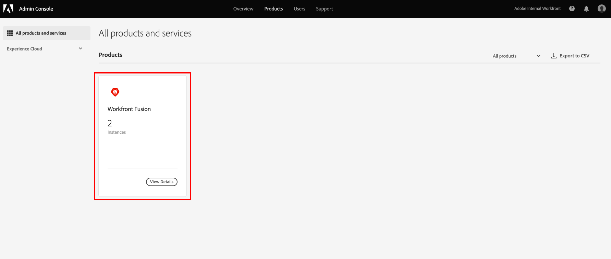

# Adobe Admin Console を使用した Adobe Workfront Fusion へのユーザーの追加

[!DNL Adobe Admin Console]にユーザーを追加してAdobe Workfront Fusionに割り当てるか、[!DNL Adobe Admin Console]の既存のユーザーをWorkfront Fusionに割り当てることができます。

ユーザーの追加方法など、[!DNL Adobe Admin Console]のWorkfront Fusionについて説明するビデオについては、[[!DNL Fusion] Adobe IMS](https://video.tv.adobe.com/v/3412464/){target=_blank}を参照してください。

## アクセス要件

+++ 展開すると、この記事の機能のアクセス要件が表示されます。

<table style="table-layout:auto">
 <col> 
 <col> 
 <tbody> 
  <tr> 
   <td role="rowheader">Adobe Workfront パッケージ</td> 
   <td> 
任意の Adobe Workfront Workflow パッケージと任意の Adobe Workfront Automation および Integration パッケージ

Workfront Ultimate

Workfront Fusion を追加購入した Workfront Prime および Select パッケージ。
 </td> 
  </tr> 
  <tr data-mc-conditions=""> 
   <td role="rowheader">Adobe Workfront ライセンス</td> 
   <td> 
標準

Work またはそれ以上
 </td> 
  </tr> 
  <tr> 
   <td role="rowheader">製品</td> 
   <td>
   
組織が Workfront Automation および Integration を含まない Select またはPrime Workfront パッケージを持っている場合は、Adobe Workfront Fusion を購入する必要があります。</li></ul>
   </td> 
  </tr>
  <tr data-mc-conditions=""> 
   <td role="rowheader">アクセスレベル設定</td> 
   <td> 
     
組織の Workfront Fusion 管理者である必要があります。

     
Workfront Fusionの管理者である必要があります。

   </td> 
  </tr> 
  </tr>
   <tr> 
   <td role="rowheader">アクセスレベル設定</td> 
   <td>お客様は、お客様の組織のAdobe製品の製品コンフィギュレーション管理者である必要があります。</td> 
  </tr>
 </tbody> 
</table>

この表の情報について詳しくは、[ドキュメントのアクセス要件](/help/workfront-fusion/references/licenses-and-roles/access-level-requirements-in-documentation.md)を参照してください。

+++

## 前提条件

Workfront用の[!DNL Admin Console]を使用する前に、コンソールに招待するメールが届きます。

* [!DNL Adobe] を初めて使用する場合で、組織の [!DNL Adobe] ソフトウェアとサービスを管理する管理者権限があることを知らせるメールを受け取った場合には、メール内のボタンをクリックして [!DNL Adobe] アカウントを作成して、[!DNL Admin Console] を開きます。

  または

  既に Adobeアカウント がある場合は、[[!DNL Adobe Admin Console] ページ](https://adminconsole.adobe.com)に移動します。

## [!DNL Adobe Admin Console]とWorkfront Fusionに新しいユーザーを追加

1. [[!DNL Adobe Admin Console]  ページ &#x200B;](https://adminconsole.adobe.com/)から、上部のナビゲーションバーの「**[!UICONTROL 製品]**」タブを選択し、**Workfront Fusion**&#x200B;製品タイルを選択します。

   

1. 表示されるリストで、ユーザーを追加する組織を選択します。

   

1. 表示されるリストで、「**[!UICONTROL 製品プロファイル]**」タブを選択し、Workfront Fusion [!UICONTROL 製品プロファイル &#x200B;] リンクの名前をクリックします。

   >[!IMPORTANT]
   >
   > [!UICONTROL 製品プロファイル]自体には、変更を加えないでください。

1. リストの上で「**[!UICONTROL ユーザー]**」タブを選択し、「**[!UICONTROL ユーザーを追加]**」をクリックします。

1. **[!UICONTROL この製品プロファイルにユーザーを追加]**&#x200B;ボックスに、追加するユーザーのメールアドレスまたは名前を入力し、表示されるリストからそのユーザーを選択します。

1. 「**[!UICONTROL 保存]**」をクリックします。

   ユーザーはWorkfront Fusionで作成されます。

1. （オプション）引き続き[Workfront Fusionでのユーザーのアクセスレベルの変更](#change-a-users-access-level-in-workfront-fusion)を行います。

## Workfront Fusion でのユーザーのアクセスレベルを変更

* [ユーザーの役割を管理者に変更](#change-a-users-role-to-admin)
* [ユーザーの役割をメンバー、アカウント、またはアプリ開発者に変更する](#change-a-users-role-to-member-accountant-or-app-developer)

### ユーザーの役割を管理者に変更

ユーザーに管理者の役割を割り当てる場合は、[!DNL Adobe Admin Console] で実行する必要があります。

1. ユーザーを追加したWorkfront Fusion [!UICONTROL 製品プロファイル &#x200B;] ページで、「**[!UICONTROL 管理者]**」タブを選択します。

1. 「**[!UICONTROL 管理者を追加]**」をクリックします。

1. 「**[!UICONTROL 製品プロファイル管理者を追加]**」ボックスに、管理者になるユーザーのメールアドレスまたは名前を入力し、表示されるリストでユーザーを選択します。

1. 「**[!UICONTROL 保存]**」をクリックします。

   これで、ユーザーはWorkfront Fusionの管理者になりました。

### ユーザーの役割をメンバー、アカウント、またはアプリ開発者に変更する

メンバー、会計士、アプリ開発者の役割は、Workfront Fusion内で処理します。

手順については、[&#x200B; ユーザーの役割の表示または編集](/help/workfront-fusion/set-up-and-manage-workfront-fusion/set-up-and-manage-orgs-and-teams/manage-users-and-teams/view-or-edit-user-roles.md)を参照してください。

## [!DNL Adobe Admin Console]の既存のユーザーをWorkfront Fusionに割り当てる

Fusionで既存のユーザーをチームに追加できます。 これはFusion内で処理されます。

手順については、[&#x200B; チームへのユーザーの追加](/help/workfront-fusion/set-up-and-manage-workfront-fusion/set-up-and-manage-orgs-and-teams/set-up-orgs-teams-and-users/add-a-user-to-a-team.md)を参照してください。
